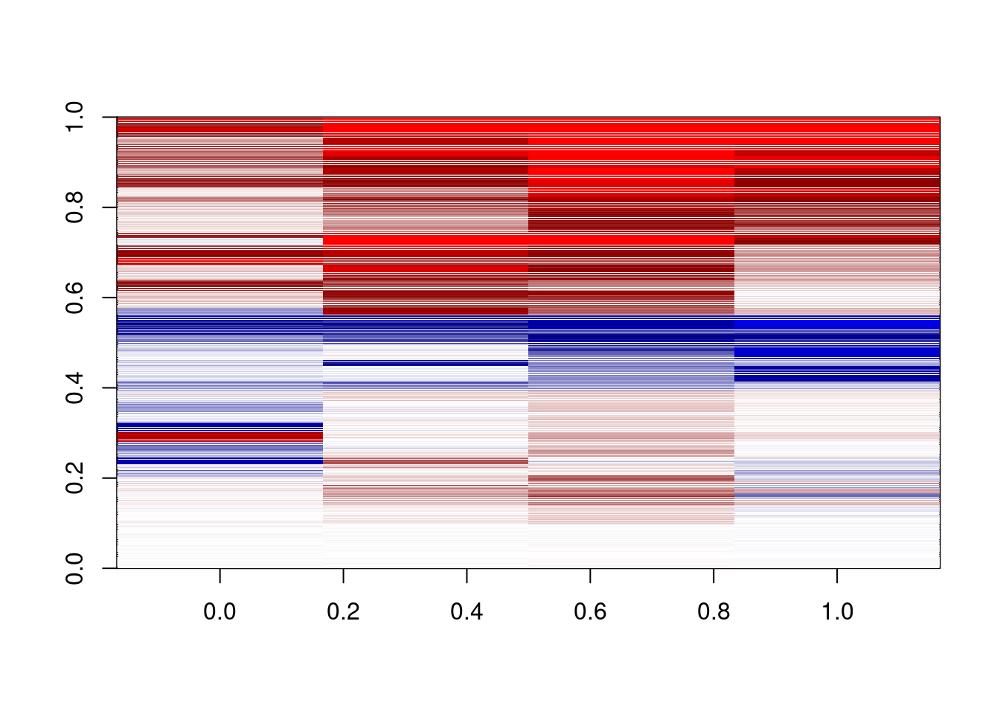
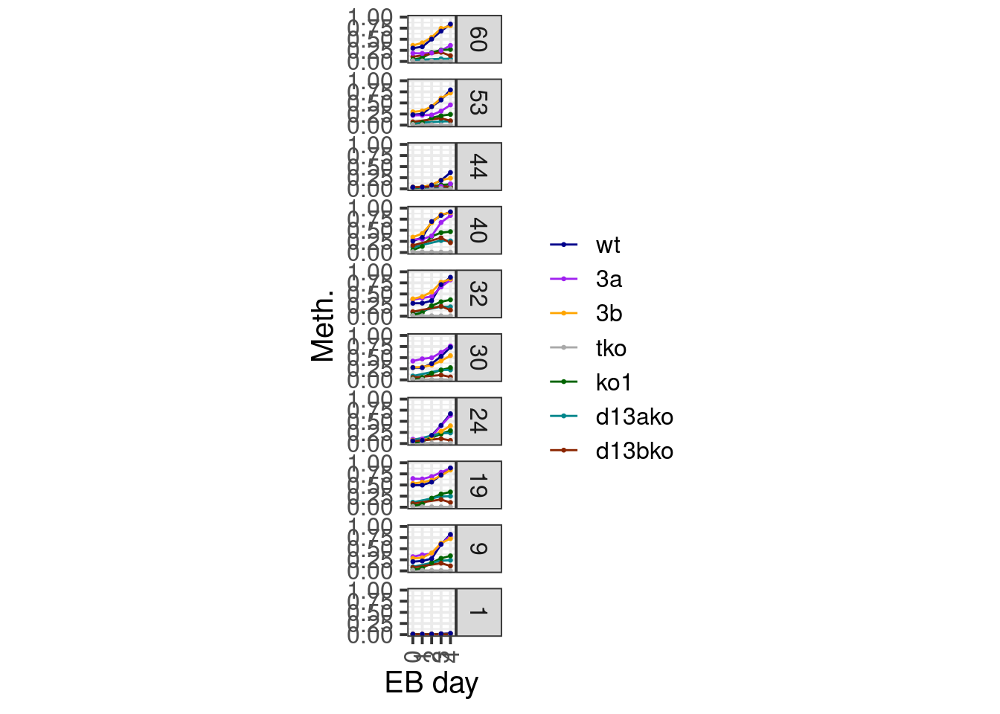
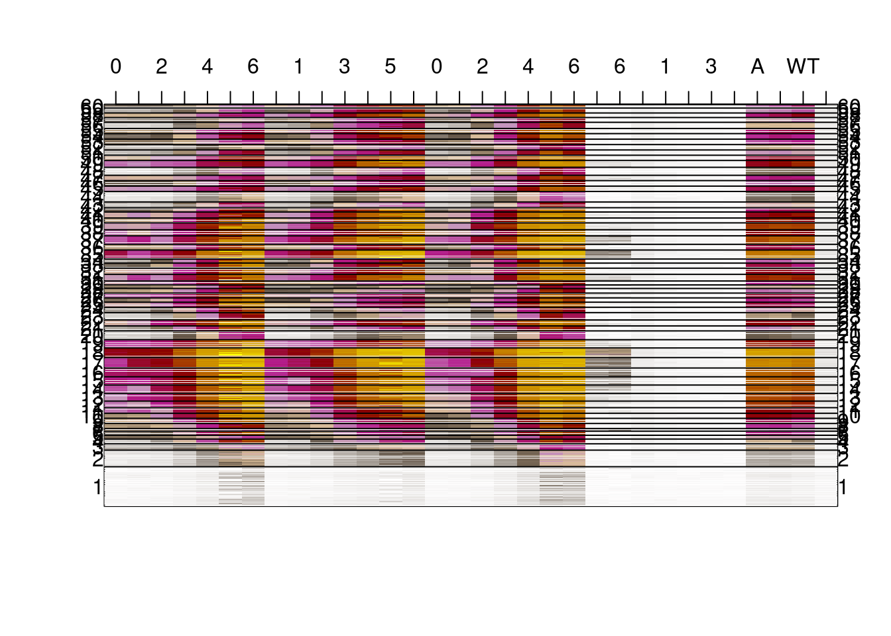

---
jupyter:
  jupytext:
    formats: ipynb,Rmd
    text_representation:
      extension: .Rmd
      format_name: rmarkdown
      format_version: '1.2'
      jupytext_version: 1.11.4
  kernelspec:
    display_name: R
    language: R
    name: ir
---

# Methylation trends in EB days 0-6


### initialize definitions


```r
suppressMessages(suppressWarnings(source(here::here("code/init.R"))))
```

### Load data


Load the data of methylation day 0-4:


```r
cpg_meth <- calc_eb_day0_to_day4_cpg_meth(min_cov = 10, max_na  = 5)
```


```r
m <- intervs_to_mat(cpg_meth)
```


```r
dim(m)
```

```
## [1] 132052     24
```


```r
colnames(m)
```

```
##  [1] "d0_3a"   "d0S_3a"  "d1_3a"   "d2_3a"   "d3_3a"   "d4_3a"   "d0_3b"  
##  [8] "d0S_3b"  "d1_3b"   "d2_3b"   "d3_3b"   "d4_3b"   "d0_tko"  "d0S_tko"
## [15] "d1_tko"  "d2_tko"  "d3_tko"  "d4_tko"  "d0_wt"   "d0S_wt"  "d1_wt"  
## [22] "d2_wt"   "d3_wt"   "d4_wt"
```

### Cluster


```r
colnames(m)
```

```
##  [1] "d0_3a"   "d0S_3a"  "d1_3a"   "d2_3a"   "d3_3a"   "d4_3a"   "d0_3b"  
##  [8] "d0S_3b"  "d1_3b"   "d2_3b"   "d3_3b"   "d4_3b"   "d0_tko"  "d0S_tko"
## [15] "d1_tko"  "d2_tko"  "d3_tko"  "d4_tko"  "d0_wt"   "d0S_wt"  "d1_wt"  
## [22] "d2_wt"   "d3_wt"   "d4_wt"
```

```r
m_column_order <- c(
    "d0_3a", "d1_3a", "d2_3a", "d3_3a", "d4_3a",
    "d0_3b", "d1_3b", "d2_3b", "d3_3b", "d4_3b",
    "d0_wt", "d1_wt", "d2_wt", "d3_wt", "d4_wt",    
    "d0_tko", "d1_tko", "d2_tko", "d3_tko", "d4_tko",
    "d0S_3a", "d0S_3b", "d0S_wt", "d0S_tko"
)
m <- m[, m_column_order]
colnames(m)
```

```
##  [1] "d0_3a"   "d1_3a"   "d2_3a"   "d3_3a"   "d4_3a"   "d0_3b"   "d1_3b"  
##  [8] "d2_3b"   "d3_3b"   "d4_3b"   "d0_wt"   "d1_wt"   "d2_wt"   "d3_wt"  
## [15] "d4_wt"   "d0_tko"  "d1_tko"  "d2_tko"  "d3_tko"  "d4_tko"  "d0S_3a" 
## [22] "d0S_3b"  "d0S_wt"  "d0S_tko"
```


```r
K <- 60
km <- tglkmeans::TGL_kmeans(m, K, id_column=FALSE, seed=19) %cache_rds% here("output/meth_capt_clust.rds")
```


```r
enframe(km$size[c(1, 9, 19, 24, 30, 32, 40, 44, 53, 60)])
```

```
## # A tibble: 10 x 2
##   name value
## 1    1  1179
## 2    9  5459
## 3   19  2023
## 4   24  1573
## 5   30  1295
## 6   32  2810
## # ... with 4 more rows
```


```r
km_m_3a <- rowSums(km$centers[,c("d1_3a","d2_3a","d3_3a","d4_3a")])
km_m_3b <- rowSums(km$centers[,c("d1_3b","d2_3b","d3_3b","d4_3b")])
km_m_wt <- rowSums(km$centers[,c("d1_wt","d2_wt","d3_wt","d4_wt")])
cent_dlt <- km$centers[,c("d1_3a","d2_3a","d3_3a","d4_3a")]-
km$centers[,c("d1_3b","d2_3b","d3_3b","d4_3b")]
```


```r
dlt24 <- cent_dlt[,2]-cent_dlt[,4]

clst_mod <- rep(0, K)
clst_mod[(km_m_3a-km_m_3b) < -0.3 & dlt24 > -0.05] <- 3
clst_mod[(km_m_3a-km_m_3b) < -0.2 & dlt24 < -0.05] <- 2
clst_mod[(km_m_3a-km_m_3b) > 0.2] <- 1
```


```r
smooth_n = floor(nrow(m)/1000)+1
km_mean_e = rowSums(km$centers)
tot_cent_dlt = rowSums(cent_dlt)

k_ord = order(ifelse(clst_mod==0, 
                    km_mean_e, 
                    abs(tot_cent_dlt)) + clst_mod*20)
clst_map <- 1:K
names(clst_map) <- as.character(k_ord)
clst <- km$cluster
clst_sorted <- clst_map[as.character(clst)]
km$cluster <- clst_sorted
km$centers <- km$centers[k_ord,]
rownames(km$centers) <- 1:K
m_ord <- order(km$cluster)
```


```r
m_s5 = apply(m[m_ord,-1],2, zoo::rollmean, smooth_n, fill=c('extend',NA,'extend'), na.rm=T)

colnames(m_s5) = colnames(m)[-1]
```


```r
dim(m_s5)
```

```
## [1] 132052     23
```


```r
options(repr.plot.width = 8, repr.plot.height = 20)
plot_clust <- function() {
    shades <- colorRampPalette(c("white", "#635547", "#DABE99","#C594BF","#B51D8D","darkred", "yellow"))(1000)
    image(t(as.matrix(m_s5)),col=shades, xaxt='n', yaxt='n'); 
    N = length(m_ord)

    m_y = tapply((1:N)/N, km$cluster[m_ord], mean)
    mtext(1:K, at = m_y, las=2, side= 2)
    mtext(1:K, at = m_y, las=2, side= 4)
    abline(h=tapply((1:N)/N, km$cluster[m_ord], max))
}
plot_clust()
```


```r
options(repr.plot.width = 3, repr.plot.height = 10)
plot_delta <- function(){
    delta = m_s5[,c("d1_3a","d2_3a","d3_3a","d4_3a")]-
            m_s5[,c("d1_3b","d2_3b","d3_3b","d4_3b")]

    dshades <- colorRampPalette(c("red","darkred","white","darkblue","blue"))(1000)
    image(pmin(pmax(t(as.matrix(delta)),-0.3),0.3),col=dshades,zlim=c(-0.3,0.3))
}
plot_delta()
```



### Project DNMT1 data


```r
clust_intervs <- m %>% mat_to_intervs() %>% select(chrom:end)
```


```r
all_clust_data <- calc_eb_cpg_meth(from = 0, to = 5, min_cov = 10, max_na = NULL, intervals = clust_intervs, iterator = clust_intervs, cache_fn = here("output/all_clust_data.tsv"), rm_meth_cov = TRUE)
```


```r
colnames(all_clust_data)
```

```
##  [1] "chrom"     "start"     "end"       "d0_d13ako" "d3_d13ako" "d4_d13ako"
##  [7] "d0_d13bko" "d3_d13bko" "d4_d13bko" "d5_dko"    "d0_ko1"    "d0S_ko1"  
## [13] "d1_ko1"    "d2_ko1"    "d3_ko1"    "d4_ko1"    "d5_ko1"    "d0_3a"    
## [19] "d0S_3a"    "d1_3a"     "d2_3a"     "d3_3a"     "d4_3a"     "d5_3a"    
## [25] "d0_3b"     "d0S_3b"    "d1_3b"     "d2_3b"     "d3_3b"     "d4_3b"    
## [31] "d5_3b"     "d0_tko"    "d0S_tko"   "d1_tko"    "d2_tko"    "d3_tko"   
## [37] "d4_tko"    "d0_wt"     "d0S_wt"    "d1_wt"     "d2_wt"     "d3_wt"    
## [43] "d4_wt"     "d5_wt"
```


```r
m_column_order <- c(
    "d0_3a", "d1_3a", "d2_3a", "d3_3a", "d4_3a", 
    "d0_3b", "d1_3b", "d2_3b", "d3_3b", "d4_3b", 
    "d0_wt", "d1_wt", "d2_wt", "d3_wt", "d4_wt", 
    "d0_tko", "d1_tko", "d2_tko", "d3_tko", "d4_tko",
    "d0S_3a", "d0S_3b", "d0S_wt", "d0S_tko", "d0S_ko1",
    "d0_ko1", "d1_ko1", "d2_ko1", "d3_ko1", "d4_ko1", 
    "d0_d13ako", "d3_d13ako", "d4_d13ako",
    "d0_d13bko", "d3_d13bko", "d4_d13bko"
)
setdiff(colnames(all_clust_data)[-1:-3], m_column_order)
```

```
## [1] "d5_dko" "d5_ko1" "d5_3a"  "d5_3b"  "d5_wt"
```


```r
m_all <- intervs_to_mat(all_clust_data)[, m_column_order]
colnames(m_all)
```

```
##  [1] "d0_3a"     "d1_3a"     "d2_3a"     "d3_3a"     "d4_3a"     "d0_3b"    
##  [7] "d1_3b"     "d2_3b"     "d3_3b"     "d4_3b"     "d0_wt"     "d1_wt"    
## [13] "d2_wt"     "d3_wt"     "d4_wt"     "d0_tko"    "d1_tko"    "d2_tko"   
## [19] "d3_tko"    "d4_tko"    "d0S_3a"    "d0S_3b"    "d0S_wt"    "d0S_tko"  
## [25] "d0S_ko1"   "d0_ko1"    "d1_ko1"    "d2_ko1"    "d3_ko1"    "d4_ko1"   
## [31] "d0_d13ako" "d3_d13ako" "d4_d13ako" "d0_d13bko" "d3_d13bko" "d4_d13bko"
```


```r
m_all_s5 = apply(m_all[m_ord, ],2, zoo::rollmean, smooth_n, fill=c('extend',NA,'extend'), na.rm=T)
```


```r
head(m_all_s5)
```

```
##           d0_3a      d1_3a       d2_3a      d3_3a      d4_3a       d0_3b
## [1,] 0.01001037 0.01079793 0.004898041 0.01102023 0.01277668 0.005717633
## [2,] 0.01001037 0.01079793 0.004898041 0.01102023 0.01277668 0.005717633
## [3,] 0.01001037 0.01079793 0.004898041 0.01102023 0.01277668 0.005717633
## [4,] 0.01001037 0.01079793 0.004898041 0.01102023 0.01277668 0.005717633
## [5,] 0.01001037 0.01079793 0.004898041 0.01102023 0.01277668 0.005717633
## [6,] 0.01001037 0.01079793 0.004898041 0.01102023 0.01277668 0.005717633
##            d1_3b       d2_3b      d3_3b      d4_3b       d0_wt       d1_wt
## [1,] 0.007146658 0.008921023 0.01298582 0.01649393 0.006180905 0.006556652
## [2,] 0.007146658 0.008921023 0.01298582 0.01649393 0.006180905 0.006556652
## [3,] 0.007146658 0.008921023 0.01298582 0.01649393 0.006180905 0.006556652
## [4,] 0.007146658 0.008921023 0.01298582 0.01649393 0.006180905 0.006556652
## [5,] 0.007146658 0.008921023 0.01298582 0.01649393 0.006180905 0.006556652
## [6,] 0.007146658 0.008921023 0.01298582 0.01649393 0.006180905 0.006556652
##           d2_wt      d3_wt      d4_wt      d0_tko      d1_tko      d2_tko
## [1,] 0.01132803 0.01854894 0.02603882 0.005965149 0.004823037 0.004019872
## [2,] 0.01132803 0.01854894 0.02603882 0.005965149 0.004823037 0.004019872
## [3,] 0.01132803 0.01854894 0.02603882 0.005965149 0.004823037 0.004019872
## [4,] 0.01132803 0.01854894 0.02603882 0.005965149 0.004823037 0.004019872
## [5,] 0.01132803 0.01854894 0.02603882 0.005965149 0.004823037 0.004019872
## [6,] 0.01132803 0.01854894 0.02603882 0.005965149 0.004823037 0.004019872
##           d3_tko      d4_tko     d0S_3a     d0S_3b     d0S_wt     d0S_tko
## [1,] 0.005696785 0.006240729 0.01627394 0.01726621 0.02124627 0.007268556
## [2,] 0.005696785 0.006240729 0.01627394 0.01726621 0.02124627 0.007268556
## [3,] 0.005696785 0.006240729 0.01627394 0.01726621 0.02124627 0.007268556
## [4,] 0.005696785 0.006240729 0.01627394 0.01726621 0.02124627 0.007268556
## [5,] 0.005696785 0.006240729 0.01627394 0.01726621 0.02124627 0.007268556
## [6,] 0.005696785 0.006240729 0.01627394 0.01726621 0.02124627 0.007268556
##         d0S_ko1      d0_ko1      d1_ko1      d2_ko1     d3_ko1      d4_ko1
## [1,] 0.01001541 0.004047823 0.006723765 0.007574284 0.01410948 0.007942855
## [2,] 0.01001541 0.004047823 0.006723765 0.007574284 0.01410948 0.007942855
## [3,] 0.01001541 0.004047823 0.006723765 0.007574284 0.01410948 0.007942855
## [4,] 0.01001541 0.004047823 0.006723765 0.007574284 0.01410948 0.007942855
## [5,] 0.01001541 0.004047823 0.006723765 0.007574284 0.01410948 0.007942855
## [6,] 0.01001541 0.004047823 0.006723765 0.007574284 0.01410948 0.007942855
##        d0_d13ako d3_d13ako  d4_d13ako   d0_d13bko  d3_d13bko   d4_d13bko
## [1,] 0.008525676 0.0166642 0.01150588 0.006178614 0.01029716 0.005339577
## [2,] 0.008525676 0.0166642 0.01150588 0.006178614 0.01029716 0.005339577
## [3,] 0.008525676 0.0166642 0.01150588 0.006178614 0.01029716 0.005339577
## [4,] 0.008525676 0.0166642 0.01150588 0.006178614 0.01029716 0.005339577
## [5,] 0.008525676 0.0166642 0.01150588 0.006178614 0.01029716 0.005339577
## [6,] 0.008525676 0.0166642 0.01150588 0.006178614 0.01029716 0.005339577
```


```r
days <- strsplit(colnames(m_all_s5), split = "_") %>% map_chr(~ .x[1]) %>% gsub("d", "", .) 
days[grep("0S", days)] <- c("A", "B", "WT", "TKO", "KO1")
```


```r
options(repr.plot.width = 20, repr.plot.height = 20)
shades <- colorRampPalette(c("white", "#635547", "#DABE99","#C594BF","#B51D8D","darkred", "yellow"))(1000)
image(t(as.matrix(m_all_s5)),col=shades, xaxt='n', yaxt='n'); 
N = length(m_ord)

m_y = tapply((1:N)/N, km$cluster[m_ord], mean)
mtext(1:K, at = m_y, las=2, side= 2)
mtext(1:K, at = m_y, las=2, side= 4)
axis(3, at = seq(0, 1, length = ncol(m_all_s5)), labels = days)
abline(h=tapply((1:N)/N, km$cluster[m_ord], max))
```


```r
options(repr.plot.width = 3, repr.plot.height = 20)
delta = m_s5[,c("d1_3a","d2_3a","d3_3a","d4_3a")]-
        m_s5[,c("d1_3b","d2_3b","d3_3b","d4_3b")]

dshades <- colorRampPalette(c("red","darkred","white","darkblue","blue"))(1000)
image(pmin(pmax(t(as.matrix(delta)),-0.3),0.3),col=dshades,zlim=c(-0.3,0.3))
```


#### Trajectory per cluster


```r
chosen_clusters <- c(1, 9, 19, 24, 30, 32, 40, 44, 53, 60)
```


```r
line_colors <- c("wt" = "darkblue", "3a" = "purple", "3b" = "orange", "tko" = "darkgray", "ko1" = "darkgreen", "d13ako" = "turquoise4", "d13bko" = "orangered4")
```


```r
df <- all_clust_data %>%         
    mutate(clust = km$cluster) %>% 
    group_by(clust) %>% 
    summarise_at(vars(starts_with("d")), mean, na.rm=TRUE) %>% 
    gather("samp", "meth", -clust) %>% 
    separate(samp, c("day", "line"), sep="_") %>% 
    filter(day != "d0S", day != "d5") %>% 
    mutate(day = gsub("d", "", day)) %>% 
    mutate(line = factor(line, levels = names(line_colors)))
```


```r
options(repr.plot.width = 5, repr.plot.height = 15)
df %>% 
    filter(clust %in% chosen_clusters) %>% 
    mutate(clust = factor(clust), clust = forcats::fct_rev(clust)) %>% 
    ggplot(aes(x=day, y=meth, color=line, group=line)) + 
        geom_line() + 
        geom_point(size=0.5) + 
        xlab("EB day") + 
        ylab("Meth.") + 
        theme(aspect.ratio = 1) + 
        facet_grid(clust~.) + 
        scale_color_manual(name = "", values = line_colors) + 
        scale_y_continuous(limits=c(0,1))
```



## Plot global EB trends


### Figure 4A


```r
cpg_meth1 <- gextract.left_join("seq.CG_500_mean", intervals=cpg_meth, iterator=cpg_meth, colnames="cg_cont") %>% select(-(chrom1:end1)) %>% select(chrom, start, end, cg_cont, everything()) %>% as_tibble()
```


```r
line_colors <- c("wt" = "darkblue", "3a" = "purple", "3b" = "orange", "tko" = "darkgray")
df <- cpg_meth1 %>% 
    mutate(cg_cont = cut(cg_cont, c(0,0.03,0.08,0.15), include.lowest=TRUE, labels=c("low", "mid", "high"))) %>% 
    group_by(cg_cont) %>% 
    summarise_at(vars(starts_with("d")), mean, na.rm=TRUE) %>% 
    gather("samp", "meth", -cg_cont) %>% 
    separate(samp, c("day", "line"), sep="_") %>% 
    filter(day != "d0S") %>% 
    mutate(day = gsub("d", "", day)) %>% 
    mutate(line = factor(line, levels = names(line_colors)))
```


```r
options(repr.plot.width = 14, repr.plot.height = 7)
p_high <- df %>% filter(cg_cont == "high") %>% ggplot(aes(x=day, y=meth, color=line, group=line)) + geom_line() + geom_point(size=0.5) + ggtitle("High CpG content") + xlab("EB day") + ylab("Meth.") + theme(aspect.ratio = 1) + scale_color_manual(name = "", values = line_colors) + scale_y_continuous(limits=c(0,0.8))
p_low <- df %>% filter(cg_cont == "low") %>% ggplot(aes(x=day, y=meth, color=line, group=line)) + geom_line() + geom_point(size=0.5) + ggtitle("Low CpG content") + xlab("EB day") + ylab("Meth.") + theme(aspect.ratio = 1) + scale_color_manual(name = "", values = line_colors) + scale_y_continuous(limits=c(0,0.8))
p_high + p_low
```


### Extended Data Figure 8K


Same for X chromosome


```r
line_colors <- c("wt" = "darkblue", "3a" = "purple", "3b" = "orange", "tko" = "darkgray")
df <- cpg_meth1 %>% 
    mutate(type = case_when(chrom == "chrX" ~ "X", TRUE ~ "autosome")) %>% 
    mutate(cg_cont = cut(cg_cont, c(0,0.03,0.08,0.15), include.lowest=TRUE, labels=c("low", "mid", "high"))) %>% 
    group_by(type, cg_cont) %>% 
    summarise_at(vars(starts_with("d")), mean, na.rm=TRUE) %>% 
    gather("samp", "meth", -cg_cont, -type) %>% 
    separate(samp, c("day", "line"), sep="_") %>% 
    filter(day != "d0S") %>% 
    mutate(day = gsub("d", "", day)) %>% 
    mutate(line = factor(line, levels = names(line_colors)))
```


```r
options(repr.plot.width = 14, repr.plot.height = 7)
p_high_x <- df %>% filter(type == "X", cg_cont == "high") %>% ggplot(aes(x=day, y=meth, color=line, group=line)) + geom_line() + geom_point(size=0.5) + ggtitle("X chromosome:\nHigh CpG content") + xlab("EB day") + ylab("Meth.") + theme(aspect.ratio = 1) + scale_color_manual(name = "", values = line_colors) + scale_y_continuous(limits=c(0,0.8))
p_low_x <- df %>% filter(type == "X", cg_cont == "low") %>% ggplot(aes(x=day, y=meth, color=line, group=line)) + geom_line() + geom_point(size=0.5) + ggtitle("X chromosome:\nLow CpG content") + xlab("EB day") + ylab("Meth.") + theme(aspect.ratio = 1) + scale_color_manual(name = "", values = line_colors) + scale_y_continuous(limits=c(0,0.8))
p_high_x + p_low_x
```


## cluster methylation in days 5 and 6 with DKO


```r
cpg_meth_56 <- calc_eb_day5_to_day6_cpg_meth()
```

### Project DKO on day 1-4 clusters


```r
all_clust_data <- calc_eb_cpg_meth(from = 0, to = 6, min_cov = 10, max_na = NULL, intervals = clust_intervs, iterator = clust_intervs, cache_fn = here("output/all_clust_data_day1_to_6.tsv"), rm_meth_cov = TRUE, tracks_key = NULL)
```


```r
m_column_order <- c(
    "d0_3a", "d1_3a", "d2_3a", "d3_3a", "d4_3a",  "d5_3a", "d6_3a", 
    "d0_3b", "d1_3b", "d2_3b", "d3_3b", "d4_3b",  "d5_3b", "d6_3b",
    "d0_wt", "d1_wt", "d2_wt", "d3_wt", "d4_wt",  "d5_wt", "d6_wt",
    "d5_dko", "d6_dko",
    "d0_tko", "d1_tko", "d2_tko", "d3_tko", "d4_tko", 
    "d0S_3a", "d0S_3b", "d0S_wt", "d0S_tko"
)
setdiff(colnames(all_clust_data)[-1:-3], m_column_order)
```

```
##  [1] "d0_d13ako" "d3_d13ako" "d4_d13ako" "d0_d13bko" "d3_d13bko" "d4_d13bko"
##  [7] "d0_ko1"    "d0S_ko1"   "d1_ko1"    "d2_ko1"    "d3_ko1"    "d4_ko1"   
## [13] "d5_ko1"
```


```r
setdiff(m_column_order, colnames(all_clust_data))
```

```
## character(0)
```


```r
m_all <- intervs_to_mat(all_clust_data)[, m_column_order]
colnames(m_all)
```

```
##  [1] "d0_3a"   "d1_3a"   "d2_3a"   "d3_3a"   "d4_3a"   "d5_3a"   "d6_3a"  
##  [8] "d0_3b"   "d1_3b"   "d2_3b"   "d3_3b"   "d4_3b"   "d5_3b"   "d6_3b"  
## [15] "d0_wt"   "d1_wt"   "d2_wt"   "d3_wt"   "d4_wt"   "d5_wt"   "d6_wt"  
## [22] "d5_dko"  "d6_dko"  "d0_tko"  "d1_tko"  "d2_tko"  "d3_tko"  "d4_tko" 
## [29] "d0S_3a"  "d0S_3b"  "d0S_wt"  "d0S_tko"
```


```r
m_all_s5 = apply(m_all[m_ord, ],2, zoo::rollmean, smooth_n, fill=c('extend',NA,'extend'), na.rm=T)
```


```r
head(m_all_s5)
```

```
##           d0_3a      d1_3a       d2_3a      d3_3a      d4_3a d5_3a      d6_3a
## [1,] 0.01001037 0.01079793 0.004898041 0.01102023 0.01277668     0 0.02408283
## [2,] 0.01001037 0.01079793 0.004898041 0.01102023 0.01277668     0 0.02408283
## [3,] 0.01001037 0.01079793 0.004898041 0.01102023 0.01277668     0 0.02408283
## [4,] 0.01001037 0.01079793 0.004898041 0.01102023 0.01277668     0 0.02408283
## [5,] 0.01001037 0.01079793 0.004898041 0.01102023 0.01277668     0 0.02408283
## [6,] 0.01001037 0.01079793 0.004898041 0.01102023 0.01277668     0 0.02408283
##            d0_3b       d1_3b       d2_3b      d3_3b      d4_3b      d5_3b
## [1,] 0.005717633 0.007146658 0.008921023 0.01298582 0.01649393 0.01666667
## [2,] 0.005717633 0.007146658 0.008921023 0.01298582 0.01649393 0.01666667
## [3,] 0.005717633 0.007146658 0.008921023 0.01298582 0.01649393 0.01666667
## [4,] 0.005717633 0.007146658 0.008921023 0.01298582 0.01649393 0.01666667
## [5,] 0.005717633 0.007146658 0.008921023 0.01298582 0.01649393 0.01666667
## [6,] 0.005717633 0.007146658 0.008921023 0.01298582 0.01649393 0.01666667
##           d6_3b       d0_wt       d1_wt      d2_wt      d3_wt      d4_wt
## [1,] 0.01485334 0.006180905 0.006556652 0.01132803 0.01854894 0.02603882
## [2,] 0.01485334 0.006180905 0.006556652 0.01132803 0.01854894 0.02603882
## [3,] 0.01485334 0.006180905 0.006556652 0.01132803 0.01854894 0.02603882
## [4,] 0.01485334 0.006180905 0.006556652 0.01132803 0.01854894 0.02603882
## [5,] 0.01485334 0.006180905 0.006556652 0.01132803 0.01854894 0.02603882
## [6,] 0.01485334 0.006180905 0.006556652 0.01132803 0.01854894 0.02603882
##           d5_wt      d6_wt      d5_dko      d6_dko      d0_tko      d1_tko
## [1,] 0.03191584 0.02506428 0.004145408 0.004717813 0.005965149 0.004823037
## [2,] 0.03191584 0.02506428 0.004145408 0.004717813 0.005965149 0.004823037
## [3,] 0.03191584 0.02506428 0.004145408 0.004717813 0.005965149 0.004823037
## [4,] 0.03191584 0.02506428 0.004145408 0.004717813 0.005965149 0.004823037
## [5,] 0.03191584 0.02506428 0.004145408 0.004717813 0.005965149 0.004823037
## [6,] 0.03191584 0.02506428 0.004145408 0.004717813 0.005965149 0.004823037
##           d2_tko      d3_tko      d4_tko     d0S_3a     d0S_3b     d0S_wt
## [1,] 0.004019872 0.005696785 0.006240729 0.01627394 0.01726621 0.02124627
## [2,] 0.004019872 0.005696785 0.006240729 0.01627394 0.01726621 0.02124627
## [3,] 0.004019872 0.005696785 0.006240729 0.01627394 0.01726621 0.02124627
## [4,] 0.004019872 0.005696785 0.006240729 0.01627394 0.01726621 0.02124627
## [5,] 0.004019872 0.005696785 0.006240729 0.01627394 0.01726621 0.02124627
## [6,] 0.004019872 0.005696785 0.006240729 0.01627394 0.01726621 0.02124627
##          d0S_tko
## [1,] 0.007268556
## [2,] 0.007268556
## [3,] 0.007268556
## [4,] 0.007268556
## [5,] 0.007268556
## [6,] 0.007268556
```


```r
days <- strsplit(colnames(m_all_s5), split = "_") %>% map_chr(~ .x[1]) %>% gsub("d", "", .)
days
```

```
##  [1] "0"  "1"  "2"  "3"  "4"  "5"  "6"  "0"  "1"  "2"  "3"  "4"  "5"  "6"  "0" 
## [16] "1"  "2"  "3"  "4"  "5"  "6"  "5"  "6"  "0"  "1"  "2"  "3"  "4"  "0S" "0S"
## [31] "0S" "0S"
```


```r
days[grep("0S", days)] <- c("A", "B", "WT", "TKO")
```

### Figure 4C


```r
options(repr.plot.width = 20, repr.plot.height = 20)
shades <- colorRampPalette(c("white", "#635547", "#DABE99","#C594BF","#B51D8D","darkred", "yellow"))(1000)
image(t(as.matrix(m_all_s5)),col=shades, xaxt='n', yaxt='n'); 
N = length(m_ord)

m_y = tapply((1:N)/N, km$cluster[m_ord], mean)
mtext(1:K, at = m_y, las=2, side= 2)
mtext(1:K, at = m_y, las=2, side= 4)
axis(3, at = seq(0, 1, length = ncol(m_all_s5)), labels = days)
abline(h=tapply((1:N)/N, km$cluster[m_ord], max))
```



### Figure 4B


```r
options(repr.plot.width = 3, repr.plot.height = 20)
delta = m_s5[,c("d1_3a","d2_3a","d3_3a","d4_3a")]-
        m_s5[,c("d1_3b","d2_3b","d3_3b","d4_3b")]

dshades <- colorRampPalette(c("red","darkred","white","darkblue","blue"))(1000)
image(pmin(pmax(t(as.matrix(delta)),-0.3),0.3),col=dshades,zlim=c(-0.3,0.3))
```


