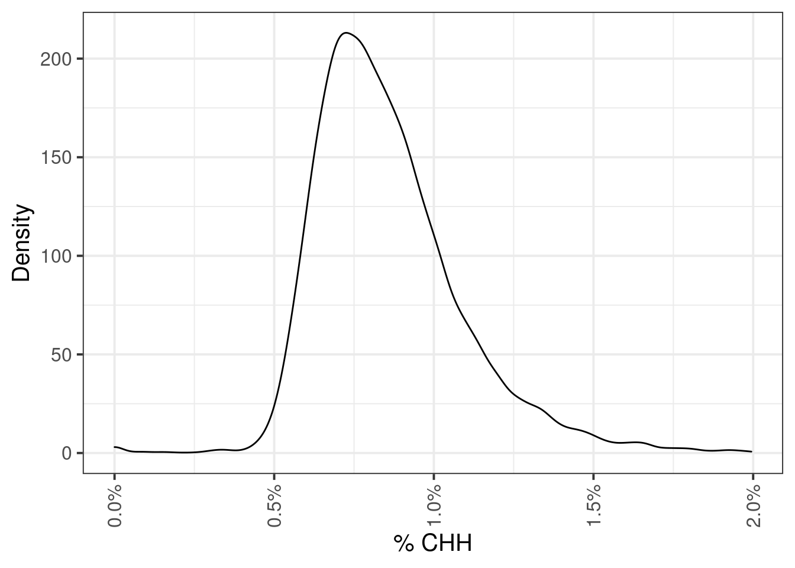
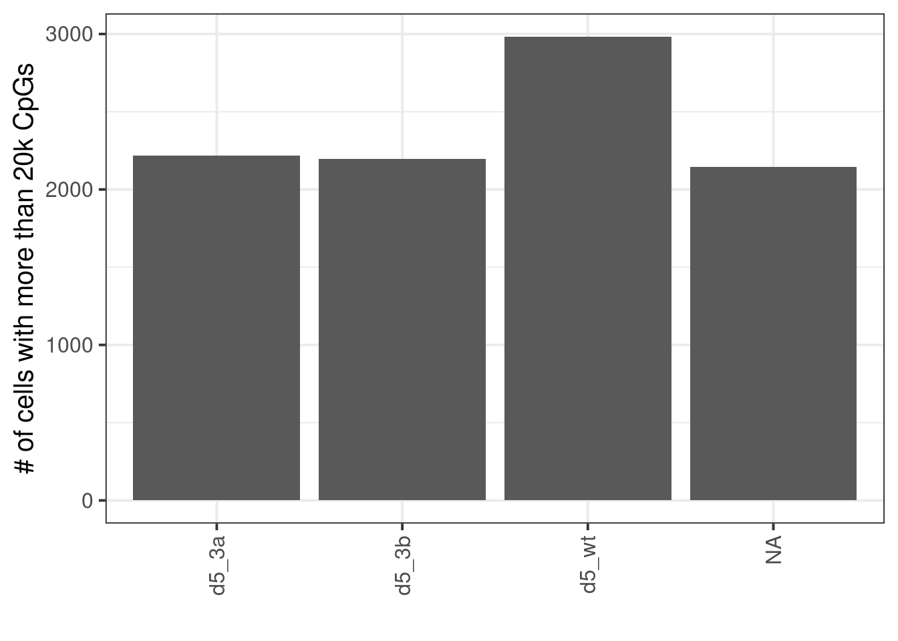
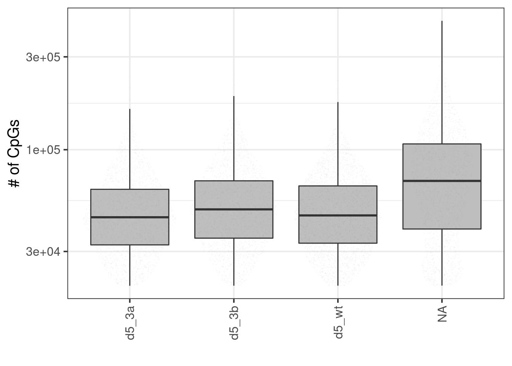
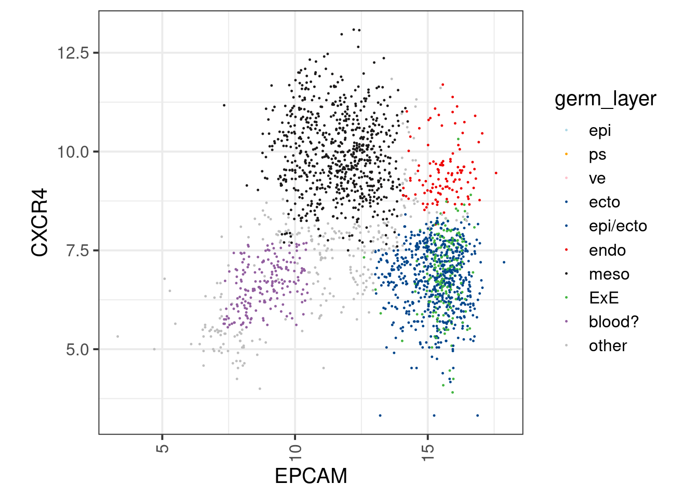
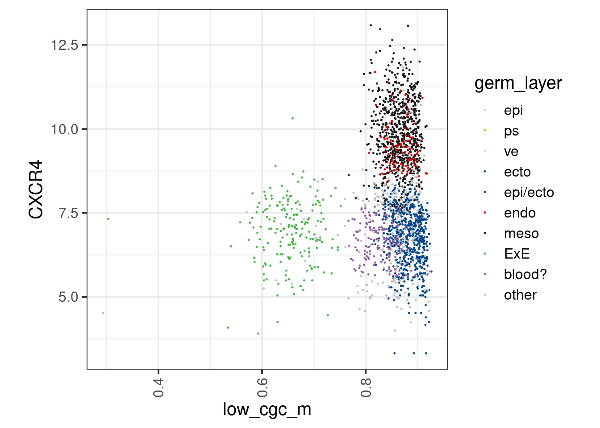
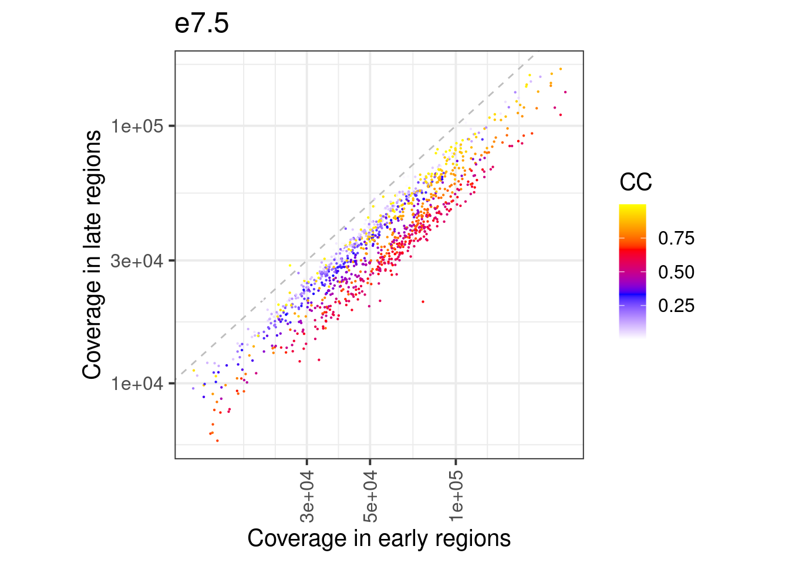

---
jupyter:
  jupytext:
    formats: ipynb,Rmd
    text_representation:
      extension: .Rmd
      format_name: rmarkdown
      format_version: '1.2'
      jupytext_version: 1.11.4
  kernelspec:
    display_name: R
    language: R
    name: ir
---

# QC - sc methylation

<!-- #region tags=[] -->
### initialize definitions
<!-- #endregion -->


```r
suppressMessages(suppressWarnings(source(here::here("code/init.R"))))
```


```r
suppressMessages(suppressWarnings(load_cgdb()))
```


```r
db
```

```
## cgdb object
## 21,342,746 CpGs X 24,179 cells
```

```
## --- root (@db_root): /net/mraid14/export/tgdata/users/aviezerl/proj/ebdnmt/Dnmt3ab_EB/methylation/data/cgdb
```


```r
samp_levels <- c("d5_3a", "d5_3b", "d5_wt", "e7.5_ecto", "e7.5_meso", "e7.5_endo")
```


```r
sc_stats <- db_f@cells %>% 
    filter(day %in% c("d5", "e7.5"))
```


```r
invivo_sort <- fread(here("data/cells_germ_layer_invivo.tsv")) %>% as_tibble()
```


```r
sc_stats <- sc_stats %>% 
    left_join(invivo_sort) %>% 
    replace_na(replace = list(germ_layer = "other")) %>%
    mutate(sort = ifelse(day == "e7.5", germ_layer, sort)) 
```

```
## Joining, by = "cell_id"
```

> Note that for cell cycle we use specific experiments with similar cell cycle profile


```r
sc_stats %>% count(day, line, sort) 
```

```
## # A tibble: 15 x 4
##   day line         sort    n
## 1  d5 ko3a CXCR4-EPCAM+  372
## 2  d5 ko3a CXCR4+EPCAM+  372
## 3  d5 ko3a        index 1851
## 4  d5 ko3b CXCR4-EPCAM+  372
## 5  d5 ko3b CXCR4+EPCAM+  372
## 6  d5 ko3b        index 1837
## # ... with 9 more rows
```

## Distribution of %CHH


### Extended Data Figure 9B


```r
p <- sc_stats %>%    
    ggplot(aes(x=CHH)) + 
        geom_density() + 
        scale_x_continuous(labels=scales::percent) + 
        vertical_labs() + 
        xlab("% CHH") + 
        ylab("Density")
p
```



## Number of cells


### Extended Data Figure 9A


```r
sc_stats %>% 
    filter(cg_num >= 2e4) %>% 
    organize_sc_samp_id() %>% 
    count(samp_id, day, line)
```

```
## # A tibble: 4 x 4
##   samp_id  day  line    n
## 1   d5_3a   d5  ko3a 2217
## 2   d5_3b   d5  ko3b 2197
## 3   d5_wt   d5    wt 2984
## 4    e7.5 e7.5 mouse 2146
```

```r
sc_stats %>% 
    filter(cg_num >= 2e4) %>% 
    organize_sc_samp_id() %>% 
    count(day)
```

```
## # A tibble: 2 x 2
##    day    n
## 1   d5 7398
## 2 e7.5 2146
```


```r
p <- sc_stats %>% 
    filter(cg_num >= 2e4) %>% 
    organize_sc_samp_id() %>% 
    count(samp_id, day, line) %>%
    mutate(samp_id = factor(samp_id, levels=samp_levels)) %>%
    ggplot(aes(x=samp_id, y=n)) + 
        geom_col() + 
        vertical_labs() + 
        ylab("# of cells with more than 20k CpGs") + 
        xlab("")
        
p
```



## Number of CpGs


### Extended Data Figure 9C


```r
p <- sc_stats %>% 
    filter(cg_num >= 2e4) %>% 
    organize_sc_samp_id() %>%     
    mutate(samp_id = factor(samp_id, levels=samp_levels)) %>%
    ggplot(aes(x=samp_id, y=cg_num)) + 
        geom_boxplot(fill="gray", outlier.shape = NA) + 
        scale_y_log10(labels=scales::scientific) + 
        ggforce::geom_sina(size=0.001, alpha=0.01) + 
        vertical_labs() + 
        ylab("# of CpGs") + 
        xlab("")
        
p
```



## Sorting plots


```r
facs_df <- sc_stats %>%         
    filter(!is.na(APC_A), !is.na(BV421_A)) %>% 
    group_by(sort_date) %>%
    mutate(EPCAM = log2(abs(min(APC_A, na.rm=TRUE)) + 10 + APC_A), CXCR4 = log2(abs(min(BV421_A, na.rm=TRUE)) + 10 + BV421_A)) %>% 
    replace_na(replace = list(gate = "no_gate")) %>% 
    ungroup() %>% 
    filter(cpg_num >= 2e4) 

facs_df_e7.5 <- facs_df %>% filter(day == "e7.5")
facs_df_d5 <- facs_df %>% filter(day == "d5")
```

### Extended Data Figure 9D


```r
options(repr.plot.width = 7, repr.plot.height = 7)
p_7.5 <- facs_df_e7.5 %>% 
    
    ggplot(aes(x=EPCAM, y=CXCR4, color=germ_layer)) + 
        geom_point(size=0.2) + 
        scale_color_manual(values=germ_layer_colors) + 
        theme(aspect.ratio=1)
p_7.5
```



### Extended Data Figure 9E


```r
options(repr.plot.width = 7, repr.plot.height = 7)
p_meth_7.5 <- facs_df_e7.5 %>% 
    ggplot(aes(x=low_cgc_m, y=CXCR4, color=germ_layer)) + 
        geom_point(size=0.2) + 
        scale_color_manual(values=germ_layer_colors) + 
        theme(aspect.ratio=1)
p_meth_7.5
```



## Early/Late coverage per cell (e7.5)


```r
df_ord_invivo <- fread(here("output/cell_cycle/segmented.tsv")) %>% filter(day == "e7.5") %>% mutate(germ_layer = factor(line, levels=c("ecto", "meso", "endo")))
```

### Extended Data Figure 9F


```r
p <- df_ord_invivo %>% 
    ggplot(aes(x=early, y=late, color=ord2)) + 
        geom_abline(linetype="dashed", color="gray") +     
        geom_point(size=0.1) + 
        scale_color_gradientn(name = "CC", colors=c("white", "blue", "red", "yellow")) +         
        theme(aspect.ratio=1) +
        scale_x_log10(labels=scales::scientific) + 
        scale_y_log10(labels=scales::scientific) + 
        vertical_labs() + 
        xlab("Coverage in early regions") + 
        ylab("Coverage in late regions") + 
        ggtitle("e7.5")
p      
```


