---
jupyter:
  jupytext:
    formats: ipynb,Rmd
    text_representation:
      extension: .Rmd
      format_name: rmarkdown
      format_version: '1.2'
      jupytext_version: 1.11.4
  kernelspec:
    display_name: R
    language: R
    name: ir
---

# Mallona et al. NAR 2020


Data from: https://doi.org/10.1093/nar/gkaa1168

<!-- #region tags=[] -->
### initialize definitions
<!-- #endregion -->


```r
suppressMessages(suppressWarnings(source(here::here("code/init.R"))))
```


```r
md_baubec <- tibble::tribble(
    ~name, ~track,
    "active_3a", "Mallona_NAR_2020.HA36_TKO_DNMT3A2_r2",
    "active_3b", "Mallona_NAR_2020.HA36_TKO_DNMT3B1_r2"
)
md_baubec
```

```
## # A tibble: 2 x 2
##        name                                track
## 1 active_3a Mallona_NAR_2020.HA36_TKO_DNMT3A2_r2
## 2 active_3b Mallona_NAR_2020.HA36_TKO_DNMT3B1_r2
```


```r
baubec_meth_all <- misha.ext::gextract_meth(tracks = md_baubec$track, names =  md_baubec$name, extract_meth_calls = TRUE) %cache_df% here("output/baubec_meth_all.tsv") %>% as_tibble()
```


```r
baubec_meth_plus <- misha.ext::gextract_meth(tracks = paste0(md_baubec$track, "_plus"), names =  md_baubec$name, extract_meth_calls = TRUE) %cache_df% here("output/baubec_meth_plus.tsv") %>% as_tibble()
baubec_meth_minus <- misha.ext::gextract_meth(tracks = paste0(md_baubec$track, "_minus"), names =  md_baubec$name, extract_meth_calls = TRUE) %cache_df% here("output/baubec_meth_minus.tsv") %>% as_tibble()
```


```r
baubec_meth_all %>% filter(active_3a.cov > 0 | active_3b.cov > 0) %>% nrow()
```

```
## [1] 16082106
```

```r
baubec_meth_plus %>% filter(active_3a.cov > 0 | active_3b.cov > 0) %>% nrow()
```

```
## [1] 12036497
```

```r
baubec_meth_minus %>% filter(active_3a.cov > 0 | active_3b.cov > 0) %>% nrow()
```

```
## [1] 12028654
```


```r
summary(baubec_meth_all$active_3a.cov[baubec_meth_all$active_3a.cov > 0])
```

```
##    Min. 1st Qu.  Median    Mean 3rd Qu.    Max. 
##    10.0    11.0    14.0    16.5    18.0  1972.0
```

```r
scales::comma(sum(baubec_meth_all$active_3a.cov > 0))
```

```
## [1] "2,298,609"
```

```r
summary(baubec_meth_plus$active_3a.cov[baubec_meth_plus$active_3a.cov > 0])
```

```
##    Min. 1st Qu.  Median    Mean 3rd Qu.    Max. 
##   10.00   11.00   14.00   16.36   18.00 1947.00
```

```r
scales::comma(sum(baubec_meth_plus$active_3a.cov > 0))
```

```
## [1] "1,151,583"
```

```r
summary(baubec_meth_minus$active_3a.cov[baubec_meth_minus$active_3a.cov > 0])
```

```
##    Min. 1st Qu.  Median    Mean 3rd Qu.    Max. 
##   10.00   11.00   14.00   16.58   18.00 1904.00
```

```r
scales::comma(sum(baubec_meth_minus$active_3a.cov > 0))
```

```
## [1] "1,152,232"
```


```r
summary(baubec_meth_all$active_3b.cov[baubec_meth_all$active_3b.cov > 0])
```

```
##    Min. 1st Qu.  Median    Mean 3rd Qu.    Max. 
##   1.000   2.000   4.000   4.291   6.000 190.000
```

```r
scales::comma(sum(baubec_meth_all$active_3b.cov > 0))
```

```
## [1] "15,928,534"
```

```r
summary(baubec_meth_plus$active_3b.cov[baubec_meth_plus$active_3b.cov > 0])
```

```
##    Min. 1st Qu.  Median    Mean 3rd Qu.    Max. 
##   1.000   1.000   2.000   2.861   4.000  99.000
```

```r
scales::comma(sum(baubec_meth_plus$active_3b.cov > 0))
```

```
## [1] "11,944,096"
```

```r
summary(baubec_meth_minus$active_3b.cov[baubec_meth_minus$active_3b.cov > 0])
```

```
##    Min. 1st Qu.  Median    Mean 3rd Qu.    Max. 
##   1.000   1.000   2.000   2.864   4.000 101.000
```

```r
scales::comma(sum(baubec_meth_minus$active_3b.cov > 0))
```

```
## [1] "11,936,048"
```


```r
baubec_meth_cov <- baubec_meth_all %>% filter(active_3a.cov >= 10, active_3b.cov >= 10) 
nrow(baubec_meth_cov)
```

```
## [1] 306664
```


```r
baubec_meth_plus_cov <- baubec_meth_plus %>% filter(active_3a.cov >= 10, active_3b.cov >= 10) 
nrow(baubec_meth_plus_cov)
```

```
## [1] 93967
```


```r
baubec_meth_minus_cov <- baubec_meth_minus %>% filter(active_3a.cov >= 10, active_3b.cov >= 10) 
nrow(baubec_meth_minus_cov)
```

```
## [1] 95747
```


```r
esc_wgbs <- misha.ext::gextract_meth("schuebler.wgbs.esc.sum", intervals=gintervals.all(), names="esc") %>% 
    filter(esc.cov >= 7) %>% 
    select(-intervalID) %cache_df% 
    here("data/schuebler_esc_wgbs.tsv") %>% 
    as_tibble()
```


```r
filter_low_esc_meth <- function(df, esc_wgbs){
    df %>% inner_join(esc_wgbs %>% select(chrom, start, end, esc) %>% filter(esc >= 0.05))
}
```

## Model ES


```r
m_bau_plus <- baubec_meth_plus_cov %>% 
    filter_low_esc_meth(esc_wgbs)
```

```
## Joining, by = c("chrom", "start", "end")
```

```r
m_bau_minus <- baubec_meth_minus_cov %>% 
    filter_low_esc_meth(esc_wgbs) 
```

```
## Joining, by = c("chrom", "start", "end")
```

```r
scales::comma(nrow(m_bau_plus))
```

```
## [1] "48,354"
```

```r
scales::comma(nrow(m_bau_minus))
```

```
## [1] "49,215"
```


```r
intervs_all_plus <- m_bau_plus %>% select(chrom, start, end)
intervs_all_minus <- m_bau_minus %>% select(chrom, start, end)
```


```r
seq_df_plus <- get_seq_df(intervs_all_plus, flank_bp = 5)
seq_df_minus <- get_seq_df(intervs_all_minus, strand = -1, flank_bp = 5)
```


```r
seq_df_wide_plus <- seq_df_to_wide(seq_df_plus, flank_bp = 5)
seq_df_wide_minus <- seq_df_to_wide(seq_df_minus, flank_bp = 5)
```


```r
head(m_bau_plus)
```

```
## # A tibble: 6 x 11
##   chrom   start     end active_3a active_3b active_3a.cov active_3b.cov
## 1  chr1 3322345 3322346 0.0000000       0.0            13            10
## 2  chr1 3574384 3574385 0.1764706       0.1            17            10
## 3  chr1 3574389 3574390 0.2352941       0.1            17            10
## 4  chr1 3574421 3574422 0.1904762       0.0            21            10
## 5  chr1 3698778 3698779 0.0000000       0.0            15            11
## 6  chr1 3708906 3708907 0.0000000       0.0            29            11
##   active_3a.meth active_3b.meth intervalID       esc
## 1              0              0          1 0.5714286
## 2              3              1          1 0.9000000
## 3              4              1          1 0.8333333
## 4              4              0          1 0.9285714
## 5              0              0          1 1.0000000
## 6              0              0          1 0.8333333
```


```r
model_ab_bau_plus_A <- gen_seq_model(seq_df_wide_plus, m_bau_plus, active_3a) %cache_rds% here("output/baubec_plus_a_dinuc_model_5bp.rds")
model_ab_bau_plus_B <- gen_seq_model(seq_df_wide_plus, m_bau_plus, active_3b) %cache_rds% here("output/baubec_plus_b_dinuc_model_5bp.rds")

model_ab_bau_minus_A <- gen_seq_model(seq_df_wide_minus, m_bau_minus, active_3a) %cache_rds% here("output/baubec_plus_a_dinuc_model_5bp.rds")
model_ab_bau_minus_B <- gen_seq_model(seq_df_wide_minus, m_bau_minus, active_3b) %cache_rds% here("output/baubec_plus_b_dinuc_model_5bp.rds")
```


```r
options(repr.plot.width = 12, repr.plot.height = 6)
bandwidth <- 0.08
point_size <- 0.001
p_a <- tibble(pred = model_ab_bau_plus_A$pred, y = model_ab_bau_plus_A$y) %>% 
    mutate(col = densCols(., bandwidth=0.06,colramp=colorRampPalette(c("white","lightblue", "blue", "darkblue", "yellow", "gold","orange","red", "darkred" )))) %>% 
    ggplot(aes(x=pred, y=y, col=col)) + 
        geom_point(shape=19, size=point_size) + 
        scale_color_identity() +         
        xlab("Dinucleotide combined model") + 
        ylab("Meth (3a-/-)") +         
        theme(aspect.ratio=1, panel.grid.major=element_blank(), panel.grid.minor=element_blank()) + 
        labs(subtitle = glue("R^2 = {cor}", cor = round(cor(model_ab_bau_plus_A$pred, model_ab_bau_plus_A$y)^2, digits=2))) + 
        theme(plot.subtitle = ggtext::element_markdown())

p_b <- tibble(pred = model_ab_bau_plus_B$pred, y = model_ab_bau_plus_B$y) %>% 
    mutate(col = densCols(., bandwidth=0.06,colramp=colorRampPalette(c("white","lightblue", "blue", "darkblue", "yellow", "gold","orange","red", "darkred" )))) %>% 
    ggplot(aes(x=pred, y=y, col=col)) + 
        geom_point(shape=19, size=point_size) + 
        scale_color_identity() + 
        xlab("Dinucleotide combined model") + 
        ylab("Meth (3b-/-)") +         
        theme(aspect.ratio=1, panel.grid.major=element_blank(), panel.grid.minor=element_blank()) + 
        labs(subtitle = glue("R^2 = {cor}", cor = round(cor(model_ab_bau_plus_B$pred, model_ab_bau_plus_B$y)^2, digits=2))) + 
        theme(plot.subtitle = ggtext::element_markdown())

p_a + p_b
```

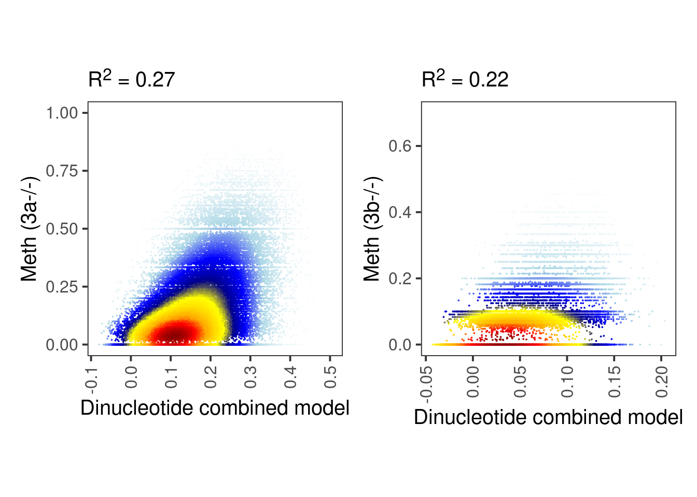


```r
coef_df_A <- get_coef_df(model_ab_bau_plus_A)
```

```
## Loading required package: Matrix
```

```
## 
## Attaching package: 'Matrix'
```

```
## The following objects are masked from 'package:tidyr':
## 
##     expand, pack, unpack
```

```
## Loaded glmnet 4.1-4
```

```r
coef_df_B <- get_coef_df(model_ab_bau_plus_B)
```

### Figure 5B,C


```r
options(repr.plot.width = 12, repr.plot.height = 6)
p_a <- coef_df_A %>% 
    ggplot(aes(x=pos, y=dinuc, fill=coefficient)) + 
        geom_tile() + 
        scale_fill_gradient2(low = "darkblue", high = "darkred", mid = "white", midpoint = 0, na.value="white") + 
        theme_minimal() + 
        ylab("Dinucleotide") + 
        xlab("Position") + 
        ggtitle("A")
p_b <- coef_df_B %>% 
    ggplot(aes(x=pos, y=dinuc, fill=coefficient)) + 
        geom_tile() + 
        scale_fill_gradient2(low = "darkblue", high = "darkred", mid = "white", midpoint = 0, na.value="white") + 
        theme_minimal() + 
        ylab("Dinucleotide") + 
        xlab("Position") + 
        ggtitle("B")
p_a + p_b
```

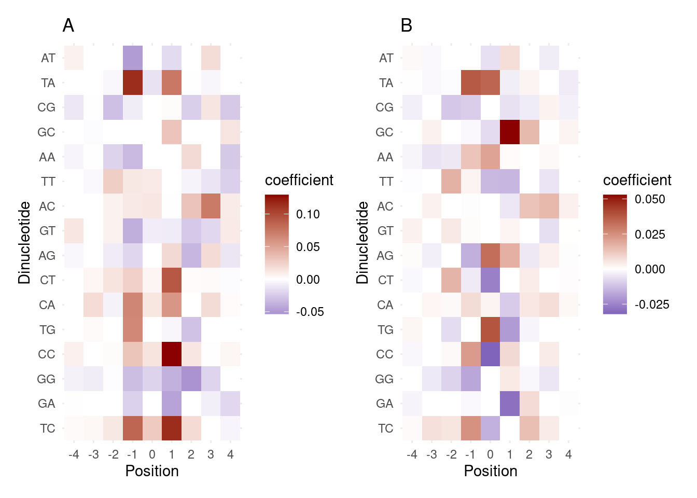


```r
model_ab <- readr::read_rds(here("output/ab_dinuc_model_5bp.rds"))
model_a <- readr::read_rds(here("output/a_dinuc_model_5bp.rds"))
model_b <- readr::read_rds(here("output/b_dinuc_model_5bp.rds"))
```


```r
all_cpgs <- gintervals.load("intervs.global.seq_CG")
```


```r
intercept_A <- coef(model_ab_bau_plus_A$fit_cv, s = "lambda.min")[1, ]
intercept_B <- coef(model_ab_bau_plus_B$fit_cv, s = "lambda.min")[1, ]
```


```r
coef_mat_A <- coef_df_to_matrix(coef_df_A %>% select(pos, dinuc, coefficient), model_ab, intercept=intercept_A) %cache_rds% here("output/coef_A_mat.rds")
coef_mat_B <- coef_df_to_matrix(coef_df_B %>% select(pos, dinuc, coefficient), model_ab, intercept=intercept_B) %cache_rds% here("output/coef_B_mat.rds")
```


```r
res <- compute_interval_model_mat_score_parallel(all_cpgs, model_ab, coef_mat_A, coef_mat_A, coef_mat_B) %cache_df% here("output/baubec_model_vs_ours_not_sym.tsv") %>% as_tibble()
```

### Figure 5D


```r
a_limits <- c(-0.1,0.5)
a_bins <- seq(-0.1, 0.5, length.out = 30)
b_limits <- c(-0.05,0.2)
b_bins <- seq(-0.05, 0.2, length.out = 30)
```


```r
cols <- colorRampPalette(c("white","lightblue", "blue", "darkblue", "yellow", "gold","orange","red", "darkred"))
options(repr.plot.width = 7, repr.plot.height = 7)
smoothScatter(
    res$score_a_plus, 
    res$score_a_minus,     
    xlab="+", 
    ylab = "-",     
    xlim = a_limits, 
    ylim = a_limits, 
    colramp = cols)
abline(v = a_bins, h = a_bins, col=alpha(rgb(0,0,0), 0.1))
abline(a = 0, b = 1, lty=5)
```

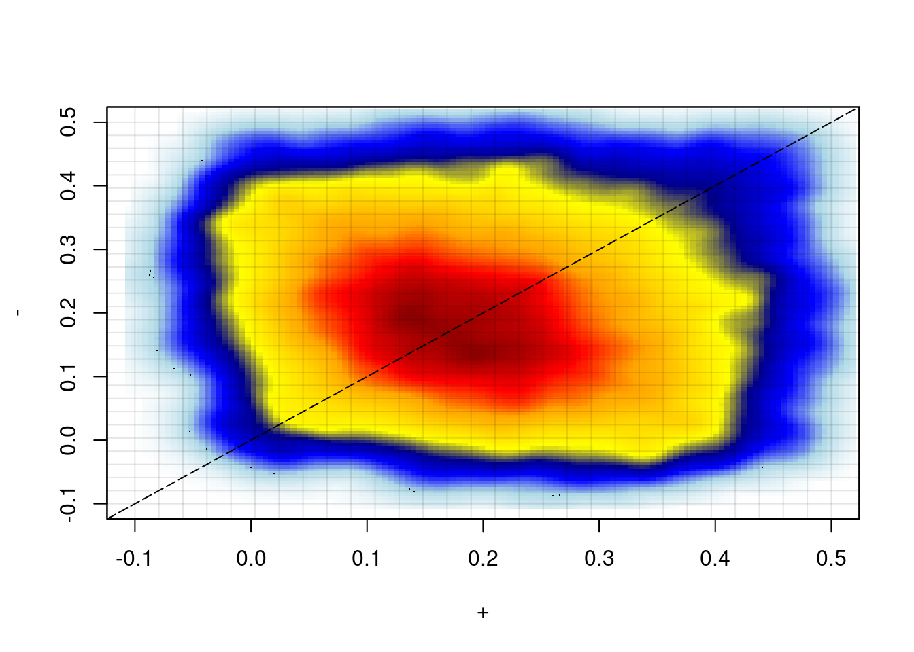

### Figure 5E


```r
options(repr.plot.width = 7, repr.plot.height = 7)
smoothScatter(
    res$score_b_plus, 
    res$score_b_minus,     
    xlab="+", 
    ylab = "-",     
    xlim = b_limits, 
    ylim = b_limits,
    colramp = cols)
abline(v = b_bins, h = b_bins, col=alpha(rgb(0,0,0), 0.1))
abline(a = 0, b = 1, lty=5)
```

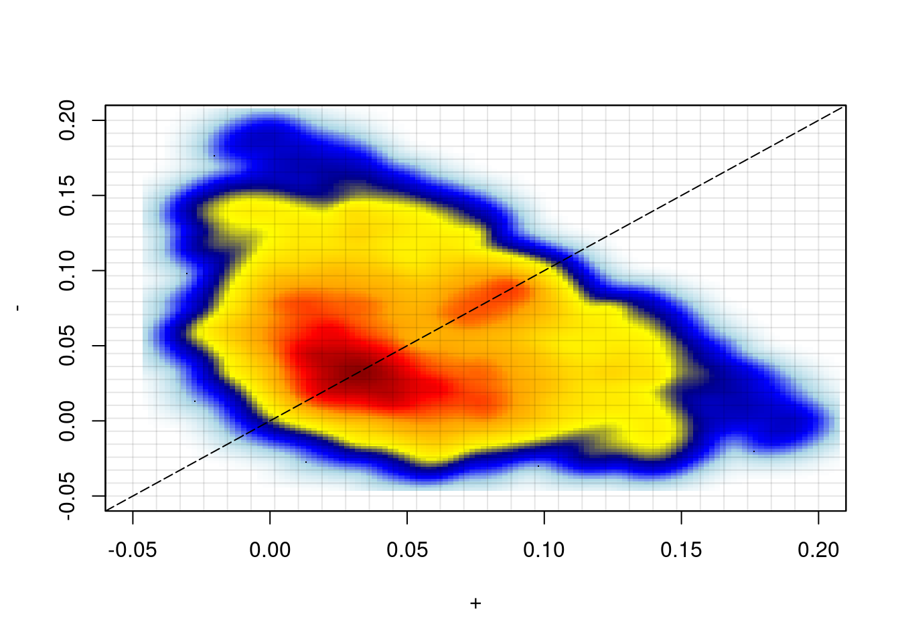


```r
df <- {
    df_wt <- tracks_key  %>% filter(day == "d5") %>% filter(line == "wt")
    df_ko3a <- tracks_key  %>% filter(day == "d5") %>% filter(line == "ko3a")
    df_ko3b <- tracks_key  %>% filter(day == "d5") %>% filter(line == "ko3b")
    df_ab_bulk <- extract_meth_annot(c(
        df_wt$track_name, 
        df_ko3a$track_name, 
        df_ko3b$track_name), 
        names = c(df_wt$name, df_ko3a$name, df_ko3b$name), d_expand = 250, extract_meth_calls = TRUE)
    df <- df_ab_bulk %>% select(chrom, start, end, d_exon:gc_cont)
    df$wt.meth <- rowSums(df_ab_bulk[, paste0(df_wt$name, ".meth")], na.rm=TRUE)
    df$wt.cov <- rowSums(df_ab_bulk[, paste0(df_wt$name, ".cov")], na.rm=TRUE)

    df$ko3a.meth <- rowSums(df_ab_bulk[, paste0(df_ko3a$name, ".meth")], na.rm=TRUE)
    df$ko3a.cov <- rowSums(df_ab_bulk[, paste0(df_ko3a$name, ".cov")], na.rm=TRUE)

    df$ko3b.meth <- rowSums(df_ab_bulk[, paste0(df_ko3b$name, ".meth")], na.rm=TRUE)
    df$ko3b.cov <- rowSums(df_ab_bulk[, paste0(df_ko3b$name, ".cov")], na.rm=TRUE)

    df$ko3a <- df$ko3a.meth / df$ko3a.cov
    df$wt <- df$wt.meth / df$wt.cov
    df$ko3b <- df$ko3b.meth / df$ko3b.cov
    df    
} %cache_df% here("output/ab_diff_d5_bulk.tsv") %>% as_tibble()
```

We take only regions that are well covered and add a `diff` column with `3a(-/-) - 3b(-/-)`


```r
min_cov <- 50
df_diff <- {
        df_diff <- df %>% filter(ko3a.cov >= min_cov, ko3b.cov >= min_cov, wt.cov >= min_cov) %>% mutate(diff = ko3a - ko3b)
        df_diff <- df_diff %>% gintervals.neighbors1("intervs.global.tss") %>% select(chrom:diff, geneSymbol, dist)
        df_diff
} %cache_df%  here("output/ab_diff_d5_bulk_diff.tsv") %>% as_tibble()
```


```r
head(df_diff)
```

```
## # A tibble: 6 x 23
##   chrom   start     end d_exon d_tss       tor    ab_score    a_score
## 1  chr1 3137716 3137717  58268 67996 -0.807965 -0.06375566 -0.0563031
## 2  chr1 3137749 3137750  58235 67963 -0.807965  0.35113215  0.1569280
## 3  chr1 3137829 3137830  58155 67883 -0.807965 -0.84893745 -0.5477075
## 4  chr1 3137834 3137835  58150 67878 -0.807965 -0.15073226 -0.1115560
## 5  chr1 3137836 3137837  58148 67876 -0.807965 -0.32485920 -0.2463233
## 6  chr1 3137840 3137841  58144 67872 -0.807965 -0.10740878  0.0732030
##       b_score    cg_cont   gc_cont wt.meth wt.cov ko3a.meth ko3a.cov ko3b.meth
## 1 -0.07885952 0.03636364 0.5036364      84     90        88       95        50
## 2 -0.24173479 0.03636364 0.5036364      90     96        92      100        54
## 3  0.04839351 0.03272727 0.5054545      93    100        97      105        55
## 4 -0.05077374 0.03272727 0.5054545      93    100        97      105        55
## 5  0.07614822 0.03272727 0.5054545      93    100        97      105        55
## 6 -0.11832523 0.03272727 0.5054545      93    100        97      105        55
##   ko3b.cov      ko3a        wt      ko3b       diff geneSymbol  dist
## 1       58 0.9263158 0.9333333 0.8620690 0.06424682  mKIAA1889 67995
## 2       62 0.9200000 0.9375000 0.8709677 0.04903226  mKIAA1889 67962
## 3       61 0.9238095 0.9300000 0.9016393 0.02217018  mKIAA1889 67882
## 4       61 0.9238095 0.9300000 0.9016393 0.02217018  mKIAA1889 67877
## 5       61 0.9238095 0.9300000 0.9016393 0.02217018  mKIAA1889 67875
## 6       61 0.9238095 0.9300000 0.9016393 0.02217018  mKIAA1889 67871
```


```r
meth_df_meeb <- df_diff %>% left_join(res)
```

```
## Joining, by = c("chrom", "start", "end")
```


```r
meth_df_meeb <- meth_df_meeb %>% rename(mA = ko3a, mB = ko3b)
```


```r
meth_df_meeb_f <- meth_df_meeb %>% 
    filter(abs(d_tss) >= 2000) %>% 
    filter_low_esc_meth(esc_wgbs) %>% 
    gintervals.neighbors1(get_all_enhancers()) %>% 
    filter(dist != 0) %>% 
    select(-(chrom1:end1))
```

```
## Joining, by = c("chrom", "start", "end")
```

```r
dim(meth_df_meeb_f)
```

```
## [1] 947724     35
```


```r
meth_df_meeb_f %>% colnames()
```

```
##  [1] "chrom"             "start"             "end"              
##  [4] "d_exon"            "d_tss"             "tor"              
##  [7] "ab_score"          "a_score"           "b_score"          
## [10] "cg_cont"           "gc_cont"           "wt.meth"          
## [13] "wt.cov"            "ko3a.meth"         "ko3a.cov"         
## [16] "ko3b.meth"         "ko3b.cov"          "mA"               
## [19] "wt"                "mB"                "diff"             
## [22] "geneSymbol"        "dist"              "score_plus"       
## [25] "score_minus"       "score_a_plus"      "score_a_minus"    
## [28] "score_b_plus"      "score_b_minus"     "score_model_plus" 
## [31] "score_model_minus" "score_orig_plus"   "score_orig_minus" 
## [34] "esc"               "dist1"
```

### Figure 5F,G


```r
meth_df_meeb_d4 <- calc_eb_day0_to_day4_cpg_meth(min_cov = 10, max_na  = 5) %>% 
    rename(mA = d4_3a, mB = d4_3b) %>% 
    inner_join(fread(here("output/ebd_day1_to_day4_cpg_meth_mat.tsv")) %>% select(chrom, start, end)) %>% 
    left_join(res)
```

```
## Joining, by = c("chrom", "start", "end")
## Joining, by = c("chrom", "start", "end")
```


```r
options(repr.plot.width = 7, repr.plot.height = 7)
colors <- viridis::viridis(30, option = "A")
df <- meth_df_meeb_d4 %>%
        mutate(score_plus = cut(score_a_plus, a_bins)) %>%
        mutate(score_minus = cut(score_a_minus, a_bins)) %>%
        group_by(score_plus, score_minus) %>%
        summarise(mB = mean(mB, na.rm=TRUE)) %>%         
        filter(!is.na(score_plus), !is.na(score_minus)) %>% 
        tidyr::complete(fill=list(mB = NA))

limits <- NULL

p_A <- df %>% 
    arrange(score_plus) %>%
    group_by(score_minus) %>%
    mutate(mB = zoo::rollapply(mB, FUN = function(x) mean(x, na.rm=TRUE), width=4, fill=NA)) %>%
    arrange(score_minus) %>%
    group_by(score_plus) %>%    
    mutate(mB = zoo::rollapply(mB, FUN = function(x) mean(x, na.rm=TRUE), width=4, fill=NA)) %>%
    na.omit() %>% 
    ggplot(aes(x=score_plus, y=score_minus, fill=mB)) + 
            geom_tile() + 
            scale_fill_gradientn(colors=colors, limits=limits) + 
            vertical_labs() + 
            scale_x_discrete(drop=FALSE) + 
            scale_y_discrete(drop=FALSE) + 
            xlab("+ strand A model") + 
            ylab("- strand A model") + 
            ggtitle("MEEB 3B-/- methylation day 4") + 
            theme(axis.ticks.x = element_blank(),
                  axis.text.x = element_blank(),
                  axis.ticks.y = element_blank(),
                  axis.text.y = element_blank())
                               
p_A
```

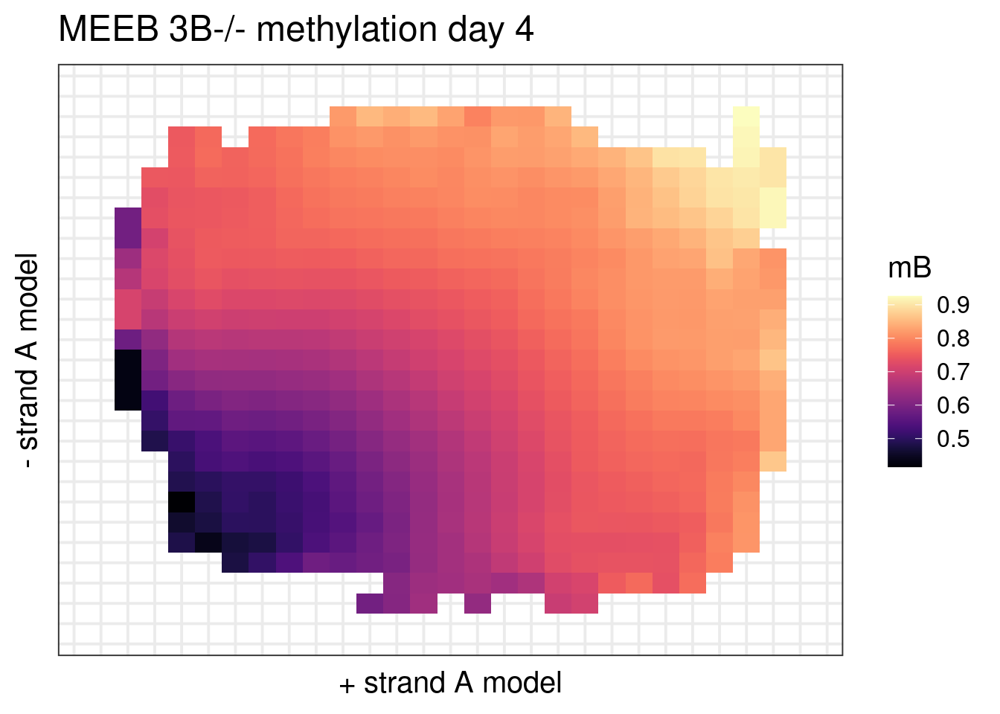

```r
df <- meth_df_meeb_d4 %>%
        mutate(score_plus = cut(score_b_plus, b_bins)) %>%
        mutate(score_minus = cut(score_b_minus, b_bins)) %>%
        group_by(score_plus, score_minus) %>%
        summarise(mA = mean(mA, na.rm=TRUE)) %>%         
        filter(!is.na(score_plus), !is.na(score_minus)) %>% 
        tidyr::complete(fill=list(mA = NA))
                               
p_B <- df %>% 
    arrange(score_plus) %>%
    group_by(score_minus) %>%
    mutate(mA = zoo::rollapply(mA, FUN = function(x) mean(x, na.rm=TRUE), width=4, fill=NA)) %>%
    arrange(score_minus) %>%
    group_by(score_plus) %>%    
    mutate(mA = zoo::rollapply(mA, FUN = function(x) mean(x, na.rm=TRUE), width=4, fill=NA)) %>%
    na.omit() %>% 
    ggplot(aes(x=score_plus, y=score_minus, fill=mA)) + 
            geom_tile() + 
            scale_fill_gradientn(colors=colors, limits=limits) + 
            vertical_labs() + 
            scale_x_discrete(drop=FALSE) + 
            scale_y_discrete(drop=FALSE) + 
            xlab("+ strand B model") + 
            ylab("- strand B model") + 
            ggtitle("MEEB 3A-/- methylation Day 4") + 
            theme(axis.ticks.x = element_blank(),
                  axis.text.x = element_blank(),
                  axis.ticks.y = element_blank(),
                  axis.text.y = element_blank())
p_B
```

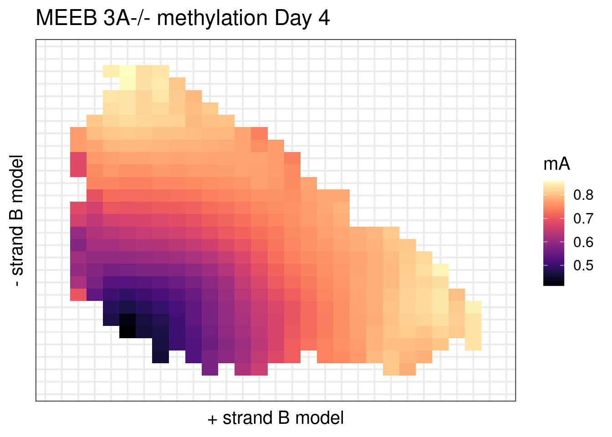

#### Predict MEEB using strands


```r
meth_df_meeb <- fread(here("output/ebd_day1_to_day4_cpg_meth_mat.tsv")) %>% left_join(res)
```

```
## Joining, by = c("chrom", "start", "end")
```


```r
feats_mat_comb_df <- meth_df_meeb %>% 
    inner_join(meth_df_meeb_d4 %>% select(chrom, start, end)) %>% 
    mutate(score_max_a = pmax(score_a_plus, score_a_minus)) %>% 
    mutate(score_max_b = pmax(score_b_plus, score_b_minus)) %>% 
    select(chrom, start, end, score_a_plus, score_a_minus, score_b_plus, score_b_minus, score_max_a, score_max_b, dAB) %>% 
    filter(!is.na(dAB))
```

```
## Joining, by = c("chrom", "start", "end")
```

```r
feats_mat_comb <- feats_mat_comb_df %>% 
    select(-(chrom:end)) %>% 
    as.matrix()

feats_mat_comb %>% dim
```

```
## [1] 80228     7
```


```r
library(xgboost)
```

```
## 
## Attaching package: 'xgboost'
```

```
## The following object is masked from 'package:dplyr':
## 
##     slice
```

```r
dtrain <- xgb.DMatrix(feats_mat_comb[, -7], label=feats_mat_comb[, 7])

xgb_params <- readr::read_rds(here("data/xgb_params.rds"))

xgbcv <- xgb.cv(params = xgb_params$params, data = dtrain, nrounds = xgb_params$nrounds, nfold = 10, prediction = TRUE)
```

```
## [1]	train-rmse:0.914976+0.001127	test-rmse:0.914986+0.003794 
## [2]	train-rmse:0.881840+0.001363	test-rmse:0.881918+0.003766 
## [3]	train-rmse:0.851517+0.002020	test-rmse:0.851576+0.003881 
## [4]	train-rmse:0.823455+0.002133	test-rmse:0.823559+0.003889 
## [5]	train-rmse:0.796019+0.002401	test-rmse:0.796166+0.004076 
## [6]	train-rmse:0.770361+0.002147	test-rmse:0.770520+0.003819 
## [7]	train-rmse:0.746327+0.002155	test-rmse:0.746500+0.003163 
## [8]	train-rmse:0.724070+0.002124	test-rmse:0.724263+0.003047 
## [9]	train-rmse:0.702849+0.002098	test-rmse:0.703063+0.003522 
## [10]	train-rmse:0.683496+0.002147	test-rmse:0.683757+0.003792 
## [11]	train-rmse:0.665380+0.002060	test-rmse:0.665712+0.003957 
## [12]	train-rmse:0.648379+0.002221	test-rmse:0.648755+0.003472 
## [13]	train-rmse:0.632596+0.002191	test-rmse:0.633018+0.003580 
## [14]	train-rmse:0.617532+0.001933	test-rmse:0.618003+0.003785 
## [15]	train-rmse:0.603758+0.002239	test-rmse:0.604296+0.003706 
## [16]	train-rmse:0.590898+0.002381	test-rmse:0.591473+0.004014 
## [17]	train-rmse:0.579237+0.002366	test-rmse:0.579846+0.004148 
## [18]	train-rmse:0.568065+0.002676	test-rmse:0.568709+0.004518 
## [19]	train-rmse:0.557567+0.002579	test-rmse:0.558257+0.004369 
## [20]	train-rmse:0.547671+0.002278	test-rmse:0.548402+0.004297 
## [21]	train-rmse:0.538665+0.002351	test-rmse:0.539429+0.003962 
## [22]	train-rmse:0.530119+0.002005	test-rmse:0.530909+0.003751 
## [23]	train-rmse:0.522251+0.001838	test-rmse:0.523070+0.003556 
## [24]	train-rmse:0.514953+0.002109	test-rmse:0.515808+0.003846 
## [25]	train-rmse:0.508429+0.002010	test-rmse:0.509311+0.003520 
## [26]	train-rmse:0.502401+0.002193	test-rmse:0.503307+0.003477 
## [27]	train-rmse:0.496522+0.002050	test-rmse:0.497480+0.003282 
## [28]	train-rmse:0.490998+0.001981	test-rmse:0.492004+0.003126 
## [29]	train-rmse:0.486138+0.001793	test-rmse:0.487193+0.003178 
## [30]	train-rmse:0.481687+0.001782	test-rmse:0.482773+0.003209 
## [31]	train-rmse:0.477337+0.001614	test-rmse:0.478458+0.003045 
## [32]	train-rmse:0.473369+0.001467	test-rmse:0.474511+0.003157 
## [33]	train-rmse:0.469594+0.001314	test-rmse:0.470771+0.003266 
## [34]	train-rmse:0.466374+0.001308	test-rmse:0.467602+0.003311 
## [35]	train-rmse:0.463150+0.001319	test-rmse:0.464414+0.003150 
## [36]	train-rmse:0.460304+0.001251	test-rmse:0.461611+0.003117 
## [37]	train-rmse:0.457697+0.001240	test-rmse:0.459039+0.003059 
## [38]	train-rmse:0.455382+0.001271	test-rmse:0.456758+0.003097 
## [39]	train-rmse:0.453036+0.001213	test-rmse:0.454469+0.003120 
## [40]	train-rmse:0.450887+0.001087	test-rmse:0.452339+0.003149 
## [41]	train-rmse:0.448949+0.001209	test-rmse:0.450419+0.003057 
## [42]	train-rmse:0.447170+0.001304	test-rmse:0.448663+0.002932 
## [43]	train-rmse:0.445465+0.001358	test-rmse:0.446978+0.002960 
## [44]	train-rmse:0.443982+0.001341	test-rmse:0.445526+0.003019 
## [45]	train-rmse:0.442581+0.001324	test-rmse:0.444158+0.002924 
## [46]	train-rmse:0.441093+0.001186	test-rmse:0.442705+0.002965 
## [47]	train-rmse:0.439832+0.001164	test-rmse:0.441465+0.002948 
## [48]	train-rmse:0.438692+0.001049	test-rmse:0.440359+0.002932 
## [49]	train-rmse:0.437629+0.001122	test-rmse:0.439333+0.002960 
## [50]	train-rmse:0.436573+0.001122	test-rmse:0.438302+0.003003 
## [51]	train-rmse:0.435616+0.001061	test-rmse:0.437382+0.003023 
## [52]	train-rmse:0.434851+0.001051	test-rmse:0.436639+0.003046 
## [53]	train-rmse:0.434095+0.001005	test-rmse:0.435904+0.002975 
## [54]	train-rmse:0.433337+0.000960	test-rmse:0.435178+0.002938 
## [55]	train-rmse:0.432671+0.000949	test-rmse:0.434528+0.002990 
## [56]	train-rmse:0.432049+0.000952	test-rmse:0.433931+0.002964 
## [57]	train-rmse:0.431413+0.000852	test-rmse:0.433329+0.002994 
## [58]	train-rmse:0.430844+0.000782	test-rmse:0.432774+0.003021 
## [59]	train-rmse:0.430321+0.000795	test-rmse:0.432276+0.003034 
## [60]	train-rmse:0.429837+0.000757	test-rmse:0.431818+0.003016 
## [61]	train-rmse:0.429402+0.000702	test-rmse:0.431396+0.003049 
## [62]	train-rmse:0.429007+0.000697	test-rmse:0.431017+0.003045 
## [63]	train-rmse:0.428635+0.000721	test-rmse:0.430675+0.003021 
## [64]	train-rmse:0.428297+0.000743	test-rmse:0.430352+0.003026 
## [65]	train-rmse:0.427952+0.000754	test-rmse:0.430034+0.003034 
## [66]	train-rmse:0.427665+0.000772	test-rmse:0.429774+0.003017 
## [67]	train-rmse:0.427372+0.000781	test-rmse:0.429505+0.003029 
## [68]	train-rmse:0.427090+0.000772	test-rmse:0.429248+0.003045 
## [69]	train-rmse:0.426791+0.000724	test-rmse:0.428978+0.003049 
## [70]	train-rmse:0.426540+0.000684	test-rmse:0.428745+0.003084 
## [71]	train-rmse:0.426297+0.000671	test-rmse:0.428525+0.003105 
## [72]	train-rmse:0.426060+0.000660	test-rmse:0.428312+0.003116 
## [73]	train-rmse:0.425814+0.000614	test-rmse:0.428094+0.003154 
## [74]	train-rmse:0.425589+0.000615	test-rmse:0.427899+0.003131 
## [75]	train-rmse:0.425380+0.000589	test-rmse:0.427702+0.003141 
## [76]	train-rmse:0.425192+0.000576	test-rmse:0.427529+0.003150 
## [77]	train-rmse:0.425029+0.000558	test-rmse:0.427387+0.003159 
## [78]	train-rmse:0.424866+0.000556	test-rmse:0.427239+0.003182 
## [79]	train-rmse:0.424706+0.000547	test-rmse:0.427097+0.003194 
## [80]	train-rmse:0.424549+0.000558	test-rmse:0.426966+0.003194 
## [81]	train-rmse:0.424394+0.000564	test-rmse:0.426840+0.003205 
## [82]	train-rmse:0.424261+0.000561	test-rmse:0.426725+0.003196 
## [83]	train-rmse:0.424131+0.000571	test-rmse:0.426618+0.003195 
## [84]	train-rmse:0.424018+0.000566	test-rmse:0.426529+0.003202 
## [85]	train-rmse:0.423883+0.000541	test-rmse:0.426417+0.003201 
## [86]	train-rmse:0.423770+0.000532	test-rmse:0.426325+0.003217 
## [87]	train-rmse:0.423665+0.000538	test-rmse:0.426246+0.003222 
## [88]	train-rmse:0.423565+0.000540	test-rmse:0.426166+0.003215 
## [89]	train-rmse:0.423458+0.000537	test-rmse:0.426079+0.003214 
## [90]	train-rmse:0.423352+0.000525	test-rmse:0.425999+0.003230 
## [91]	train-rmse:0.423240+0.000506	test-rmse:0.425917+0.003244 
## [92]	train-rmse:0.423142+0.000494	test-rmse:0.425838+0.003245 
## [93]	train-rmse:0.423043+0.000475	test-rmse:0.425757+0.003257 
## [94]	train-rmse:0.422962+0.000465	test-rmse:0.425702+0.003263 
## [95]	train-rmse:0.422876+0.000462	test-rmse:0.425632+0.003264 
## [96]	train-rmse:0.422797+0.000456	test-rmse:0.425573+0.003270 
## [97]	train-rmse:0.422721+0.000459	test-rmse:0.425520+0.003267 
## [98]	train-rmse:0.422648+0.000455	test-rmse:0.425473+0.003273 
## [99]	train-rmse:0.422570+0.000448	test-rmse:0.425417+0.003274 
## [100]	train-rmse:0.422506+0.000441	test-rmse:0.425376+0.003284 
## [101]	train-rmse:0.422431+0.000435	test-rmse:0.425335+0.003281 
## [102]	train-rmse:0.422362+0.000432	test-rmse:0.425290+0.003289 
## [103]	train-rmse:0.422301+0.000439	test-rmse:0.425253+0.003283 
## [104]	train-rmse:0.422242+0.000441	test-rmse:0.425223+0.003278 
## [105]	train-rmse:0.422181+0.000436	test-rmse:0.425180+0.003283 
## [106]	train-rmse:0.422124+0.000435	test-rmse:0.425147+0.003285 
## [107]	train-rmse:0.422061+0.000433	test-rmse:0.425104+0.003286 
## [108]	train-rmse:0.422001+0.000430	test-rmse:0.425061+0.003291 
## [109]	train-rmse:0.421934+0.000432	test-rmse:0.425022+0.003294 
## [110]	train-rmse:0.421874+0.000424	test-rmse:0.424978+0.003305 
## [111]	train-rmse:0.421825+0.000422	test-rmse:0.424952+0.003310 
## [112]	train-rmse:0.421768+0.000420	test-rmse:0.424919+0.003313 
## [113]	train-rmse:0.421722+0.000416	test-rmse:0.424893+0.003323 
## [114]	train-rmse:0.421680+0.000417	test-rmse:0.424867+0.003320 
## [115]	train-rmse:0.421633+0.000413	test-rmse:0.424842+0.003323 
## [116]	train-rmse:0.421593+0.000414	test-rmse:0.424827+0.003331 
## [117]	train-rmse:0.421544+0.000409	test-rmse:0.424796+0.003332 
## [118]	train-rmse:0.421490+0.000410	test-rmse:0.424773+0.003334 
## [119]	train-rmse:0.421446+0.000408	test-rmse:0.424749+0.003336 
## [120]	train-rmse:0.421399+0.000408	test-rmse:0.424720+0.003334 
## [121]	train-rmse:0.421357+0.000407	test-rmse:0.424701+0.003339 
## [122]	train-rmse:0.421311+0.000404	test-rmse:0.424677+0.003335 
## [123]	train-rmse:0.421263+0.000407	test-rmse:0.424651+0.003337 
## [124]	train-rmse:0.421227+0.000408	test-rmse:0.424637+0.003340 
## [125]	train-rmse:0.421180+0.000406	test-rmse:0.424610+0.003341 
## [126]	train-rmse:0.421140+0.000401	test-rmse:0.424591+0.003349 
## [127]	train-rmse:0.421101+0.000399	test-rmse:0.424580+0.003353 
## [128]	train-rmse:0.421063+0.000399	test-rmse:0.424560+0.003353 
## [129]	train-rmse:0.421026+0.000399	test-rmse:0.424542+0.003354 
## [130]	train-rmse:0.420985+0.000399	test-rmse:0.424525+0.003359 
## [131]	train-rmse:0.420947+0.000397	test-rmse:0.424506+0.003362 
## [132]	train-rmse:0.420910+0.000394	test-rmse:0.424491+0.003366 
## [133]	train-rmse:0.420874+0.000393	test-rmse:0.424470+0.003371 
## [134]	train-rmse:0.420840+0.000393	test-rmse:0.424459+0.003372 
## [135]	train-rmse:0.420808+0.000388	test-rmse:0.424444+0.003377 
## [136]	train-rmse:0.420778+0.000386	test-rmse:0.424434+0.003381 
## [137]	train-rmse:0.420742+0.000383	test-rmse:0.424412+0.003387 
## [138]	train-rmse:0.420710+0.000384	test-rmse:0.424401+0.003388 
## [139]	train-rmse:0.420670+0.000377	test-rmse:0.424382+0.003393 
## [140]	train-rmse:0.420636+0.000374	test-rmse:0.424373+0.003400 
## [141]	train-rmse:0.420604+0.000378	test-rmse:0.424362+0.003397 
## [142]	train-rmse:0.420571+0.000377	test-rmse:0.424352+0.003397 
## [143]	train-rmse:0.420539+0.000378	test-rmse:0.424341+0.003397 
## [144]	train-rmse:0.420505+0.000381	test-rmse:0.424323+0.003397 
## [145]	train-rmse:0.420475+0.000380	test-rmse:0.424318+0.003398 
## [146]	train-rmse:0.420446+0.000381	test-rmse:0.424311+0.003395 
## [147]	train-rmse:0.420415+0.000377	test-rmse:0.424300+0.003394 
## [148]	train-rmse:0.420388+0.000379	test-rmse:0.424290+0.003397 
## [149]	train-rmse:0.420359+0.000377	test-rmse:0.424282+0.003403 
## [150]	train-rmse:0.420333+0.000376	test-rmse:0.424275+0.003403 
## [151]	train-rmse:0.420301+0.000378	test-rmse:0.424265+0.003400 
## [152]	train-rmse:0.420271+0.000378	test-rmse:0.424258+0.003400 
## [153]	train-rmse:0.420244+0.000375	test-rmse:0.424249+0.003407 
## [154]	train-rmse:0.420216+0.000370	test-rmse:0.424238+0.003415 
## [155]	train-rmse:0.420191+0.000368	test-rmse:0.424234+0.003419 
## [156]	train-rmse:0.420158+0.000368	test-rmse:0.424227+0.003419 
## [157]	train-rmse:0.420130+0.000368	test-rmse:0.424222+0.003424 
## [158]	train-rmse:0.420101+0.000371	test-rmse:0.424212+0.003424 
## [159]	train-rmse:0.420074+0.000374	test-rmse:0.424206+0.003424 
## [160]	train-rmse:0.420043+0.000376	test-rmse:0.424196+0.003424 
## [161]	train-rmse:0.420016+0.000377	test-rmse:0.424192+0.003422 
## [162]	train-rmse:0.419993+0.000377	test-rmse:0.424189+0.003423 
## [163]	train-rmse:0.419967+0.000376	test-rmse:0.424188+0.003420 
## [164]	train-rmse:0.419943+0.000375	test-rmse:0.424187+0.003422 
## [165]	train-rmse:0.419916+0.000374	test-rmse:0.424186+0.003425 
## [166]	train-rmse:0.419893+0.000375	test-rmse:0.424180+0.003427 
## [167]	train-rmse:0.419869+0.000374	test-rmse:0.424179+0.003431 
## [168]	train-rmse:0.419845+0.000371	test-rmse:0.424170+0.003436 
## [169]	train-rmse:0.419822+0.000369	test-rmse:0.424164+0.003442 
## [170]	train-rmse:0.419801+0.000372	test-rmse:0.424159+0.003441 
## [171]	train-rmse:0.419778+0.000376	test-rmse:0.424155+0.003434 
## [172]	train-rmse:0.419760+0.000372	test-rmse:0.424150+0.003435 
## [173]	train-rmse:0.419738+0.000370	test-rmse:0.424145+0.003437 
## [174]	train-rmse:0.419718+0.000368	test-rmse:0.424142+0.003436 
## [175]	train-rmse:0.419699+0.000365	test-rmse:0.424140+0.003437 
## [176]	train-rmse:0.419678+0.000364	test-rmse:0.424134+0.003437 
## [177]	train-rmse:0.419658+0.000367	test-rmse:0.424134+0.003438 
## [178]	train-rmse:0.419633+0.000366	test-rmse:0.424131+0.003435 
## [179]	train-rmse:0.419607+0.000365	test-rmse:0.424133+0.003438 
## [180]	train-rmse:0.419589+0.000364	test-rmse:0.424128+0.003439 
## [181]	train-rmse:0.419570+0.000362	test-rmse:0.424128+0.003440 
## [182]	train-rmse:0.419549+0.000359	test-rmse:0.424127+0.003443 
## [183]	train-rmse:0.419527+0.000360	test-rmse:0.424125+0.003443 
## [184]	train-rmse:0.419510+0.000360	test-rmse:0.424121+0.003448 
## [185]	train-rmse:0.419492+0.000360	test-rmse:0.424122+0.003450 
## [186]	train-rmse:0.419472+0.000358	test-rmse:0.424118+0.003449 
## [187]	train-rmse:0.419456+0.000355	test-rmse:0.424117+0.003450 
## [188]	train-rmse:0.419429+0.000360	test-rmse:0.424112+0.003447 
## [189]	train-rmse:0.419415+0.000359	test-rmse:0.424112+0.003448 
## [190]	train-rmse:0.419394+0.000357	test-rmse:0.424108+0.003447 
## [191]	train-rmse:0.419372+0.000360	test-rmse:0.424098+0.003446 
## [192]	train-rmse:0.419350+0.000364	test-rmse:0.424095+0.003445 
## [193]	train-rmse:0.419334+0.000368	test-rmse:0.424091+0.003444 
## [194]	train-rmse:0.419312+0.000373	test-rmse:0.424091+0.003445 
## [195]	train-rmse:0.419290+0.000375	test-rmse:0.424088+0.003443 
## [196]	train-rmse:0.419273+0.000374	test-rmse:0.424086+0.003446 
## [197]	train-rmse:0.419258+0.000378	test-rmse:0.424088+0.003445 
## [198]	train-rmse:0.419239+0.000376	test-rmse:0.424082+0.003449 
## [199]	train-rmse:0.419222+0.000375	test-rmse:0.424085+0.003452 
## [200]	train-rmse:0.419205+0.000374	test-rmse:0.424083+0.003454 
## [201]	train-rmse:0.419189+0.000371	test-rmse:0.424078+0.003454 
## [202]	train-rmse:0.419165+0.000364	test-rmse:0.424073+0.003457 
## [203]	train-rmse:0.419150+0.000362	test-rmse:0.424072+0.003462 
## [204]	train-rmse:0.419130+0.000367	test-rmse:0.424068+0.003460 
## [205]	train-rmse:0.419116+0.000364	test-rmse:0.424070+0.003459 
## [206]	train-rmse:0.419096+0.000365	test-rmse:0.424071+0.003459 
## [207]	train-rmse:0.419078+0.000364	test-rmse:0.424063+0.003462 
## [208]	train-rmse:0.419059+0.000362	test-rmse:0.424063+0.003464 
## [209]	train-rmse:0.419040+0.000366	test-rmse:0.424057+0.003467 
## [210]	train-rmse:0.419022+0.000363	test-rmse:0.424054+0.003467 
## [211]	train-rmse:0.419010+0.000365	test-rmse:0.424053+0.003466 
## [212]	train-rmse:0.418991+0.000370	test-rmse:0.424052+0.003465 
## [213]	train-rmse:0.418973+0.000370	test-rmse:0.424048+0.003466 
## [214]	train-rmse:0.418954+0.000371	test-rmse:0.424044+0.003465 
## [215]	train-rmse:0.418939+0.000372	test-rmse:0.424043+0.003463 
## [216]	train-rmse:0.418921+0.000370	test-rmse:0.424043+0.003464 
## [217]	train-rmse:0.418905+0.000364	test-rmse:0.424041+0.003465 
## [218]	train-rmse:0.418891+0.000369	test-rmse:0.424042+0.003463 
## [219]	train-rmse:0.418874+0.000369	test-rmse:0.424042+0.003469 
## [220]	train-rmse:0.418855+0.000371	test-rmse:0.424039+0.003471 
## [221]	train-rmse:0.418841+0.000371	test-rmse:0.424040+0.003471 
## [222]	train-rmse:0.418824+0.000371	test-rmse:0.424039+0.003472 
## [223]	train-rmse:0.418805+0.000372	test-rmse:0.424037+0.003468 
## [224]	train-rmse:0.418793+0.000373	test-rmse:0.424037+0.003469 
## [225]	train-rmse:0.418777+0.000375	test-rmse:0.424034+0.003471 
## [226]	train-rmse:0.418764+0.000378	test-rmse:0.424038+0.003468 
## [227]	train-rmse:0.418748+0.000380	test-rmse:0.424036+0.003465 
## [228]	train-rmse:0.418733+0.000384	test-rmse:0.424039+0.003464 
## [229]	train-rmse:0.418716+0.000386	test-rmse:0.424037+0.003463 
## [230]	train-rmse:0.418702+0.000391	test-rmse:0.424036+0.003462 
## [231]	train-rmse:0.418686+0.000390	test-rmse:0.424035+0.003464 
## [232]	train-rmse:0.418668+0.000387	test-rmse:0.424031+0.003464 
## [233]	train-rmse:0.418656+0.000385	test-rmse:0.424033+0.003466 
## [234]	train-rmse:0.418640+0.000384	test-rmse:0.424026+0.003466 
## [235]	train-rmse:0.418625+0.000385	test-rmse:0.424026+0.003468 
## [236]	train-rmse:0.418612+0.000387	test-rmse:0.424026+0.003468 
## [237]	train-rmse:0.418594+0.000384	test-rmse:0.424025+0.003468 
## [238]	train-rmse:0.418579+0.000381	test-rmse:0.424020+0.003472 
## [239]	train-rmse:0.418568+0.000383	test-rmse:0.424018+0.003470 
## [240]	train-rmse:0.418555+0.000384	test-rmse:0.424015+0.003468 
## [241]	train-rmse:0.418544+0.000384	test-rmse:0.424018+0.003471 
## [242]	train-rmse:0.418531+0.000385	test-rmse:0.424019+0.003472 
## [243]	train-rmse:0.418516+0.000385	test-rmse:0.424018+0.003474 
## [244]	train-rmse:0.418506+0.000386	test-rmse:0.424019+0.003474 
## [245]	train-rmse:0.418495+0.000387	test-rmse:0.424017+0.003475 
## [246]	train-rmse:0.418480+0.000386	test-rmse:0.424012+0.003475 
## [247]	train-rmse:0.418469+0.000384	test-rmse:0.424013+0.003475 
## [248]	train-rmse:0.418456+0.000383	test-rmse:0.424013+0.003478 
## [249]	train-rmse:0.418443+0.000382	test-rmse:0.424014+0.003481 
## [250]	train-rmse:0.418429+0.000384	test-rmse:0.424015+0.003481 
## [251]	train-rmse:0.418413+0.000385	test-rmse:0.424014+0.003483 
## [252]	train-rmse:0.418393+0.000381	test-rmse:0.424014+0.003483 
## [253]	train-rmse:0.418379+0.000380	test-rmse:0.424014+0.003485 
## [254]	train-rmse:0.418362+0.000379	test-rmse:0.424018+0.003488 
## [255]	train-rmse:0.418341+0.000376	test-rmse:0.424016+0.003491 
## [256]	train-rmse:0.418326+0.000375	test-rmse:0.424015+0.003491 
## [257]	train-rmse:0.418310+0.000380	test-rmse:0.424017+0.003491 
## [258]	train-rmse:0.418299+0.000380	test-rmse:0.424019+0.003491 
## [259]	train-rmse:0.418289+0.000377	test-rmse:0.424020+0.003490 
## [260]	train-rmse:0.418277+0.000379	test-rmse:0.424021+0.003492 
## [261]	train-rmse:0.418264+0.000379	test-rmse:0.424020+0.003494 
## [262]	train-rmse:0.418248+0.000377	test-rmse:0.424023+0.003496 
## [263]	train-rmse:0.418233+0.000379	test-rmse:0.424022+0.003498 
## [264]	train-rmse:0.418219+0.000376	test-rmse:0.424022+0.003498 
## [265]	train-rmse:0.418207+0.000378	test-rmse:0.424021+0.003499 
## [266]	train-rmse:0.418191+0.000378	test-rmse:0.424022+0.003495 
## [267]	train-rmse:0.418174+0.000382	test-rmse:0.424020+0.003492 
## [268]	train-rmse:0.418159+0.000383	test-rmse:0.424019+0.003489 
## [269]	train-rmse:0.418146+0.000381	test-rmse:0.424017+0.003492 
## [270]	train-rmse:0.418133+0.000379	test-rmse:0.424016+0.003492 
## [271]	train-rmse:0.418117+0.000380	test-rmse:0.424018+0.003490 
## [272]	train-rmse:0.418107+0.000379	test-rmse:0.424016+0.003490 
## [273]	train-rmse:0.418091+0.000380	test-rmse:0.424018+0.003493 
## [274]	train-rmse:0.418078+0.000376	test-rmse:0.424018+0.003494 
## [275]	train-rmse:0.418064+0.000374	test-rmse:0.424015+0.003497 
## [276]	train-rmse:0.418051+0.000378	test-rmse:0.424018+0.003497 
## [277]	train-rmse:0.418035+0.000375	test-rmse:0.424018+0.003499 
## [278]	train-rmse:0.418020+0.000376	test-rmse:0.424015+0.003501 
## [279]	train-rmse:0.418006+0.000377	test-rmse:0.424018+0.003501 
## [280]	train-rmse:0.417991+0.000375	test-rmse:0.424017+0.003503 
## [281]	train-rmse:0.417978+0.000372	test-rmse:0.424019+0.003503 
## [282]	train-rmse:0.417963+0.000372	test-rmse:0.424020+0.003505 
## [283]	train-rmse:0.417951+0.000370	test-rmse:0.424020+0.003505 
## [284]	train-rmse:0.417936+0.000374	test-rmse:0.424015+0.003508 
## [285]	train-rmse:0.417920+0.000374	test-rmse:0.424015+0.003509 
## [286]	train-rmse:0.417905+0.000375	test-rmse:0.424013+0.003506 
## [287]	train-rmse:0.417887+0.000373	test-rmse:0.424009+0.003508 
## [288]	train-rmse:0.417876+0.000372	test-rmse:0.424010+0.003506 
## [289]	train-rmse:0.417867+0.000372	test-rmse:0.424012+0.003506 
## [290]	train-rmse:0.417852+0.000373	test-rmse:0.424013+0.003506 
## [291]	train-rmse:0.417839+0.000372	test-rmse:0.424015+0.003508 
## [292]	train-rmse:0.417828+0.000373	test-rmse:0.424015+0.003508 
## [293]	train-rmse:0.417813+0.000374	test-rmse:0.424011+0.003508 
## [294]	train-rmse:0.417803+0.000373	test-rmse:0.424010+0.003509 
## [295]	train-rmse:0.417789+0.000372	test-rmse:0.424010+0.003510 
## [296]	train-rmse:0.417776+0.000367	test-rmse:0.424008+0.003510 
## [297]	train-rmse:0.417764+0.000368	test-rmse:0.424008+0.003510 
## [298]	train-rmse:0.417753+0.000366	test-rmse:0.424011+0.003508 
## [299]	train-rmse:0.417739+0.000363	test-rmse:0.424008+0.003512 
## [300]	train-rmse:0.417726+0.000358	test-rmse:0.424008+0.003511 
## [301]	train-rmse:0.417715+0.000360	test-rmse:0.424007+0.003513 
## [302]	train-rmse:0.417699+0.000363	test-rmse:0.424009+0.003512 
## [303]	train-rmse:0.417687+0.000364	test-rmse:0.424008+0.003512 
## [304]	train-rmse:0.417679+0.000363	test-rmse:0.424008+0.003513 
## [305]	train-rmse:0.417669+0.000364	test-rmse:0.424011+0.003515 
## [306]	train-rmse:0.417661+0.000366	test-rmse:0.424011+0.003515 
## [307]	train-rmse:0.417651+0.000363	test-rmse:0.424012+0.003517 
## [308]	train-rmse:0.417637+0.000365	test-rmse:0.424013+0.003518 
## [309]	train-rmse:0.417620+0.000366	test-rmse:0.424014+0.003515 
## [310]	train-rmse:0.417609+0.000363	test-rmse:0.424018+0.003513 
## [311]	train-rmse:0.417599+0.000366	test-rmse:0.424017+0.003515 
## [312]	train-rmse:0.417586+0.000368	test-rmse:0.424019+0.003518 
## [313]	train-rmse:0.417568+0.000372	test-rmse:0.424020+0.003515 
## [314]	train-rmse:0.417558+0.000374	test-rmse:0.424022+0.003517 
## [315]	train-rmse:0.417545+0.000370	test-rmse:0.424021+0.003516 
## [316]	train-rmse:0.417533+0.000369	test-rmse:0.424023+0.003517 
## [317]	train-rmse:0.417518+0.000374	test-rmse:0.424021+0.003515 
## [318]	train-rmse:0.417503+0.000376	test-rmse:0.424023+0.003514 
## [319]	train-rmse:0.417491+0.000378	test-rmse:0.424023+0.003514 
## [320]	train-rmse:0.417478+0.000378	test-rmse:0.424020+0.003511 
## [321]	train-rmse:0.417462+0.000380	test-rmse:0.424021+0.003511 
## [322]	train-rmse:0.417448+0.000383	test-rmse:0.424020+0.003513 
## [323]	train-rmse:0.417435+0.000383	test-rmse:0.424019+0.003513 
## [324]	train-rmse:0.417423+0.000385	test-rmse:0.424021+0.003512 
## [325]	train-rmse:0.417414+0.000387	test-rmse:0.424021+0.003516 
## [326]	train-rmse:0.417402+0.000389	test-rmse:0.424018+0.003517 
## [327]	train-rmse:0.417392+0.000390	test-rmse:0.424015+0.003517 
## [328]	train-rmse:0.417382+0.000390	test-rmse:0.424014+0.003516 
## [329]	train-rmse:0.417370+0.000392	test-rmse:0.424012+0.003514 
## [330]	train-rmse:0.417357+0.000393	test-rmse:0.424012+0.003514 
## [331]	train-rmse:0.417345+0.000397	test-rmse:0.424010+0.003513 
## [332]	train-rmse:0.417331+0.000396	test-rmse:0.424010+0.003512 
## [333]	train-rmse:0.417315+0.000396	test-rmse:0.424011+0.003513 
## [334]	train-rmse:0.417303+0.000396	test-rmse:0.424011+0.003515 
## [335]	train-rmse:0.417293+0.000393	test-rmse:0.424010+0.003514 
## [336]	train-rmse:0.417280+0.000389	test-rmse:0.424011+0.003511 
## [337]	train-rmse:0.417269+0.000383	test-rmse:0.424016+0.003510 
## [338]	train-rmse:0.417256+0.000380	test-rmse:0.424017+0.003513 
## [339]	train-rmse:0.417245+0.000384	test-rmse:0.424020+0.003513 
## [340]	train-rmse:0.417233+0.000381	test-rmse:0.424022+0.003514 
## [341]	train-rmse:0.417222+0.000384	test-rmse:0.424022+0.003517 
## [342]	train-rmse:0.417209+0.000382	test-rmse:0.424020+0.003519 
## [343]	train-rmse:0.417194+0.000383	test-rmse:0.424018+0.003520 
## [344]	train-rmse:0.417183+0.000383	test-rmse:0.424018+0.003520 
## [345]	train-rmse:0.417168+0.000377	test-rmse:0.424015+0.003523 
## [346]	train-rmse:0.417156+0.000374	test-rmse:0.424017+0.003522 
## [347]	train-rmse:0.417141+0.000377	test-rmse:0.424016+0.003522 
## [348]	train-rmse:0.417127+0.000379	test-rmse:0.424017+0.003519 
## [349]	train-rmse:0.417117+0.000380	test-rmse:0.424016+0.003518 
## [350]	train-rmse:0.417107+0.000379	test-rmse:0.424016+0.003520 
## [351]	train-rmse:0.417094+0.000379	test-rmse:0.424016+0.003521 
## [352]	train-rmse:0.417083+0.000382	test-rmse:0.424017+0.003524 
## [353]	train-rmse:0.417067+0.000379	test-rmse:0.424016+0.003521 
## [354]	train-rmse:0.417058+0.000377	test-rmse:0.424017+0.003520 
## [355]	train-rmse:0.417044+0.000380	test-rmse:0.424014+0.003523 
## [356]	train-rmse:0.417028+0.000383	test-rmse:0.424014+0.003527 
## [357]	train-rmse:0.417015+0.000378	test-rmse:0.424013+0.003530 
## [358]	train-rmse:0.417003+0.000377	test-rmse:0.424014+0.003530 
## [359]	train-rmse:0.416989+0.000379	test-rmse:0.424012+0.003528 
## [360]	train-rmse:0.416976+0.000385	test-rmse:0.424012+0.003528 
## [361]	train-rmse:0.416965+0.000386	test-rmse:0.424012+0.003529 
## [362]	train-rmse:0.416951+0.000389	test-rmse:0.424011+0.003529 
## [363]	train-rmse:0.416943+0.000387	test-rmse:0.424010+0.003531 
## [364]	train-rmse:0.416928+0.000384	test-rmse:0.424007+0.003533 
## [365]	train-rmse:0.416920+0.000380	test-rmse:0.424008+0.003536 
## [366]	train-rmse:0.416909+0.000377	test-rmse:0.424006+0.003536 
## [367]	train-rmse:0.416894+0.000375	test-rmse:0.424001+0.003538 
## [368]	train-rmse:0.416884+0.000374	test-rmse:0.424003+0.003535 
## [369]	train-rmse:0.416867+0.000373	test-rmse:0.424000+0.003538 
## [370]	train-rmse:0.416855+0.000371	test-rmse:0.424001+0.003538 
## [371]	train-rmse:0.416839+0.000371	test-rmse:0.424000+0.003537 
## [372]	train-rmse:0.416828+0.000370	test-rmse:0.424004+0.003537 
## [373]	train-rmse:0.416818+0.000368	test-rmse:0.424002+0.003536 
## [374]	train-rmse:0.416809+0.000363	test-rmse:0.424001+0.003537 
## [375]	train-rmse:0.416798+0.000357	test-rmse:0.424000+0.003538 
## [376]	train-rmse:0.416780+0.000359	test-rmse:0.424002+0.003537 
## [377]	train-rmse:0.416769+0.000361	test-rmse:0.423998+0.003538 
## [378]	train-rmse:0.416758+0.000360	test-rmse:0.423997+0.003540 
## [379]	train-rmse:0.416747+0.000360	test-rmse:0.423999+0.003542 
## [380]	train-rmse:0.416736+0.000364	test-rmse:0.423998+0.003540 
## [381]	train-rmse:0.416725+0.000367	test-rmse:0.424000+0.003539 
## [382]	train-rmse:0.416715+0.000368	test-rmse:0.424000+0.003542 
## [383]	train-rmse:0.416699+0.000367	test-rmse:0.423998+0.003544 
## [384]	train-rmse:0.416685+0.000365	test-rmse:0.423993+0.003546 
## [385]	train-rmse:0.416673+0.000365	test-rmse:0.423994+0.003546 
## [386]	train-rmse:0.416662+0.000366	test-rmse:0.423994+0.003544 
## [387]	train-rmse:0.416652+0.000367	test-rmse:0.423993+0.003545 
## [388]	train-rmse:0.416640+0.000366	test-rmse:0.423993+0.003547 
## [389]	train-rmse:0.416627+0.000362	test-rmse:0.423991+0.003550 
## [390]	train-rmse:0.416613+0.000362	test-rmse:0.423995+0.003547 
## [391]	train-rmse:0.416601+0.000360	test-rmse:0.423995+0.003549 
## [392]	train-rmse:0.416588+0.000357	test-rmse:0.423991+0.003550 
## [393]	train-rmse:0.416577+0.000356	test-rmse:0.423991+0.003552 
## [394]	train-rmse:0.416564+0.000356	test-rmse:0.423991+0.003554 
## [395]	train-rmse:0.416550+0.000356	test-rmse:0.423990+0.003557 
## [396]	train-rmse:0.416539+0.000359	test-rmse:0.423994+0.003555 
## [397]	train-rmse:0.416527+0.000357	test-rmse:0.423993+0.003557 
## [398]	train-rmse:0.416512+0.000353	test-rmse:0.423994+0.003558 
## [399]	train-rmse:0.416497+0.000350	test-rmse:0.423989+0.003561 
## [400]	train-rmse:0.416485+0.000350	test-rmse:0.423989+0.003563 
## [401]	train-rmse:0.416473+0.000349	test-rmse:0.423985+0.003566 
## [402]	train-rmse:0.416460+0.000347	test-rmse:0.423987+0.003569 
## [403]	train-rmse:0.416447+0.000347	test-rmse:0.423986+0.003569 
## [404]	train-rmse:0.416436+0.000349	test-rmse:0.423985+0.003567 
## [405]	train-rmse:0.416427+0.000349	test-rmse:0.423986+0.003567 
## [406]	train-rmse:0.416416+0.000350	test-rmse:0.423987+0.003568 
## [407]	train-rmse:0.416403+0.000353	test-rmse:0.423986+0.003571 
## [408]	train-rmse:0.416392+0.000352	test-rmse:0.423985+0.003571 
## [409]	train-rmse:0.416377+0.000348	test-rmse:0.423983+0.003573 
## [410]	train-rmse:0.416366+0.000348	test-rmse:0.423984+0.003573 
## [411]	train-rmse:0.416351+0.000348	test-rmse:0.423985+0.003574 
## [412]	train-rmse:0.416340+0.000345	test-rmse:0.423987+0.003573 
## [413]	train-rmse:0.416327+0.000341	test-rmse:0.423989+0.003573 
## [414]	train-rmse:0.416314+0.000341	test-rmse:0.423992+0.003573 
## [415]	train-rmse:0.416303+0.000338	test-rmse:0.423990+0.003576 
## [416]	train-rmse:0.416284+0.000334	test-rmse:0.423989+0.003577 
## [417]	train-rmse:0.416273+0.000332	test-rmse:0.423986+0.003579 
## [418]	train-rmse:0.416261+0.000332	test-rmse:0.423985+0.003577 
## [419]	train-rmse:0.416251+0.000331	test-rmse:0.423984+0.003578 
## [420]	train-rmse:0.416238+0.000329	test-rmse:0.423984+0.003575 
## [421]	train-rmse:0.416228+0.000334	test-rmse:0.423985+0.003576 
## [422]	train-rmse:0.416215+0.000337	test-rmse:0.423986+0.003577 
## [423]	train-rmse:0.416203+0.000337	test-rmse:0.423986+0.003573 
## [424]	train-rmse:0.416195+0.000338	test-rmse:0.423986+0.003573 
## [425]	train-rmse:0.416182+0.000341	test-rmse:0.423984+0.003572 
## [426]	train-rmse:0.416168+0.000343	test-rmse:0.423984+0.003574 
## [427]	train-rmse:0.416157+0.000343	test-rmse:0.423985+0.003577 
## [428]	train-rmse:0.416148+0.000343	test-rmse:0.423984+0.003577 
## [429]	train-rmse:0.416137+0.000346	test-rmse:0.423985+0.003577 
## [430]	train-rmse:0.416121+0.000343	test-rmse:0.423985+0.003578 
## [431]	train-rmse:0.416108+0.000343	test-rmse:0.423985+0.003575 
## [432]	train-rmse:0.416098+0.000348	test-rmse:0.423988+0.003575 
## [433]	train-rmse:0.416084+0.000351	test-rmse:0.423984+0.003569 
## [434]	train-rmse:0.416071+0.000355	test-rmse:0.423984+0.003572 
## [435]	train-rmse:0.416055+0.000353	test-rmse:0.423981+0.003575 
## [436]	train-rmse:0.416044+0.000354	test-rmse:0.423983+0.003576 
## [437]	train-rmse:0.416030+0.000350	test-rmse:0.423981+0.003577 
## [438]	train-rmse:0.416020+0.000354	test-rmse:0.423984+0.003575 
## [439]	train-rmse:0.416008+0.000354	test-rmse:0.423985+0.003574 
## [440]	train-rmse:0.415995+0.000354	test-rmse:0.423981+0.003575 
## [441]	train-rmse:0.415984+0.000352	test-rmse:0.423980+0.003576 
## [442]	train-rmse:0.415974+0.000350	test-rmse:0.423981+0.003575 
## [443]	train-rmse:0.415960+0.000349	test-rmse:0.423981+0.003575 
## [444]	train-rmse:0.415951+0.000349	test-rmse:0.423980+0.003578 
## [445]	train-rmse:0.415934+0.000353	test-rmse:0.423983+0.003579 
## [446]	train-rmse:0.415926+0.000355	test-rmse:0.423984+0.003578 
## [447]	train-rmse:0.415911+0.000357	test-rmse:0.423985+0.003577 
## [448]	train-rmse:0.415897+0.000358	test-rmse:0.423986+0.003575 
## [449]	train-rmse:0.415884+0.000360	test-rmse:0.423989+0.003573 
## [450]	train-rmse:0.415870+0.000358	test-rmse:0.423989+0.003571 
## [451]	train-rmse:0.415857+0.000360	test-rmse:0.423989+0.003571 
## [452]	train-rmse:0.415842+0.000363	test-rmse:0.423990+0.003573 
## [453]	train-rmse:0.415831+0.000363	test-rmse:0.423992+0.003574 
## [454]	train-rmse:0.415817+0.000361	test-rmse:0.423992+0.003576 
## [455]	train-rmse:0.415806+0.000360	test-rmse:0.423993+0.003578 
## [456]	train-rmse:0.415788+0.000361	test-rmse:0.423991+0.003578 
## [457]	train-rmse:0.415774+0.000362	test-rmse:0.423990+0.003578 
## [458]	train-rmse:0.415764+0.000366	test-rmse:0.423990+0.003581 
## [459]	train-rmse:0.415755+0.000362	test-rmse:0.423988+0.003583 
## [460]	train-rmse:0.415740+0.000366	test-rmse:0.423989+0.003578 
## [461]	train-rmse:0.415729+0.000362	test-rmse:0.423989+0.003579 
## [462]	train-rmse:0.415714+0.000361	test-rmse:0.423988+0.003580 
## [463]	train-rmse:0.415703+0.000362	test-rmse:0.423985+0.003579 
## [464]	train-rmse:0.415687+0.000360	test-rmse:0.423979+0.003575 
## [465]	train-rmse:0.415678+0.000361	test-rmse:0.423980+0.003572 
## [466]	train-rmse:0.415666+0.000360	test-rmse:0.423978+0.003571 
## [467]	train-rmse:0.415654+0.000358	test-rmse:0.423978+0.003572 
## [468]	train-rmse:0.415646+0.000357	test-rmse:0.423980+0.003573 
## [469]	train-rmse:0.415630+0.000359	test-rmse:0.423980+0.003574 
## [470]	train-rmse:0.415618+0.000357	test-rmse:0.423979+0.003574 
## [471]	train-rmse:0.415610+0.000354	test-rmse:0.423979+0.003576 
## [472]	train-rmse:0.415597+0.000352	test-rmse:0.423979+0.003580 
## [473]	train-rmse:0.415585+0.000350	test-rmse:0.423978+0.003580 
## [474]	train-rmse:0.415574+0.000348	test-rmse:0.423979+0.003580 
## [475]	train-rmse:0.415561+0.000344	test-rmse:0.423976+0.003581 
## [476]	train-rmse:0.415542+0.000344	test-rmse:0.423978+0.003580 
## [477]	train-rmse:0.415526+0.000343	test-rmse:0.423977+0.003583 
## [478]	train-rmse:0.415515+0.000340	test-rmse:0.423978+0.003582 
## [479]	train-rmse:0.415506+0.000341	test-rmse:0.423978+0.003581 
## [480]	train-rmse:0.415495+0.000338	test-rmse:0.423980+0.003583 
## [481]	train-rmse:0.415485+0.000339	test-rmse:0.423981+0.003581 
## [482]	train-rmse:0.415471+0.000339	test-rmse:0.423980+0.003581 
## [483]	train-rmse:0.415459+0.000341	test-rmse:0.423981+0.003581 
## [484]	train-rmse:0.415446+0.000338	test-rmse:0.423983+0.003576 
## [485]	train-rmse:0.415432+0.000339	test-rmse:0.423978+0.003576 
## [486]	train-rmse:0.415420+0.000339	test-rmse:0.423979+0.003578 
## [487]	train-rmse:0.415406+0.000340	test-rmse:0.423978+0.003576 
## [488]	train-rmse:0.415398+0.000339	test-rmse:0.423979+0.003578 
## [489]	train-rmse:0.415384+0.000338	test-rmse:0.423983+0.003580 
## [490]	train-rmse:0.415375+0.000339	test-rmse:0.423985+0.003578 
## [491]	train-rmse:0.415357+0.000336	test-rmse:0.423983+0.003581 
## [492]	train-rmse:0.415347+0.000337	test-rmse:0.423981+0.003580 
## [493]	train-rmse:0.415333+0.000338	test-rmse:0.423981+0.003578 
## [494]	train-rmse:0.415321+0.000339	test-rmse:0.423978+0.003576 
## [495]	train-rmse:0.415308+0.000338	test-rmse:0.423976+0.003575 
## [496]	train-rmse:0.415292+0.000337	test-rmse:0.423979+0.003577 
## [497]	train-rmse:0.415278+0.000338	test-rmse:0.423979+0.003577 
## [498]	train-rmse:0.415269+0.000339	test-rmse:0.423978+0.003577 
## [499]	train-rmse:0.415261+0.000339	test-rmse:0.423978+0.003578 
## [500]	train-rmse:0.415247+0.000338	test-rmse:0.423981+0.003581 
## [501]	train-rmse:0.415236+0.000341	test-rmse:0.423980+0.003583 
## [502]	train-rmse:0.415223+0.000341	test-rmse:0.423983+0.003584 
## [503]	train-rmse:0.415215+0.000340	test-rmse:0.423985+0.003585 
## [504]	train-rmse:0.415205+0.000341	test-rmse:0.423985+0.003585 
## [505]	train-rmse:0.415189+0.000341	test-rmse:0.423985+0.003585 
## [506]	train-rmse:0.415175+0.000342	test-rmse:0.423984+0.003586 
## [507]	train-rmse:0.415164+0.000341	test-rmse:0.423985+0.003587 
## [508]	train-rmse:0.415153+0.000338	test-rmse:0.423984+0.003590 
## [509]	train-rmse:0.415142+0.000337	test-rmse:0.423982+0.003588 
## [510]	train-rmse:0.415129+0.000339	test-rmse:0.423984+0.003590 
## [511]	train-rmse:0.415118+0.000339	test-rmse:0.423983+0.003588 
## [512]	train-rmse:0.415108+0.000338	test-rmse:0.423980+0.003589 
## [513]	train-rmse:0.415092+0.000342	test-rmse:0.423978+0.003585 
## [514]	train-rmse:0.415079+0.000345	test-rmse:0.423978+0.003586 
## [515]	train-rmse:0.415066+0.000346	test-rmse:0.423977+0.003586 
## [516]	train-rmse:0.415054+0.000344	test-rmse:0.423974+0.003588 
## [517]	train-rmse:0.415041+0.000344	test-rmse:0.423977+0.003587 
## [518]	train-rmse:0.415029+0.000344	test-rmse:0.423980+0.003586 
## [519]	train-rmse:0.415014+0.000344	test-rmse:0.423984+0.003584 
## [520]	train-rmse:0.415004+0.000343	test-rmse:0.423984+0.003582 
## [521]	train-rmse:0.414991+0.000344	test-rmse:0.423986+0.003580 
## [522]	train-rmse:0.414978+0.000343	test-rmse:0.423983+0.003581 
## [523]	train-rmse:0.414966+0.000345	test-rmse:0.423983+0.003581 
## [524]	train-rmse:0.414953+0.000341	test-rmse:0.423984+0.003584 
## [525]	train-rmse:0.414942+0.000337	test-rmse:0.423982+0.003585 
## [526]	train-rmse:0.414927+0.000335	test-rmse:0.423980+0.003585 
## [527]	train-rmse:0.414910+0.000339	test-rmse:0.423978+0.003586 
## [528]	train-rmse:0.414892+0.000338	test-rmse:0.423975+0.003588 
## [529]	train-rmse:0.414876+0.000338	test-rmse:0.423971+0.003587 
## [530]	train-rmse:0.414867+0.000335	test-rmse:0.423971+0.003587 
## [531]	train-rmse:0.414858+0.000337	test-rmse:0.423970+0.003588 
## [532]	train-rmse:0.414846+0.000335	test-rmse:0.423971+0.003590 
## [533]	train-rmse:0.414833+0.000333	test-rmse:0.423973+0.003592 
## [534]	train-rmse:0.414819+0.000334	test-rmse:0.423974+0.003590 
## [535]	train-rmse:0.414807+0.000329	test-rmse:0.423972+0.003593 
## [536]	train-rmse:0.414794+0.000330	test-rmse:0.423968+0.003590 
## [537]	train-rmse:0.414780+0.000333	test-rmse:0.423968+0.003591 
## [538]	train-rmse:0.414769+0.000332	test-rmse:0.423970+0.003588 
## [539]	train-rmse:0.414756+0.000338	test-rmse:0.423966+0.003585 
## [540]	train-rmse:0.414744+0.000339	test-rmse:0.423966+0.003584 
## [541]	train-rmse:0.414735+0.000343	test-rmse:0.423967+0.003586 
## [542]	train-rmse:0.414724+0.000343	test-rmse:0.423970+0.003586 
## [543]	train-rmse:0.414714+0.000343	test-rmse:0.423970+0.003588 
## [544]	train-rmse:0.414702+0.000342	test-rmse:0.423969+0.003590 
## [545]	train-rmse:0.414691+0.000342	test-rmse:0.423969+0.003591 
## [546]	train-rmse:0.414680+0.000343	test-rmse:0.423969+0.003592 
## [547]	train-rmse:0.414669+0.000342	test-rmse:0.423968+0.003594 
## [548]	train-rmse:0.414659+0.000338	test-rmse:0.423968+0.003596 
## [549]	train-rmse:0.414643+0.000335	test-rmse:0.423968+0.003596 
## [550]	train-rmse:0.414630+0.000330	test-rmse:0.423968+0.003595 
## [551]	train-rmse:0.414619+0.000327	test-rmse:0.423967+0.003597 
## [552]	train-rmse:0.414607+0.000328	test-rmse:0.423966+0.003597 
## [553]	train-rmse:0.414595+0.000330	test-rmse:0.423967+0.003595 
## [554]	train-rmse:0.414582+0.000332	test-rmse:0.423967+0.003594 
## [555]	train-rmse:0.414573+0.000334	test-rmse:0.423967+0.003596 
## [556]	train-rmse:0.414562+0.000336	test-rmse:0.423967+0.003595 
## [557]	train-rmse:0.414550+0.000339	test-rmse:0.423969+0.003598 
## [558]	train-rmse:0.414536+0.000339	test-rmse:0.423972+0.003596 
## [559]	train-rmse:0.414518+0.000340	test-rmse:0.423970+0.003595 
## [560]	train-rmse:0.414510+0.000341	test-rmse:0.423972+0.003597 
## [561]	train-rmse:0.414496+0.000339	test-rmse:0.423970+0.003596 
## [562]	train-rmse:0.414483+0.000340	test-rmse:0.423970+0.003598 
## [563]	train-rmse:0.414468+0.000341	test-rmse:0.423972+0.003595 
## [564]	train-rmse:0.414454+0.000343	test-rmse:0.423971+0.003594 
## [565]	train-rmse:0.414443+0.000343	test-rmse:0.423972+0.003594 
## [566]	train-rmse:0.414431+0.000342	test-rmse:0.423971+0.003594 
## [567]	train-rmse:0.414419+0.000344	test-rmse:0.423969+0.003597 
## [568]	train-rmse:0.414411+0.000346	test-rmse:0.423968+0.003597 
## [569]	train-rmse:0.414396+0.000349	test-rmse:0.423967+0.003595 
## [570]	train-rmse:0.414383+0.000349	test-rmse:0.423964+0.003593 
## [571]	train-rmse:0.414369+0.000348	test-rmse:0.423965+0.003594 
## [572]	train-rmse:0.414357+0.000351	test-rmse:0.423965+0.003595 
## [573]	train-rmse:0.414346+0.000350	test-rmse:0.423967+0.003598 
## [574]	train-rmse:0.414333+0.000356	test-rmse:0.423967+0.003594 
## [575]	train-rmse:0.414322+0.000357	test-rmse:0.423969+0.003595 
## [576]	train-rmse:0.414308+0.000360	test-rmse:0.423968+0.003594 
## [577]	train-rmse:0.414297+0.000358	test-rmse:0.423969+0.003597 
## [578]	train-rmse:0.414282+0.000363	test-rmse:0.423966+0.003596 
## [579]	train-rmse:0.414270+0.000366	test-rmse:0.423964+0.003593 
## [580]	train-rmse:0.414255+0.000364	test-rmse:0.423960+0.003595 
## [581]	train-rmse:0.414245+0.000364	test-rmse:0.423960+0.003595 
## [582]	train-rmse:0.414231+0.000362	test-rmse:0.423954+0.003595 
## [583]	train-rmse:0.414219+0.000366	test-rmse:0.423952+0.003593 
## [584]	train-rmse:0.414205+0.000363	test-rmse:0.423953+0.003593 
## [585]	train-rmse:0.414193+0.000358	test-rmse:0.423952+0.003599 
## [586]	train-rmse:0.414177+0.000354	test-rmse:0.423951+0.003599 
## [587]	train-rmse:0.414163+0.000354	test-rmse:0.423955+0.003600 
## [588]	train-rmse:0.414148+0.000354	test-rmse:0.423951+0.003602 
## [589]	train-rmse:0.414134+0.000353	test-rmse:0.423953+0.003601 
## [590]	train-rmse:0.414122+0.000349	test-rmse:0.423952+0.003602 
## [591]	train-rmse:0.414110+0.000349	test-rmse:0.423950+0.003600 
## [592]	train-rmse:0.414097+0.000351	test-rmse:0.423949+0.003601 
## [593]	train-rmse:0.414085+0.000350	test-rmse:0.423951+0.003600 
## [594]	train-rmse:0.414073+0.000347	test-rmse:0.423953+0.003598 
## [595]	train-rmse:0.414063+0.000352	test-rmse:0.423953+0.003598 
## [596]	train-rmse:0.414051+0.000358	test-rmse:0.423951+0.003598 
## [597]	train-rmse:0.414038+0.000357	test-rmse:0.423954+0.003601 
## [598]	train-rmse:0.414026+0.000358	test-rmse:0.423955+0.003601 
## [599]	train-rmse:0.414014+0.000358	test-rmse:0.423955+0.003601 
## [600]	train-rmse:0.414001+0.000360	test-rmse:0.423956+0.003605 
## [601]	train-rmse:0.413989+0.000367	test-rmse:0.423959+0.003609 
## [602]	train-rmse:0.413973+0.000366	test-rmse:0.423960+0.003605 
## [603]	train-rmse:0.413962+0.000370	test-rmse:0.423962+0.003601 
## [604]	train-rmse:0.413950+0.000368	test-rmse:0.423965+0.003604 
## [605]	train-rmse:0.413937+0.000366	test-rmse:0.423965+0.003603 
## [606]	train-rmse:0.413924+0.000363	test-rmse:0.423963+0.003604 
## [607]	train-rmse:0.413914+0.000364	test-rmse:0.423967+0.003606 
## [608]	train-rmse:0.413902+0.000366	test-rmse:0.423969+0.003604 
## [609]	train-rmse:0.413889+0.000369	test-rmse:0.423973+0.003606 
## [610]	train-rmse:0.413880+0.000371	test-rmse:0.423973+0.003607 
## [611]	train-rmse:0.413868+0.000370	test-rmse:0.423973+0.003610 
## [612]	train-rmse:0.413854+0.000370	test-rmse:0.423971+0.003611 
## [613]	train-rmse:0.413843+0.000370	test-rmse:0.423973+0.003609 
## [614]	train-rmse:0.413832+0.000374	test-rmse:0.423971+0.003609 
## [615]	train-rmse:0.413817+0.000371	test-rmse:0.423967+0.003610 
## [616]	train-rmse:0.413807+0.000372	test-rmse:0.423970+0.003611 
## [617]	train-rmse:0.413797+0.000374	test-rmse:0.423970+0.003610 
## [618]	train-rmse:0.413789+0.000373	test-rmse:0.423970+0.003609 
## [619]	train-rmse:0.413779+0.000376	test-rmse:0.423973+0.003612 
## [620]	train-rmse:0.413764+0.000377	test-rmse:0.423974+0.003617 
## [621]	train-rmse:0.413753+0.000378	test-rmse:0.423975+0.003616 
## [622]	train-rmse:0.413741+0.000377	test-rmse:0.423976+0.003617 
## [623]	train-rmse:0.413727+0.000377	test-rmse:0.423980+0.003616 
## [624]	train-rmse:0.413715+0.000375	test-rmse:0.423978+0.003615 
## [625]	train-rmse:0.413705+0.000374	test-rmse:0.423978+0.003617 
## [626]	train-rmse:0.413692+0.000373	test-rmse:0.423979+0.003616 
## [627]	train-rmse:0.413682+0.000371	test-rmse:0.423978+0.003618 
## [628]	train-rmse:0.413670+0.000370	test-rmse:0.423979+0.003616 
## [629]	train-rmse:0.413654+0.000369	test-rmse:0.423980+0.003617 
## [630]	train-rmse:0.413639+0.000370	test-rmse:0.423981+0.003617 
## [631]	train-rmse:0.413630+0.000371	test-rmse:0.423985+0.003619 
## [632]	train-rmse:0.413613+0.000369	test-rmse:0.423984+0.003621 
## [633]	train-rmse:0.413595+0.000369	test-rmse:0.423982+0.003618 
## [634]	train-rmse:0.413583+0.000374	test-rmse:0.423983+0.003619 
## [635]	train-rmse:0.413570+0.000371	test-rmse:0.423984+0.003620 
## [636]	train-rmse:0.413558+0.000374	test-rmse:0.423982+0.003618 
## [637]	train-rmse:0.413547+0.000371	test-rmse:0.423981+0.003622 
## [638]	train-rmse:0.413533+0.000369	test-rmse:0.423981+0.003622 
## [639]	train-rmse:0.413520+0.000371	test-rmse:0.423979+0.003618 
## [640]	train-rmse:0.413508+0.000371	test-rmse:0.423978+0.003618 
## [641]	train-rmse:0.413497+0.000373	test-rmse:0.423978+0.003618 
## [642]	train-rmse:0.413483+0.000375	test-rmse:0.423976+0.003617 
## [643]	train-rmse:0.413470+0.000377	test-rmse:0.423976+0.003618 
## [644]	train-rmse:0.413457+0.000378	test-rmse:0.423974+0.003617 
## [645]	train-rmse:0.413446+0.000377	test-rmse:0.423975+0.003619 
## [646]	train-rmse:0.413434+0.000379	test-rmse:0.423974+0.003618 
## [647]	train-rmse:0.413423+0.000377	test-rmse:0.423974+0.003619 
## [648]	train-rmse:0.413413+0.000378	test-rmse:0.423975+0.003620 
## [649]	train-rmse:0.413405+0.000377	test-rmse:0.423976+0.003616 
## [650]	train-rmse:0.413393+0.000377	test-rmse:0.423977+0.003616 
## [651]	train-rmse:0.413378+0.000376	test-rmse:0.423976+0.003615 
## [652]	train-rmse:0.413370+0.000377	test-rmse:0.423973+0.003616 
## [653]	train-rmse:0.413359+0.000375	test-rmse:0.423973+0.003616 
## [654]	train-rmse:0.413347+0.000379	test-rmse:0.423973+0.003614 
## [655]	train-rmse:0.413333+0.000378	test-rmse:0.423975+0.003616 
## [656]	train-rmse:0.413320+0.000381	test-rmse:0.423971+0.003613 
## [657]	train-rmse:0.413303+0.000379	test-rmse:0.423971+0.003613 
## [658]	train-rmse:0.413294+0.000382	test-rmse:0.423971+0.003613 
## [659]	train-rmse:0.413283+0.000385	test-rmse:0.423973+0.003615 
## [660]	train-rmse:0.413272+0.000387	test-rmse:0.423972+0.003617 
## [661]	train-rmse:0.413261+0.000386	test-rmse:0.423973+0.003618 
## [662]	train-rmse:0.413251+0.000386	test-rmse:0.423973+0.003620 
## [663]	train-rmse:0.413236+0.000388	test-rmse:0.423974+0.003617 
## [664]	train-rmse:0.413226+0.000389	test-rmse:0.423975+0.003619 
## [665]	train-rmse:0.413212+0.000388	test-rmse:0.423978+0.003618 
## [666]	train-rmse:0.413201+0.000388	test-rmse:0.423979+0.003620 
## [667]	train-rmse:0.413188+0.000386	test-rmse:0.423978+0.003621 
## [668]	train-rmse:0.413176+0.000384	test-rmse:0.423975+0.003620 
## [669]	train-rmse:0.413164+0.000385	test-rmse:0.423978+0.003621 
## [670]	train-rmse:0.413155+0.000387	test-rmse:0.423978+0.003620 
## [671]	train-rmse:0.413142+0.000386	test-rmse:0.423976+0.003618 
## [672]	train-rmse:0.413131+0.000385	test-rmse:0.423975+0.003616 
## [673]	train-rmse:0.413121+0.000389	test-rmse:0.423972+0.003614 
## [674]	train-rmse:0.413109+0.000393	test-rmse:0.423971+0.003615 
## [675]	train-rmse:0.413099+0.000391	test-rmse:0.423974+0.003617 
## [676]	train-rmse:0.413089+0.000392	test-rmse:0.423975+0.003618 
## [677]	train-rmse:0.413076+0.000394	test-rmse:0.423975+0.003618 
## [678]	train-rmse:0.413064+0.000395	test-rmse:0.423972+0.003619 
## [679]	train-rmse:0.413052+0.000395	test-rmse:0.423971+0.003619 
## [680]	train-rmse:0.413041+0.000395	test-rmse:0.423971+0.003619 
## [681]	train-rmse:0.413028+0.000396	test-rmse:0.423974+0.003618 
## [682]	train-rmse:0.413016+0.000396	test-rmse:0.423976+0.003623 
## [683]	train-rmse:0.413003+0.000396	test-rmse:0.423975+0.003621 
## [684]	train-rmse:0.412986+0.000393	test-rmse:0.423972+0.003621 
## [685]	train-rmse:0.412972+0.000396	test-rmse:0.423972+0.003620 
## [686]	train-rmse:0.412959+0.000394	test-rmse:0.423968+0.003619 
## [687]	train-rmse:0.412947+0.000393	test-rmse:0.423969+0.003619 
## [688]	train-rmse:0.412936+0.000395	test-rmse:0.423973+0.003621 
## [689]	train-rmse:0.412924+0.000392	test-rmse:0.423975+0.003622 
## [690]	train-rmse:0.412912+0.000395	test-rmse:0.423976+0.003624 
## [691]	train-rmse:0.412903+0.000395	test-rmse:0.423977+0.003627 
## [692]	train-rmse:0.412890+0.000394	test-rmse:0.423978+0.003628 
## [693]	train-rmse:0.412878+0.000393	test-rmse:0.423981+0.003629 
## [694]	train-rmse:0.412867+0.000389	test-rmse:0.423984+0.003627 
## [695]	train-rmse:0.412857+0.000392	test-rmse:0.423983+0.003626 
## [696]	train-rmse:0.412841+0.000394	test-rmse:0.423983+0.003624 
## [697]	train-rmse:0.412832+0.000396	test-rmse:0.423982+0.003625 
## [698]	train-rmse:0.412820+0.000393	test-rmse:0.423981+0.003625 
## [699]	train-rmse:0.412809+0.000393	test-rmse:0.423986+0.003627 
## [700]	train-rmse:0.412794+0.000395	test-rmse:0.423989+0.003624 
## [701]	train-rmse:0.412782+0.000399	test-rmse:0.423990+0.003626 
## [702]	train-rmse:0.412771+0.000398	test-rmse:0.423991+0.003627 
## [703]	train-rmse:0.412758+0.000403	test-rmse:0.423990+0.003626 
## [704]	train-rmse:0.412746+0.000405	test-rmse:0.423991+0.003626 
## [705]	train-rmse:0.412735+0.000409	test-rmse:0.423989+0.003624 
## [706]	train-rmse:0.412724+0.000405	test-rmse:0.423991+0.003625 
## [707]	train-rmse:0.412712+0.000404	test-rmse:0.423994+0.003626 
## [708]	train-rmse:0.412699+0.000404	test-rmse:0.423995+0.003627 
## [709]	train-rmse:0.412685+0.000401	test-rmse:0.423996+0.003626 
## [710]	train-rmse:0.412674+0.000403	test-rmse:0.424000+0.003628 
## [711]	train-rmse:0.412663+0.000407	test-rmse:0.423999+0.003630 
## [712]	train-rmse:0.412654+0.000408	test-rmse:0.423999+0.003631 
## [713]	train-rmse:0.412640+0.000408	test-rmse:0.423999+0.003631 
## [714]	train-rmse:0.412629+0.000407	test-rmse:0.423998+0.003632 
## [715]	train-rmse:0.412618+0.000406	test-rmse:0.424003+0.003632 
## [716]	train-rmse:0.412609+0.000406	test-rmse:0.424004+0.003633 
## [717]	train-rmse:0.412600+0.000406	test-rmse:0.424004+0.003633 
## [718]	train-rmse:0.412590+0.000404	test-rmse:0.424006+0.003634 
## [719]	train-rmse:0.412578+0.000403	test-rmse:0.424006+0.003635 
## [720]	train-rmse:0.412562+0.000403	test-rmse:0.424008+0.003636 
## [721]	train-rmse:0.412552+0.000403	test-rmse:0.424009+0.003638 
## [722]	train-rmse:0.412538+0.000403	test-rmse:0.424010+0.003636 
## [723]	train-rmse:0.412527+0.000403	test-rmse:0.424011+0.003639 
## [724]	train-rmse:0.412514+0.000401	test-rmse:0.424011+0.003639 
## [725]	train-rmse:0.412500+0.000400	test-rmse:0.424011+0.003636 
## [726]	train-rmse:0.412489+0.000401	test-rmse:0.424008+0.003633 
## [727]	train-rmse:0.412478+0.000405	test-rmse:0.424008+0.003634 
## [728]	train-rmse:0.412466+0.000404	test-rmse:0.424006+0.003636 
## [729]	train-rmse:0.412452+0.000404	test-rmse:0.424006+0.003642 
## [730]	train-rmse:0.412437+0.000400	test-rmse:0.424008+0.003645 
## [731]	train-rmse:0.412423+0.000398	test-rmse:0.424007+0.003644 
## [732]	train-rmse:0.412417+0.000400	test-rmse:0.424010+0.003646 
## [733]	train-rmse:0.412404+0.000399	test-rmse:0.424011+0.003649 
## [734]	train-rmse:0.412390+0.000400	test-rmse:0.424011+0.003648 
## [735]	train-rmse:0.412378+0.000402	test-rmse:0.424011+0.003651 
## [736]	train-rmse:0.412364+0.000404	test-rmse:0.424013+0.003650 
## [737]	train-rmse:0.412352+0.000401	test-rmse:0.424014+0.003650 
## [738]	train-rmse:0.412340+0.000396	test-rmse:0.424014+0.003652 
## [739]	train-rmse:0.412332+0.000395	test-rmse:0.424016+0.003652 
## [740]	train-rmse:0.412317+0.000393	test-rmse:0.424015+0.003652 
## [741]	train-rmse:0.412304+0.000390	test-rmse:0.424017+0.003654 
## [742]	train-rmse:0.412290+0.000388	test-rmse:0.424019+0.003656 
## [743]	train-rmse:0.412278+0.000388	test-rmse:0.424022+0.003655 
## [744]	train-rmse:0.412270+0.000390	test-rmse:0.424023+0.003654 
## [745]	train-rmse:0.412259+0.000389	test-rmse:0.424023+0.003655 
## [746]	train-rmse:0.412242+0.000392	test-rmse:0.424021+0.003653 
## [747]	train-rmse:0.412230+0.000394	test-rmse:0.424018+0.003654 
## [748]	train-rmse:0.412220+0.000395	test-rmse:0.424019+0.003654 
## [749]	train-rmse:0.412207+0.000394	test-rmse:0.424018+0.003655 
## [750]	train-rmse:0.412195+0.000396	test-rmse:0.424021+0.003656 
## [751]	train-rmse:0.412184+0.000392	test-rmse:0.424021+0.003656 
## [752]	train-rmse:0.412171+0.000391	test-rmse:0.424022+0.003655 
## [753]	train-rmse:0.412160+0.000392	test-rmse:0.424024+0.003658 
## [754]	train-rmse:0.412147+0.000392	test-rmse:0.424027+0.003657 
## [755]	train-rmse:0.412136+0.000392	test-rmse:0.424029+0.003659 
## [756]	train-rmse:0.412125+0.000391	test-rmse:0.424029+0.003658 
## [757]	train-rmse:0.412112+0.000390	test-rmse:0.424030+0.003659 
## [758]	train-rmse:0.412099+0.000387	test-rmse:0.424028+0.003660 
## [759]	train-rmse:0.412086+0.000387	test-rmse:0.424029+0.003660 
## [760]	train-rmse:0.412077+0.000388	test-rmse:0.424030+0.003658 
## [761]	train-rmse:0.412063+0.000384	test-rmse:0.424031+0.003657 
## [762]	train-rmse:0.412051+0.000382	test-rmse:0.424030+0.003656 
## [763]	train-rmse:0.412041+0.000381	test-rmse:0.424031+0.003656 
## [764]	train-rmse:0.412029+0.000380	test-rmse:0.424031+0.003660 
## [765]	train-rmse:0.412014+0.000378	test-rmse:0.424030+0.003659 
## [766]	train-rmse:0.412000+0.000377	test-rmse:0.424028+0.003656 
## [767]	train-rmse:0.411988+0.000378	test-rmse:0.424027+0.003657 
## [768]	train-rmse:0.411975+0.000379	test-rmse:0.424028+0.003659 
## [769]	train-rmse:0.411965+0.000380	test-rmse:0.424031+0.003657 
## [770]	train-rmse:0.411952+0.000384	test-rmse:0.424033+0.003656 
## [771]	train-rmse:0.411938+0.000385	test-rmse:0.424033+0.003656 
## [772]	train-rmse:0.411928+0.000388	test-rmse:0.424035+0.003657 
## [773]	train-rmse:0.411915+0.000389	test-rmse:0.424035+0.003658 
## [774]	train-rmse:0.411903+0.000391	test-rmse:0.424038+0.003658 
## [775]	train-rmse:0.411894+0.000393	test-rmse:0.424037+0.003656 
## [776]	train-rmse:0.411884+0.000395	test-rmse:0.424037+0.003655 
## [777]	train-rmse:0.411875+0.000396	test-rmse:0.424034+0.003653 
## [778]	train-rmse:0.411865+0.000395	test-rmse:0.424036+0.003655 
## [779]	train-rmse:0.411855+0.000396	test-rmse:0.424038+0.003655 
## [780]	train-rmse:0.411845+0.000398	test-rmse:0.424037+0.003653 
## [781]	train-rmse:0.411833+0.000399	test-rmse:0.424038+0.003654 
## [782]	train-rmse:0.411827+0.000399	test-rmse:0.424037+0.003654 
## [783]	train-rmse:0.411818+0.000401	test-rmse:0.424036+0.003653 
## [784]	train-rmse:0.411809+0.000399	test-rmse:0.424037+0.003653 
## [785]	train-rmse:0.411799+0.000400	test-rmse:0.424036+0.003654 
## [786]	train-rmse:0.411788+0.000398	test-rmse:0.424039+0.003652 
## [787]	train-rmse:0.411778+0.000396	test-rmse:0.424041+0.003650 
## [788]	train-rmse:0.411768+0.000392	test-rmse:0.424040+0.003655 
## [789]	train-rmse:0.411759+0.000388	test-rmse:0.424039+0.003655 
## [790]	train-rmse:0.411744+0.000386	test-rmse:0.424038+0.003655 
## [791]	train-rmse:0.411729+0.000385	test-rmse:0.424041+0.003651 
## [792]	train-rmse:0.411720+0.000385	test-rmse:0.424041+0.003651 
## [793]	train-rmse:0.411711+0.000387	test-rmse:0.424042+0.003652 
## [794]	train-rmse:0.411698+0.000386	test-rmse:0.424041+0.003652 
## [795]	train-rmse:0.411686+0.000384	test-rmse:0.424042+0.003652 
## [796]	train-rmse:0.411672+0.000387	test-rmse:0.424039+0.003654 
## [797]	train-rmse:0.411661+0.000385	test-rmse:0.424040+0.003654 
## [798]	train-rmse:0.411649+0.000382	test-rmse:0.424040+0.003654 
## [799]	train-rmse:0.411639+0.000381	test-rmse:0.424039+0.003656 
## [800]	train-rmse:0.411625+0.000383	test-rmse:0.424037+0.003655 
## [801]	train-rmse:0.411611+0.000385	test-rmse:0.424039+0.003655 
## [802]	train-rmse:0.411599+0.000385	test-rmse:0.424040+0.003656 
## [803]	train-rmse:0.411588+0.000386	test-rmse:0.424042+0.003654 
## [804]	train-rmse:0.411580+0.000385	test-rmse:0.424041+0.003653 
## [805]	train-rmse:0.411567+0.000385	test-rmse:0.424040+0.003655 
## [806]	train-rmse:0.411558+0.000386	test-rmse:0.424042+0.003658 
## [807]	train-rmse:0.411545+0.000384	test-rmse:0.424042+0.003657 
## [808]	train-rmse:0.411531+0.000383	test-rmse:0.424041+0.003656 
## [809]	train-rmse:0.411518+0.000382	test-rmse:0.424043+0.003657 
## [810]	train-rmse:0.411508+0.000381	test-rmse:0.424045+0.003657 
## [811]	train-rmse:0.411494+0.000375	test-rmse:0.424042+0.003657 
## [812]	train-rmse:0.411482+0.000374	test-rmse:0.424043+0.003658 
## [813]	train-rmse:0.411471+0.000377	test-rmse:0.424042+0.003658 
## [814]	train-rmse:0.411456+0.000378	test-rmse:0.424044+0.003660 
## [815]	train-rmse:0.411442+0.000377	test-rmse:0.424043+0.003662 
## [816]	train-rmse:0.411431+0.000378	test-rmse:0.424044+0.003662 
## [817]	train-rmse:0.411422+0.000379	test-rmse:0.424048+0.003660 
## [818]	train-rmse:0.411414+0.000382	test-rmse:0.424049+0.003662 
## [819]	train-rmse:0.411401+0.000385	test-rmse:0.424049+0.003658 
## [820]	train-rmse:0.411391+0.000382	test-rmse:0.424046+0.003658 
## [821]	train-rmse:0.411380+0.000384	test-rmse:0.424050+0.003656 
## [822]	train-rmse:0.411367+0.000382	test-rmse:0.424047+0.003655 
## [823]	train-rmse:0.411354+0.000384	test-rmse:0.424046+0.003656 
## [824]	train-rmse:0.411344+0.000384	test-rmse:0.424048+0.003656 
## [825]	train-rmse:0.411329+0.000385	test-rmse:0.424048+0.003652 
## [826]	train-rmse:0.411315+0.000388	test-rmse:0.424049+0.003652 
## [827]	train-rmse:0.411304+0.000387	test-rmse:0.424051+0.003654 
## [828]	train-rmse:0.411295+0.000385	test-rmse:0.424053+0.003653 
## [829]	train-rmse:0.411285+0.000383	test-rmse:0.424053+0.003651 
## [830]	train-rmse:0.411274+0.000387	test-rmse:0.424053+0.003649 
## [831]	train-rmse:0.411261+0.000387	test-rmse:0.424054+0.003649 
## [832]	train-rmse:0.411248+0.000388	test-rmse:0.424054+0.003648 
## [833]	train-rmse:0.411237+0.000389	test-rmse:0.424058+0.003647 
## [834]	train-rmse:0.411226+0.000390	test-rmse:0.424060+0.003650 
## [835]	train-rmse:0.411215+0.000390	test-rmse:0.424060+0.003649 
## [836]	train-rmse:0.411201+0.000388	test-rmse:0.424060+0.003647 
## [837]	train-rmse:0.411191+0.000392	test-rmse:0.424061+0.003648 
## [838]	train-rmse:0.411178+0.000393	test-rmse:0.424059+0.003647 
## [839]	train-rmse:0.411163+0.000396	test-rmse:0.424056+0.003646 
## [840]	train-rmse:0.411151+0.000397	test-rmse:0.424057+0.003647 
## [841]	train-rmse:0.411141+0.000394	test-rmse:0.424058+0.003646 
## [842]	train-rmse:0.411130+0.000395	test-rmse:0.424059+0.003646 
## [843]	train-rmse:0.411118+0.000397	test-rmse:0.424058+0.003645 
## [844]	train-rmse:0.411108+0.000398	test-rmse:0.424060+0.003644 
## [845]	train-rmse:0.411094+0.000399	test-rmse:0.424058+0.003641 
## [846]	train-rmse:0.411081+0.000402	test-rmse:0.424058+0.003644 
## [847]	train-rmse:0.411069+0.000404	test-rmse:0.424056+0.003643 
## [848]	train-rmse:0.411056+0.000408	test-rmse:0.424056+0.003641 
## [849]	train-rmse:0.411044+0.000404	test-rmse:0.424057+0.003641 
## [850]	train-rmse:0.411033+0.000409	test-rmse:0.424058+0.003636 
## [851]	train-rmse:0.411021+0.000413	test-rmse:0.424057+0.003636 
## [852]	train-rmse:0.411010+0.000412	test-rmse:0.424057+0.003638 
## [853]	train-rmse:0.410999+0.000411	test-rmse:0.424059+0.003638 
## [854]	train-rmse:0.410989+0.000412	test-rmse:0.424060+0.003639 
## [855]	train-rmse:0.410978+0.000411	test-rmse:0.424061+0.003638 
## [856]	train-rmse:0.410966+0.000411	test-rmse:0.424062+0.003640 
## [857]	train-rmse:0.410951+0.000408	test-rmse:0.424062+0.003642 
## [858]	train-rmse:0.410941+0.000410	test-rmse:0.424063+0.003641 
## [859]	train-rmse:0.410933+0.000410	test-rmse:0.424065+0.003638 
## [860]	train-rmse:0.410925+0.000413	test-rmse:0.424067+0.003638 
## [861]	train-rmse:0.410912+0.000413	test-rmse:0.424068+0.003638 
## [862]	train-rmse:0.410903+0.000416	test-rmse:0.424069+0.003635 
## [863]	train-rmse:0.410891+0.000418	test-rmse:0.424068+0.003635 
## [864]	train-rmse:0.410882+0.000420	test-rmse:0.424068+0.003632 
## [865]	train-rmse:0.410870+0.000421	test-rmse:0.424069+0.003633 
## [866]	train-rmse:0.410861+0.000422	test-rmse:0.424067+0.003635 
## [867]	train-rmse:0.410850+0.000421	test-rmse:0.424069+0.003636 
## [868]	train-rmse:0.410839+0.000421	test-rmse:0.424071+0.003636 
## [869]	train-rmse:0.410826+0.000422	test-rmse:0.424073+0.003637 
## [870]	train-rmse:0.410817+0.000420	test-rmse:0.424075+0.003639 
## [871]	train-rmse:0.410805+0.000420	test-rmse:0.424076+0.003641 
## [872]	train-rmse:0.410793+0.000421	test-rmse:0.424078+0.003644 
## [873]	train-rmse:0.410781+0.000422	test-rmse:0.424081+0.003647 
## [874]	train-rmse:0.410772+0.000424	test-rmse:0.424082+0.003650 
## [875]	train-rmse:0.410760+0.000426	test-rmse:0.424084+0.003647 
## [876]	train-rmse:0.410749+0.000427	test-rmse:0.424084+0.003648 
## [877]	train-rmse:0.410740+0.000430	test-rmse:0.424084+0.003651 
## [878]	train-rmse:0.410726+0.000429	test-rmse:0.424088+0.003649 
## [879]	train-rmse:0.410717+0.000432	test-rmse:0.424088+0.003650 
## [880]	train-rmse:0.410710+0.000433	test-rmse:0.424088+0.003647 
## [881]	train-rmse:0.410699+0.000434	test-rmse:0.424091+0.003647 
## [882]	train-rmse:0.410690+0.000434	test-rmse:0.424094+0.003647 
## [883]	train-rmse:0.410676+0.000436	test-rmse:0.424096+0.003646 
## [884]	train-rmse:0.410666+0.000437	test-rmse:0.424095+0.003647 
## [885]	train-rmse:0.410656+0.000438	test-rmse:0.424095+0.003647 
## [886]	train-rmse:0.410649+0.000443	test-rmse:0.424098+0.003647 
## [887]	train-rmse:0.410638+0.000445	test-rmse:0.424099+0.003648 
## [888]	train-rmse:0.410625+0.000446	test-rmse:0.424105+0.003650 
## [889]	train-rmse:0.410612+0.000449	test-rmse:0.424107+0.003651 
## [890]	train-rmse:0.410602+0.000451	test-rmse:0.424107+0.003652 
## [891]	train-rmse:0.410593+0.000454	test-rmse:0.424109+0.003653 
## [892]	train-rmse:0.410584+0.000455	test-rmse:0.424110+0.003655 
## [893]	train-rmse:0.410573+0.000455	test-rmse:0.424110+0.003653 
## [894]	train-rmse:0.410559+0.000454	test-rmse:0.424113+0.003651 
## [895]	train-rmse:0.410549+0.000453	test-rmse:0.424114+0.003653 
## [896]	train-rmse:0.410537+0.000451	test-rmse:0.424110+0.003653 
## [897]	train-rmse:0.410528+0.000452	test-rmse:0.424114+0.003657 
## [898]	train-rmse:0.410517+0.000451	test-rmse:0.424116+0.003655 
## [899]	train-rmse:0.410507+0.000454	test-rmse:0.424116+0.003657 
## [900]	train-rmse:0.410498+0.000453	test-rmse:0.424115+0.003659 
## [901]	train-rmse:0.410487+0.000453	test-rmse:0.424114+0.003658 
## [902]	train-rmse:0.410475+0.000451	test-rmse:0.424114+0.003659 
## [903]	train-rmse:0.410462+0.000451	test-rmse:0.424113+0.003663 
## [904]	train-rmse:0.410452+0.000449	test-rmse:0.424112+0.003666 
## [905]	train-rmse:0.410441+0.000452	test-rmse:0.424115+0.003667 
## [906]	train-rmse:0.410432+0.000451	test-rmse:0.424115+0.003668 
## [907]	train-rmse:0.410420+0.000448	test-rmse:0.424115+0.003671 
## [908]	train-rmse:0.410408+0.000446	test-rmse:0.424115+0.003671 
## [909]	train-rmse:0.410395+0.000446	test-rmse:0.424121+0.003672 
## [910]	train-rmse:0.410382+0.000448	test-rmse:0.424120+0.003672 
## [911]	train-rmse:0.410371+0.000447	test-rmse:0.424123+0.003668 
## [912]	train-rmse:0.410362+0.000450	test-rmse:0.424124+0.003669 
## [913]	train-rmse:0.410348+0.000449	test-rmse:0.424123+0.003671 
## [914]	train-rmse:0.410335+0.000450	test-rmse:0.424125+0.003669 
## [915]	train-rmse:0.410325+0.000451	test-rmse:0.424127+0.003669 
## [916]	train-rmse:0.410310+0.000451	test-rmse:0.424126+0.003671 
## [917]	train-rmse:0.410297+0.000455	test-rmse:0.424129+0.003672 
## [918]	train-rmse:0.410285+0.000454	test-rmse:0.424130+0.003672 
## [919]	train-rmse:0.410270+0.000456	test-rmse:0.424130+0.003674 
## [920]	train-rmse:0.410258+0.000454	test-rmse:0.424131+0.003674 
## [921]	train-rmse:0.410246+0.000455	test-rmse:0.424134+0.003669 
## [922]	train-rmse:0.410235+0.000457	test-rmse:0.424135+0.003670 
## [923]	train-rmse:0.410226+0.000459	test-rmse:0.424134+0.003669 
## [924]	train-rmse:0.410210+0.000459	test-rmse:0.424131+0.003662 
## [925]	train-rmse:0.410197+0.000459	test-rmse:0.424136+0.003663 
## [926]	train-rmse:0.410185+0.000459	test-rmse:0.424136+0.003662 
## [927]	train-rmse:0.410168+0.000460	test-rmse:0.424136+0.003660 
## [928]	train-rmse:0.410156+0.000461	test-rmse:0.424139+0.003661 
## [929]	train-rmse:0.410143+0.000459	test-rmse:0.424137+0.003662 
## [930]	train-rmse:0.410132+0.000459	test-rmse:0.424135+0.003663 
## [931]	train-rmse:0.410121+0.000462	test-rmse:0.424134+0.003664 
## [932]	train-rmse:0.410108+0.000465	test-rmse:0.424135+0.003664 
## [933]	train-rmse:0.410096+0.000464	test-rmse:0.424138+0.003663 
## [934]	train-rmse:0.410083+0.000468	test-rmse:0.424140+0.003662 
## [935]	train-rmse:0.410075+0.000470	test-rmse:0.424140+0.003663 
## [936]	train-rmse:0.410063+0.000469	test-rmse:0.424141+0.003664 
## [937]	train-rmse:0.410051+0.000469	test-rmse:0.424142+0.003666 
## [938]	train-rmse:0.410039+0.000471	test-rmse:0.424144+0.003667 
## [939]	train-rmse:0.410028+0.000472	test-rmse:0.424148+0.003667 
## [940]	train-rmse:0.410020+0.000473	test-rmse:0.424149+0.003668 
## [941]	train-rmse:0.410006+0.000472	test-rmse:0.424150+0.003668 
## [942]	train-rmse:0.409995+0.000472	test-rmse:0.424150+0.003669 
## [943]	train-rmse:0.409984+0.000472	test-rmse:0.424151+0.003671 
## [944]	train-rmse:0.409972+0.000471	test-rmse:0.424152+0.003672 
## [945]	train-rmse:0.409961+0.000469	test-rmse:0.424156+0.003669 
## [946]	train-rmse:0.409950+0.000470	test-rmse:0.424154+0.003669 
## [947]	train-rmse:0.409936+0.000470	test-rmse:0.424155+0.003668 
## [948]	train-rmse:0.409925+0.000470	test-rmse:0.424154+0.003669 
## [949]	train-rmse:0.409914+0.000472	test-rmse:0.424152+0.003668 
## [950]	train-rmse:0.409905+0.000469	test-rmse:0.424154+0.003668 
## [951]	train-rmse:0.409894+0.000472	test-rmse:0.424154+0.003666 
## [952]	train-rmse:0.409882+0.000474	test-rmse:0.424154+0.003665 
## [953]	train-rmse:0.409872+0.000472	test-rmse:0.424152+0.003666 
## [954]	train-rmse:0.409860+0.000469	test-rmse:0.424150+0.003668 
## [955]	train-rmse:0.409845+0.000465	test-rmse:0.424148+0.003669 
## [956]	train-rmse:0.409835+0.000462	test-rmse:0.424149+0.003670 
## [957]	train-rmse:0.409822+0.000462	test-rmse:0.424147+0.003673 
## [958]	train-rmse:0.409814+0.000459	test-rmse:0.424144+0.003673 
## [959]	train-rmse:0.409803+0.000461	test-rmse:0.424145+0.003673 
## [960]	train-rmse:0.409792+0.000459	test-rmse:0.424145+0.003671 
## [961]	train-rmse:0.409780+0.000460	test-rmse:0.424144+0.003671 
## [962]	train-rmse:0.409771+0.000454	test-rmse:0.424144+0.003673 
## [963]	train-rmse:0.409762+0.000455	test-rmse:0.424144+0.003674 
## [964]	train-rmse:0.409750+0.000452	test-rmse:0.424144+0.003676 
## [965]	train-rmse:0.409737+0.000449	test-rmse:0.424145+0.003676 
## [966]	train-rmse:0.409727+0.000448	test-rmse:0.424146+0.003675 
## [967]	train-rmse:0.409719+0.000446	test-rmse:0.424149+0.003675 
## [968]	train-rmse:0.409707+0.000447	test-rmse:0.424149+0.003673 
## [969]	train-rmse:0.409695+0.000448	test-rmse:0.424151+0.003676 
## [970]	train-rmse:0.409684+0.000451	test-rmse:0.424151+0.003679 
## [971]	train-rmse:0.409674+0.000448	test-rmse:0.424153+0.003677 
## [972]	train-rmse:0.409662+0.000445	test-rmse:0.424153+0.003678 
## [973]	train-rmse:0.409653+0.000443	test-rmse:0.424153+0.003679 
## [974]	train-rmse:0.409641+0.000445	test-rmse:0.424153+0.003674 
## [975]	train-rmse:0.409630+0.000448	test-rmse:0.424154+0.003674 
## [976]	train-rmse:0.409619+0.000446	test-rmse:0.424154+0.003673 
## [977]	train-rmse:0.409607+0.000447	test-rmse:0.424151+0.003670 
## [978]	train-rmse:0.409595+0.000447	test-rmse:0.424151+0.003671 
## [979]	train-rmse:0.409581+0.000448	test-rmse:0.424151+0.003671 
## [980]	train-rmse:0.409568+0.000450	test-rmse:0.424152+0.003670 
## [981]	train-rmse:0.409556+0.000453	test-rmse:0.424152+0.003669 
## [982]	train-rmse:0.409546+0.000455	test-rmse:0.424152+0.003669 
## [983]	train-rmse:0.409536+0.000459	test-rmse:0.424153+0.003668 
## [984]	train-rmse:0.409525+0.000460	test-rmse:0.424154+0.003667 
## [985]	train-rmse:0.409512+0.000464	test-rmse:0.424153+0.003665 
## [986]	train-rmse:0.409499+0.000463	test-rmse:0.424156+0.003665 
## [987]	train-rmse:0.409486+0.000466	test-rmse:0.424158+0.003664 
## [988]	train-rmse:0.409473+0.000467	test-rmse:0.424157+0.003665 
## [989]	train-rmse:0.409463+0.000466	test-rmse:0.424155+0.003669 
## [990]	train-rmse:0.409453+0.000466	test-rmse:0.424158+0.003669 
## [991]	train-rmse:0.409438+0.000468	test-rmse:0.424159+0.003667 
## [992]	train-rmse:0.409427+0.000467	test-rmse:0.424162+0.003669 
## [993]	train-rmse:0.409414+0.000467	test-rmse:0.424159+0.003668 
## [994]	train-rmse:0.409401+0.000469	test-rmse:0.424158+0.003667 
## [995]	train-rmse:0.409392+0.000471	test-rmse:0.424155+0.003668 
## [996]	train-rmse:0.409382+0.000470	test-rmse:0.424155+0.003668 
## [997]	train-rmse:0.409371+0.000470	test-rmse:0.424158+0.003668 
## [998]	train-rmse:0.409362+0.000471	test-rmse:0.424158+0.003667 
## [999]	train-rmse:0.409350+0.000473	test-rmse:0.424159+0.003666 
## [1000]	train-rmse:0.409339+0.000472	test-rmse:0.424161+0.003664 
## [1001]	train-rmse:0.409331+0.000476	test-rmse:0.424162+0.003664 
## [1002]	train-rmse:0.409323+0.000474	test-rmse:0.424161+0.003665 
## [1003]	train-rmse:0.409314+0.000474	test-rmse:0.424159+0.003662 
## [1004]	train-rmse:0.409303+0.000473	test-rmse:0.424159+0.003662 
## [1005]	train-rmse:0.409292+0.000475	test-rmse:0.424158+0.003662 
## [1006]	train-rmse:0.409282+0.000475	test-rmse:0.424159+0.003660 
## [1007]	train-rmse:0.409270+0.000477	test-rmse:0.424161+0.003661 
## [1008]	train-rmse:0.409259+0.000474	test-rmse:0.424162+0.003660 
## [1009]	train-rmse:0.409249+0.000474	test-rmse:0.424162+0.003662 
## [1010]	train-rmse:0.409239+0.000475	test-rmse:0.424164+0.003663 
## [1011]	train-rmse:0.409230+0.000474	test-rmse:0.424164+0.003664 
## [1012]	train-rmse:0.409217+0.000475	test-rmse:0.424163+0.003666 
## [1013]	train-rmse:0.409206+0.000476	test-rmse:0.424164+0.003666 
## [1014]	train-rmse:0.409197+0.000474	test-rmse:0.424163+0.003668 
## [1015]	train-rmse:0.409186+0.000478	test-rmse:0.424161+0.003664 
## [1016]	train-rmse:0.409177+0.000482	test-rmse:0.424162+0.003666 
## [1017]	train-rmse:0.409163+0.000484	test-rmse:0.424165+0.003669 
## [1018]	train-rmse:0.409151+0.000484	test-rmse:0.424167+0.003670 
## [1019]	train-rmse:0.409139+0.000483	test-rmse:0.424167+0.003664 
## [1020]	train-rmse:0.409126+0.000483	test-rmse:0.424167+0.003662 
## [1021]	train-rmse:0.409117+0.000484	test-rmse:0.424169+0.003660 
## [1022]	train-rmse:0.409106+0.000488	test-rmse:0.424169+0.003659 
## [1023]	train-rmse:0.409096+0.000488	test-rmse:0.424167+0.003659 
## [1024]	train-rmse:0.409086+0.000488	test-rmse:0.424166+0.003657 
## [1025]	train-rmse:0.409075+0.000489	test-rmse:0.424166+0.003657 
## [1026]	train-rmse:0.409062+0.000488	test-rmse:0.424167+0.003659 
## [1027]	train-rmse:0.409052+0.000491	test-rmse:0.424168+0.003657 
## [1028]	train-rmse:0.409041+0.000491	test-rmse:0.424167+0.003659 
## [1029]	train-rmse:0.409028+0.000494	test-rmse:0.424169+0.003656 
## [1030]	train-rmse:0.409016+0.000496	test-rmse:0.424170+0.003657 
## [1031]	train-rmse:0.409007+0.000496	test-rmse:0.424172+0.003657 
## [1032]	train-rmse:0.408994+0.000494	test-rmse:0.424172+0.003655 
## [1033]	train-rmse:0.408984+0.000492	test-rmse:0.424171+0.003657 
## [1034]	train-rmse:0.408977+0.000491	test-rmse:0.424172+0.003657 
## [1035]	train-rmse:0.408968+0.000493	test-rmse:0.424173+0.003657 
## [1036]	train-rmse:0.408955+0.000491	test-rmse:0.424174+0.003657 
## [1037]	train-rmse:0.408944+0.000489	test-rmse:0.424177+0.003654 
## [1038]	train-rmse:0.408932+0.000489	test-rmse:0.424174+0.003657 
## [1039]	train-rmse:0.408920+0.000487	test-rmse:0.424177+0.003658 
## [1040]	train-rmse:0.408912+0.000488	test-rmse:0.424178+0.003658 
## [1041]	train-rmse:0.408899+0.000490	test-rmse:0.424177+0.003661 
## [1042]	train-rmse:0.408888+0.000488	test-rmse:0.424176+0.003662 
## [1043]	train-rmse:0.408874+0.000486	test-rmse:0.424176+0.003664 
## [1044]	train-rmse:0.408863+0.000486	test-rmse:0.424176+0.003665 
## [1045]	train-rmse:0.408852+0.000487	test-rmse:0.424177+0.003668 
## [1046]	train-rmse:0.408843+0.000488	test-rmse:0.424179+0.003669 
## [1047]	train-rmse:0.408832+0.000486	test-rmse:0.424178+0.003668 
## [1048]	train-rmse:0.408823+0.000488	test-rmse:0.424183+0.003668 
## [1049]	train-rmse:0.408814+0.000491	test-rmse:0.424184+0.003666 
## [1050]	train-rmse:0.408807+0.000489	test-rmse:0.424184+0.003666 
## [1051]	train-rmse:0.408799+0.000490	test-rmse:0.424184+0.003666 
## [1052]	train-rmse:0.408789+0.000486	test-rmse:0.424187+0.003664 
## [1053]	train-rmse:0.408778+0.000487	test-rmse:0.424188+0.003666 
## [1054]	train-rmse:0.408770+0.000483	test-rmse:0.424189+0.003668 
## [1055]	train-rmse:0.408759+0.000483	test-rmse:0.424189+0.003668 
## [1056]	train-rmse:0.408750+0.000482	test-rmse:0.424191+0.003668 
## [1057]	train-rmse:0.408739+0.000483	test-rmse:0.424191+0.003668 
## [1058]	train-rmse:0.408728+0.000482	test-rmse:0.424192+0.003669 
## [1059]	train-rmse:0.408718+0.000481	test-rmse:0.424193+0.003667 
## [1060]	train-rmse:0.408709+0.000479	test-rmse:0.424195+0.003668 
## [1061]	train-rmse:0.408700+0.000481	test-rmse:0.424194+0.003666 
## [1062]	train-rmse:0.408691+0.000481	test-rmse:0.424193+0.003666 
## [1063]	train-rmse:0.408682+0.000484	test-rmse:0.424193+0.003666 
## [1064]	train-rmse:0.408672+0.000484	test-rmse:0.424193+0.003665 
## [1065]	train-rmse:0.408663+0.000483	test-rmse:0.424192+0.003666 
## [1066]	train-rmse:0.408653+0.000482	test-rmse:0.424194+0.003665 
## [1067]	train-rmse:0.408641+0.000482	test-rmse:0.424198+0.003665 
## [1068]	train-rmse:0.408631+0.000481	test-rmse:0.424197+0.003667 
## [1069]	train-rmse:0.408619+0.000481	test-rmse:0.424198+0.003668 
## [1070]	train-rmse:0.408608+0.000478	test-rmse:0.424199+0.003669 
## [1071]	train-rmse:0.408600+0.000478	test-rmse:0.424199+0.003668 
## [1072]	train-rmse:0.408590+0.000478	test-rmse:0.424203+0.003668 
## [1073]	train-rmse:0.408578+0.000478	test-rmse:0.424203+0.003669 
## [1074]	train-rmse:0.408568+0.000477	test-rmse:0.424203+0.003667 
## [1075]	train-rmse:0.408555+0.000475	test-rmse:0.424203+0.003667 
## [1076]	train-rmse:0.408545+0.000476	test-rmse:0.424204+0.003668 
## [1077]	train-rmse:0.408536+0.000474	test-rmse:0.424203+0.003669 
## [1078]	train-rmse:0.408527+0.000473	test-rmse:0.424204+0.003669 
## [1079]	train-rmse:0.408517+0.000470	test-rmse:0.424203+0.003669 
## [1080]	train-rmse:0.408505+0.000471	test-rmse:0.424203+0.003668 
## [1081]	train-rmse:0.408493+0.000471	test-rmse:0.424201+0.003667 
## [1082]	train-rmse:0.408480+0.000470	test-rmse:0.424203+0.003665 
## [1083]	train-rmse:0.408470+0.000469	test-rmse:0.424204+0.003665 
## [1084]	train-rmse:0.408458+0.000470	test-rmse:0.424201+0.003666 
## [1085]	train-rmse:0.408448+0.000468	test-rmse:0.424202+0.003668 
## [1086]	train-rmse:0.408438+0.000468	test-rmse:0.424202+0.003665 
## [1087]	train-rmse:0.408423+0.000470	test-rmse:0.424202+0.003666 
## [1088]	train-rmse:0.408413+0.000466	test-rmse:0.424204+0.003668 
## [1089]	train-rmse:0.408400+0.000465	test-rmse:0.424205+0.003667 
## [1090]	train-rmse:0.408388+0.000466	test-rmse:0.424205+0.003669 
## [1091]	train-rmse:0.408374+0.000465	test-rmse:0.424205+0.003670 
## [1092]	train-rmse:0.408367+0.000465	test-rmse:0.424208+0.003671 
## [1093]	train-rmse:0.408357+0.000463	test-rmse:0.424209+0.003673 
## [1094]	train-rmse:0.408350+0.000466	test-rmse:0.424209+0.003673 
## [1095]	train-rmse:0.408339+0.000468	test-rmse:0.424209+0.003672 
## [1096]	train-rmse:0.408329+0.000467	test-rmse:0.424210+0.003671 
## [1097]	train-rmse:0.408317+0.000469	test-rmse:0.424211+0.003669 
## [1098]	train-rmse:0.408307+0.000472	test-rmse:0.424212+0.003669 
## [1099]	train-rmse:0.408296+0.000473	test-rmse:0.424215+0.003669 
## [1100]	train-rmse:0.408285+0.000475	test-rmse:0.424214+0.003663 
## [1101]	train-rmse:0.408276+0.000477	test-rmse:0.424215+0.003663 
## [1102]	train-rmse:0.408268+0.000481	test-rmse:0.424217+0.003665 
## [1103]	train-rmse:0.408261+0.000481	test-rmse:0.424218+0.003666 
## [1104]	train-rmse:0.408252+0.000483	test-rmse:0.424217+0.003665 
## [1105]	train-rmse:0.408244+0.000481	test-rmse:0.424216+0.003666 
## [1106]	train-rmse:0.408235+0.000485	test-rmse:0.424217+0.003664 
## [1107]	train-rmse:0.408226+0.000484	test-rmse:0.424218+0.003662 
## [1108]	train-rmse:0.408217+0.000488	test-rmse:0.424219+0.003662 
## [1109]	train-rmse:0.408203+0.000489	test-rmse:0.424219+0.003661 
## [1110]	train-rmse:0.408193+0.000490	test-rmse:0.424218+0.003660 
## [1111]	train-rmse:0.408184+0.000494	test-rmse:0.424219+0.003662 
## [1112]	train-rmse:0.408172+0.000494	test-rmse:0.424219+0.003661 
## [1113]	train-rmse:0.408163+0.000494	test-rmse:0.424222+0.003662 
## [1114]	train-rmse:0.408148+0.000496	test-rmse:0.424220+0.003662 
## [1115]	train-rmse:0.408141+0.000497	test-rmse:0.424221+0.003658 
## [1116]	train-rmse:0.408132+0.000500	test-rmse:0.424222+0.003659 
## [1117]	train-rmse:0.408123+0.000502	test-rmse:0.424224+0.003660 
## [1118]	train-rmse:0.408116+0.000504	test-rmse:0.424227+0.003661 
## [1119]	train-rmse:0.408109+0.000506	test-rmse:0.424227+0.003661 
## [1120]	train-rmse:0.408102+0.000508	test-rmse:0.424228+0.003661 
## [1121]	train-rmse:0.408090+0.000506	test-rmse:0.424230+0.003658 
## [1122]	train-rmse:0.408082+0.000506	test-rmse:0.424232+0.003659 
## [1123]	train-rmse:0.408071+0.000506	test-rmse:0.424230+0.003660 
## [1124]	train-rmse:0.408062+0.000508	test-rmse:0.424231+0.003657 
## [1125]	train-rmse:0.408050+0.000509	test-rmse:0.424230+0.003657 
## [1126]	train-rmse:0.408041+0.000510	test-rmse:0.424231+0.003657 
## [1127]	train-rmse:0.408031+0.000510	test-rmse:0.424230+0.003658 
## [1128]	train-rmse:0.408022+0.000512	test-rmse:0.424231+0.003658 
## [1129]	train-rmse:0.408007+0.000509	test-rmse:0.424230+0.003657 
## [1130]	train-rmse:0.407996+0.000509	test-rmse:0.424230+0.003657 
## [1131]	train-rmse:0.407987+0.000507	test-rmse:0.424230+0.003658 
## [1132]	train-rmse:0.407977+0.000507	test-rmse:0.424234+0.003658 
## [1133]	train-rmse:0.407965+0.000504	test-rmse:0.424233+0.003659 
## [1134]	train-rmse:0.407955+0.000502	test-rmse:0.424233+0.003660 
## [1135]	train-rmse:0.407949+0.000502	test-rmse:0.424234+0.003659 
## [1136]	train-rmse:0.407941+0.000499	test-rmse:0.424233+0.003658 
## [1137]	train-rmse:0.407932+0.000500	test-rmse:0.424234+0.003660 
## [1138]	train-rmse:0.407924+0.000504	test-rmse:0.424234+0.003660 
## [1139]	train-rmse:0.407914+0.000504	test-rmse:0.424237+0.003661 
## [1140]	train-rmse:0.407905+0.000504	test-rmse:0.424238+0.003662 
## [1141]	train-rmse:0.407896+0.000505	test-rmse:0.424240+0.003661 
## [1142]	train-rmse:0.407887+0.000504	test-rmse:0.424239+0.003663 
## [1143]	train-rmse:0.407878+0.000505	test-rmse:0.424238+0.003661 
## [1144]	train-rmse:0.407870+0.000505	test-rmse:0.424238+0.003662 
## [1145]	train-rmse:0.407864+0.000504	test-rmse:0.424237+0.003663 
## [1146]	train-rmse:0.407853+0.000504	test-rmse:0.424241+0.003660 
## [1147]	train-rmse:0.407842+0.000504	test-rmse:0.424241+0.003661 
## [1148]	train-rmse:0.407832+0.000505	test-rmse:0.424239+0.003662 
## [1149]	train-rmse:0.407821+0.000502	test-rmse:0.424240+0.003663 
## [1150]	train-rmse:0.407810+0.000504	test-rmse:0.424242+0.003662 
## [1151]	train-rmse:0.407805+0.000506	test-rmse:0.424240+0.003661 
## [1152]	train-rmse:0.407793+0.000504	test-rmse:0.424236+0.003663 
## [1153]	train-rmse:0.407783+0.000504	test-rmse:0.424239+0.003662 
## [1154]	train-rmse:0.407775+0.000505	test-rmse:0.424239+0.003661 
## [1155]	train-rmse:0.407758+0.000506	test-rmse:0.424241+0.003663 
## [1156]	train-rmse:0.407746+0.000509	test-rmse:0.424240+0.003663 
## [1157]	train-rmse:0.407733+0.000508	test-rmse:0.424243+0.003664 
## [1158]	train-rmse:0.407724+0.000510	test-rmse:0.424245+0.003666 
## [1159]	train-rmse:0.407717+0.000510	test-rmse:0.424246+0.003667 
## [1160]	train-rmse:0.407706+0.000510	test-rmse:0.424246+0.003665 
## [1161]	train-rmse:0.407694+0.000512	test-rmse:0.424244+0.003662 
## [1162]	train-rmse:0.407684+0.000512	test-rmse:0.424245+0.003661 
## [1163]	train-rmse:0.407673+0.000514	test-rmse:0.424245+0.003661 
## [1164]	train-rmse:0.407662+0.000514	test-rmse:0.424243+0.003661 
## [1165]	train-rmse:0.407652+0.000515	test-rmse:0.424244+0.003661 
## [1166]	train-rmse:0.407639+0.000516	test-rmse:0.424244+0.003662 
## [1167]	train-rmse:0.407626+0.000518	test-rmse:0.424243+0.003663 
## [1168]	train-rmse:0.407611+0.000521	test-rmse:0.424243+0.003661 
## [1169]	train-rmse:0.407600+0.000522	test-rmse:0.424242+0.003662 
## [1170]	train-rmse:0.407590+0.000519	test-rmse:0.424241+0.003663 
## [1171]	train-rmse:0.407579+0.000520	test-rmse:0.424243+0.003662 
## [1172]	train-rmse:0.407564+0.000521	test-rmse:0.424241+0.003659 
## [1173]	train-rmse:0.407554+0.000524	test-rmse:0.424242+0.003657 
## [1174]	train-rmse:0.407542+0.000525	test-rmse:0.424238+0.003660 
## [1175]	train-rmse:0.407533+0.000523	test-rmse:0.424236+0.003662 
## [1176]	train-rmse:0.407521+0.000521	test-rmse:0.424233+0.003663 
## [1177]	train-rmse:0.407513+0.000519	test-rmse:0.424235+0.003664 
## [1178]	train-rmse:0.407500+0.000518	test-rmse:0.424237+0.003663 
## [1179]	train-rmse:0.407490+0.000516	test-rmse:0.424240+0.003664 
## [1180]	train-rmse:0.407478+0.000518	test-rmse:0.424240+0.003664 
## [1181]	train-rmse:0.407466+0.000517	test-rmse:0.424242+0.003667 
## [1182]	train-rmse:0.407457+0.000518	test-rmse:0.424241+0.003666 
## [1183]	train-rmse:0.407445+0.000515	test-rmse:0.424239+0.003667 
## [1184]	train-rmse:0.407433+0.000515	test-rmse:0.424238+0.003667 
## [1185]	train-rmse:0.407425+0.000519	test-rmse:0.424236+0.003669 
## [1186]	train-rmse:0.407416+0.000521	test-rmse:0.424235+0.003669 
## [1187]	train-rmse:0.407403+0.000522	test-rmse:0.424236+0.003667 
## [1188]	train-rmse:0.407389+0.000520	test-rmse:0.424238+0.003667 
## [1189]	train-rmse:0.407378+0.000524	test-rmse:0.424240+0.003669 
## [1190]	train-rmse:0.407365+0.000526	test-rmse:0.424240+0.003670 
## [1191]	train-rmse:0.407355+0.000529	test-rmse:0.424242+0.003669 
## [1192]	train-rmse:0.407344+0.000531	test-rmse:0.424242+0.003667 
## [1193]	train-rmse:0.407333+0.000533	test-rmse:0.424240+0.003669 
## [1194]	train-rmse:0.407322+0.000533	test-rmse:0.424243+0.003665 
## [1195]	train-rmse:0.407312+0.000536	test-rmse:0.424243+0.003665 
## [1196]	train-rmse:0.407301+0.000540	test-rmse:0.424245+0.003665 
## [1197]	train-rmse:0.407290+0.000540	test-rmse:0.424244+0.003667 
## [1198]	train-rmse:0.407278+0.000541	test-rmse:0.424241+0.003669 
## [1199]	train-rmse:0.407263+0.000539	test-rmse:0.424247+0.003667 
## [1200]	train-rmse:0.407251+0.000539	test-rmse:0.424245+0.003665 
## [1201]	train-rmse:0.407240+0.000537	test-rmse:0.424243+0.003664 
## [1202]	train-rmse:0.407229+0.000539	test-rmse:0.424245+0.003667 
## [1203]	train-rmse:0.407220+0.000543	test-rmse:0.424245+0.003667 
## [1204]	train-rmse:0.407209+0.000540	test-rmse:0.424246+0.003667 
## [1205]	train-rmse:0.407198+0.000544	test-rmse:0.424243+0.003665 
## [1206]	train-rmse:0.407186+0.000543	test-rmse:0.424243+0.003663 
## [1207]	train-rmse:0.407176+0.000544	test-rmse:0.424245+0.003665 
## [1208]	train-rmse:0.407166+0.000543	test-rmse:0.424245+0.003665 
## [1209]	train-rmse:0.407156+0.000547	test-rmse:0.424247+0.003666 
## [1210]	train-rmse:0.407145+0.000547	test-rmse:0.424246+0.003665 
## [1211]	train-rmse:0.407137+0.000551	test-rmse:0.424245+0.003663 
## [1212]	train-rmse:0.407128+0.000553	test-rmse:0.424244+0.003664 
## [1213]	train-rmse:0.407115+0.000553	test-rmse:0.424242+0.003667 
## [1214]	train-rmse:0.407106+0.000552	test-rmse:0.424244+0.003668 
## [1215]	train-rmse:0.407094+0.000553	test-rmse:0.424244+0.003672 
## [1216]	train-rmse:0.407082+0.000554	test-rmse:0.424245+0.003672 
## [1217]	train-rmse:0.407072+0.000558	test-rmse:0.424243+0.003670 
## [1218]	train-rmse:0.407061+0.000560	test-rmse:0.424242+0.003672 
## [1219]	train-rmse:0.407051+0.000564	test-rmse:0.424241+0.003670 
## [1220]	train-rmse:0.407041+0.000564	test-rmse:0.424242+0.003669 
## [1221]	train-rmse:0.407031+0.000565	test-rmse:0.424243+0.003669 
## [1222]	train-rmse:0.407021+0.000565	test-rmse:0.424243+0.003669 
## [1223]	train-rmse:0.407009+0.000568	test-rmse:0.424242+0.003669 
## [1224]	train-rmse:0.407000+0.000569	test-rmse:0.424242+0.003669 
## [1225]	train-rmse:0.406990+0.000570	test-rmse:0.424242+0.003671 
## [1226]	train-rmse:0.406980+0.000570	test-rmse:0.424241+0.003668 
## [1227]	train-rmse:0.406970+0.000569	test-rmse:0.424242+0.003669 
## [1228]	train-rmse:0.406957+0.000570	test-rmse:0.424246+0.003672 
## [1229]	train-rmse:0.406948+0.000567	test-rmse:0.424248+0.003674 
## [1230]	train-rmse:0.406939+0.000565	test-rmse:0.424247+0.003676 
## [1231]	train-rmse:0.406928+0.000562	test-rmse:0.424245+0.003676 
## [1232]	train-rmse:0.406920+0.000560	test-rmse:0.424246+0.003676 
## [1233]	train-rmse:0.406906+0.000563	test-rmse:0.424249+0.003673 
## [1234]	train-rmse:0.406897+0.000563	test-rmse:0.424252+0.003679 
## [1235]	train-rmse:0.406888+0.000565	test-rmse:0.424254+0.003680 
## [1236]	train-rmse:0.406878+0.000565	test-rmse:0.424255+0.003679 
## [1237]	train-rmse:0.406867+0.000567	test-rmse:0.424254+0.003680 
## [1238]	train-rmse:0.406856+0.000567	test-rmse:0.424256+0.003681 
## [1239]	train-rmse:0.406842+0.000564	test-rmse:0.424255+0.003679 
## [1240]	train-rmse:0.406832+0.000564	test-rmse:0.424256+0.003678 
## [1241]	train-rmse:0.406822+0.000559	test-rmse:0.424252+0.003682 
## [1242]	train-rmse:0.406815+0.000561	test-rmse:0.424254+0.003682 
## [1243]	train-rmse:0.406806+0.000560	test-rmse:0.424256+0.003682 
## [1244]	train-rmse:0.406796+0.000561	test-rmse:0.424256+0.003682 
## [1245]	train-rmse:0.406785+0.000561	test-rmse:0.424256+0.003684 
## [1246]	train-rmse:0.406778+0.000563	test-rmse:0.424257+0.003685 
## [1247]	train-rmse:0.406770+0.000564	test-rmse:0.424260+0.003684 
## [1248]	train-rmse:0.406760+0.000565	test-rmse:0.424258+0.003682 
## [1249]	train-rmse:0.406749+0.000568	test-rmse:0.424258+0.003682 
## [1250]	train-rmse:0.406741+0.000570	test-rmse:0.424259+0.003681 
## [1251]	train-rmse:0.406731+0.000569	test-rmse:0.424259+0.003681 
## [1252]	train-rmse:0.406720+0.000569	test-rmse:0.424260+0.003685 
## [1253]	train-rmse:0.406707+0.000568	test-rmse:0.424261+0.003682 
## [1254]	train-rmse:0.406697+0.000567	test-rmse:0.424262+0.003681 
## [1255]	train-rmse:0.406685+0.000567	test-rmse:0.424261+0.003679 
## [1256]	train-rmse:0.406677+0.000568	test-rmse:0.424263+0.003682 
## [1257]	train-rmse:0.406666+0.000568	test-rmse:0.424262+0.003683 
## [1258]	train-rmse:0.406657+0.000570	test-rmse:0.424264+0.003683 
## [1259]	train-rmse:0.406647+0.000570	test-rmse:0.424265+0.003683 
## [1260]	train-rmse:0.406634+0.000571	test-rmse:0.424268+0.003683 
## [1261]	train-rmse:0.406621+0.000573	test-rmse:0.424270+0.003684 
## [1262]	train-rmse:0.406610+0.000573	test-rmse:0.424267+0.003691 
## [1263]	train-rmse:0.406603+0.000573	test-rmse:0.424267+0.003689 
## [1264]	train-rmse:0.406593+0.000574	test-rmse:0.424267+0.003687 
## [1265]	train-rmse:0.406585+0.000575	test-rmse:0.424268+0.003689 
## [1266]	train-rmse:0.406571+0.000577	test-rmse:0.424268+0.003688 
## [1267]	train-rmse:0.406561+0.000578	test-rmse:0.424269+0.003688 
## [1268]	train-rmse:0.406552+0.000579	test-rmse:0.424271+0.003690 
## [1269]	train-rmse:0.406544+0.000580	test-rmse:0.424273+0.003692 
## [1270]	train-rmse:0.406532+0.000581	test-rmse:0.424275+0.003696 
## [1271]	train-rmse:0.406526+0.000579	test-rmse:0.424273+0.003697 
## [1272]	train-rmse:0.406514+0.000578	test-rmse:0.424273+0.003696 
## [1273]	train-rmse:0.406503+0.000579	test-rmse:0.424272+0.003695 
## [1274]	train-rmse:0.406494+0.000577	test-rmse:0.424272+0.003697 
## [1275]	train-rmse:0.406485+0.000578	test-rmse:0.424275+0.003697 
## [1276]	train-rmse:0.406473+0.000575	test-rmse:0.424278+0.003696 
## [1277]	train-rmse:0.406463+0.000573	test-rmse:0.424281+0.003695 
## [1278]	train-rmse:0.406453+0.000576	test-rmse:0.424279+0.003694 
## [1279]	train-rmse:0.406442+0.000579	test-rmse:0.424281+0.003696 
## [1280]	train-rmse:0.406430+0.000579	test-rmse:0.424278+0.003692 
## [1281]	train-rmse:0.406419+0.000581	test-rmse:0.424281+0.003693 
## [1282]	train-rmse:0.406409+0.000581	test-rmse:0.424283+0.003693 
## [1283]	train-rmse:0.406396+0.000580	test-rmse:0.424285+0.003692 
## [1284]	train-rmse:0.406384+0.000577	test-rmse:0.424284+0.003695 
## [1285]	train-rmse:0.406372+0.000579	test-rmse:0.424283+0.003695 
## [1286]	train-rmse:0.406362+0.000582	test-rmse:0.424286+0.003697 
## [1287]	train-rmse:0.406351+0.000580	test-rmse:0.424287+0.003694 
## [1288]	train-rmse:0.406341+0.000584	test-rmse:0.424286+0.003693 
## [1289]	train-rmse:0.406330+0.000583	test-rmse:0.424286+0.003690 
## [1290]	train-rmse:0.406320+0.000589	test-rmse:0.424287+0.003688 
## [1291]	train-rmse:0.406310+0.000591	test-rmse:0.424289+0.003690 
## [1292]	train-rmse:0.406302+0.000591	test-rmse:0.424289+0.003692 
## [1293]	train-rmse:0.406291+0.000593	test-rmse:0.424288+0.003692 
## [1294]	train-rmse:0.406280+0.000592	test-rmse:0.424287+0.003688 
## [1295]	train-rmse:0.406267+0.000590	test-rmse:0.424285+0.003689 
## [1296]	train-rmse:0.406258+0.000588	test-rmse:0.424285+0.003689 
## [1297]	train-rmse:0.406249+0.000588	test-rmse:0.424287+0.003689 
## [1298]	train-rmse:0.406238+0.000586	test-rmse:0.424289+0.003687 
## [1299]	train-rmse:0.406225+0.000587	test-rmse:0.424286+0.003690 
## [1300]	train-rmse:0.406211+0.000588	test-rmse:0.424287+0.003689 
## [1301]	train-rmse:0.406202+0.000588	test-rmse:0.424286+0.003689 
## [1302]	train-rmse:0.406191+0.000588	test-rmse:0.424288+0.003689 
## [1303]	train-rmse:0.406182+0.000592	test-rmse:0.424290+0.003690 
## [1304]	train-rmse:0.406174+0.000591	test-rmse:0.424290+0.003691 
## [1305]	train-rmse:0.406166+0.000595	test-rmse:0.424288+0.003691 
## [1306]	train-rmse:0.406158+0.000595	test-rmse:0.424286+0.003690 
## [1307]	train-rmse:0.406149+0.000598	test-rmse:0.424288+0.003691 
## [1308]	train-rmse:0.406140+0.000600	test-rmse:0.424287+0.003692 
## [1309]	train-rmse:0.406131+0.000598	test-rmse:0.424289+0.003691 
## [1310]	train-rmse:0.406122+0.000597	test-rmse:0.424288+0.003692 
## [1311]	train-rmse:0.406112+0.000599	test-rmse:0.424288+0.003692 
## [1312]	train-rmse:0.406103+0.000602	test-rmse:0.424287+0.003692 
## [1313]	train-rmse:0.406091+0.000602	test-rmse:0.424287+0.003690 
## [1314]	train-rmse:0.406078+0.000604	test-rmse:0.424287+0.003688 
## [1315]	train-rmse:0.406073+0.000604	test-rmse:0.424288+0.003688 
## [1316]	train-rmse:0.406062+0.000606	test-rmse:0.424287+0.003688 
## [1317]	train-rmse:0.406052+0.000606	test-rmse:0.424289+0.003685 
## [1318]	train-rmse:0.406046+0.000609	test-rmse:0.424289+0.003685 
## [1319]	train-rmse:0.406040+0.000611	test-rmse:0.424288+0.003686 
## [1320]	train-rmse:0.406033+0.000612	test-rmse:0.424289+0.003687 
## [1321]	train-rmse:0.406025+0.000613	test-rmse:0.424291+0.003684 
## [1322]	train-rmse:0.406018+0.000615	test-rmse:0.424291+0.003684 
## [1323]	train-rmse:0.406010+0.000616	test-rmse:0.424293+0.003687 
## [1324]	train-rmse:0.406001+0.000621	test-rmse:0.424291+0.003687 
## [1325]	train-rmse:0.405993+0.000622	test-rmse:0.424292+0.003685 
## [1326]	train-rmse:0.405985+0.000628	test-rmse:0.424291+0.003685 
## [1327]	train-rmse:0.405977+0.000628	test-rmse:0.424289+0.003683 
## [1328]	train-rmse:0.405970+0.000631	test-rmse:0.424291+0.003684 
## [1329]	train-rmse:0.405959+0.000633	test-rmse:0.424292+0.003686 
## [1330]	train-rmse:0.405953+0.000634	test-rmse:0.424294+0.003688 
## [1331]	train-rmse:0.405942+0.000633	test-rmse:0.424296+0.003688 
## [1332]	train-rmse:0.405931+0.000633	test-rmse:0.424296+0.003683 
## [1333]	train-rmse:0.405923+0.000635	test-rmse:0.424298+0.003684 
## [1334]	train-rmse:0.405913+0.000636	test-rmse:0.424298+0.003683 
## [1335]	train-rmse:0.405904+0.000637	test-rmse:0.424299+0.003680 
## [1336]	train-rmse:0.405895+0.000636	test-rmse:0.424299+0.003678 
## [1337]	train-rmse:0.405884+0.000640	test-rmse:0.424300+0.003677 
## [1338]	train-rmse:0.405872+0.000642	test-rmse:0.424303+0.003678 
## [1339]	train-rmse:0.405861+0.000643	test-rmse:0.424303+0.003678 
## [1340]	train-rmse:0.405850+0.000643	test-rmse:0.424305+0.003681 
## [1341]	train-rmse:0.405839+0.000644	test-rmse:0.424309+0.003681 
## [1342]	train-rmse:0.405830+0.000647	test-rmse:0.424310+0.003681 
## [1343]	train-rmse:0.405819+0.000648	test-rmse:0.424312+0.003678 
## [1344]	train-rmse:0.405811+0.000649	test-rmse:0.424309+0.003675 
## [1345]	train-rmse:0.405798+0.000648	test-rmse:0.424308+0.003676 
## [1346]	train-rmse:0.405785+0.000648	test-rmse:0.424309+0.003673 
## [1347]	train-rmse:0.405774+0.000651	test-rmse:0.424310+0.003671 
## [1348]	train-rmse:0.405761+0.000652	test-rmse:0.424309+0.003673 
## [1349]	train-rmse:0.405754+0.000654	test-rmse:0.424309+0.003673 
## [1350]	train-rmse:0.405744+0.000653	test-rmse:0.424310+0.003673 
## [1351]	train-rmse:0.405736+0.000652	test-rmse:0.424310+0.003673 
## [1352]	train-rmse:0.405727+0.000655	test-rmse:0.424310+0.003671 
## [1353]	train-rmse:0.405720+0.000655	test-rmse:0.424312+0.003669 
## [1354]	train-rmse:0.405712+0.000657	test-rmse:0.424312+0.003668 
## [1355]	train-rmse:0.405704+0.000657	test-rmse:0.424314+0.003669 
## [1356]	train-rmse:0.405701+0.000657	test-rmse:0.424316+0.003667 
## [1357]	train-rmse:0.405691+0.000658	test-rmse:0.424317+0.003666 
## [1358]	train-rmse:0.405683+0.000662	test-rmse:0.424317+0.003670 
## [1359]	train-rmse:0.405673+0.000663	test-rmse:0.424320+0.003673 
## [1360]	train-rmse:0.405662+0.000665	test-rmse:0.424319+0.003672 
## [1361]	train-rmse:0.405651+0.000665	test-rmse:0.424321+0.003673 
## [1362]	train-rmse:0.405643+0.000668	test-rmse:0.424321+0.003672 
## [1363]	train-rmse:0.405633+0.000672	test-rmse:0.424322+0.003671 
## [1364]	train-rmse:0.405625+0.000673	test-rmse:0.424322+0.003673 
## [1365]	train-rmse:0.405614+0.000676	test-rmse:0.424326+0.003673 
## [1366]	train-rmse:0.405603+0.000676	test-rmse:0.424328+0.003672 
## [1367]	train-rmse:0.405592+0.000678	test-rmse:0.424331+0.003674 
## [1368]	train-rmse:0.405584+0.000678	test-rmse:0.424332+0.003673 
## [1369]	train-rmse:0.405574+0.000681	test-rmse:0.424335+0.003674 
## [1370]	train-rmse:0.405564+0.000684	test-rmse:0.424336+0.003676 
## [1371]	train-rmse:0.405552+0.000680	test-rmse:0.424338+0.003677 
## [1372]	train-rmse:0.405539+0.000680	test-rmse:0.424338+0.003677 
## [1373]	train-rmse:0.405529+0.000683	test-rmse:0.424336+0.003676 
## [1374]	train-rmse:0.405518+0.000685	test-rmse:0.424337+0.003675 
## [1375]	train-rmse:0.405510+0.000686	test-rmse:0.424339+0.003676 
## [1376]	train-rmse:0.405499+0.000684	test-rmse:0.424340+0.003676 
## [1377]	train-rmse:0.405486+0.000687	test-rmse:0.424339+0.003675 
## [1378]	train-rmse:0.405476+0.000685	test-rmse:0.424342+0.003677 
## [1379]	train-rmse:0.405465+0.000686	test-rmse:0.424341+0.003677 
## [1380]	train-rmse:0.405458+0.000686	test-rmse:0.424341+0.003678 
## [1381]	train-rmse:0.405451+0.000686	test-rmse:0.424344+0.003677 
## [1382]	train-rmse:0.405444+0.000690	test-rmse:0.424347+0.003677 
## [1383]	train-rmse:0.405433+0.000690	test-rmse:0.424346+0.003677 
## [1384]	train-rmse:0.405422+0.000689	test-rmse:0.424349+0.003678 
## [1385]	train-rmse:0.405413+0.000691	test-rmse:0.424348+0.003677 
## [1386]	train-rmse:0.405401+0.000692	test-rmse:0.424346+0.003676 
## [1387]	train-rmse:0.405392+0.000690	test-rmse:0.424351+0.003675 
## [1388]	train-rmse:0.405382+0.000690	test-rmse:0.424352+0.003673 
## [1389]	train-rmse:0.405371+0.000690	test-rmse:0.424349+0.003671 
## [1390]	train-rmse:0.405362+0.000689	test-rmse:0.424351+0.003671 
## [1391]	train-rmse:0.405353+0.000691	test-rmse:0.424352+0.003673 
## [1392]	train-rmse:0.405341+0.000689	test-rmse:0.424353+0.003669 
## [1393]	train-rmse:0.405331+0.000688	test-rmse:0.424353+0.003666 
## [1394]	train-rmse:0.405320+0.000687	test-rmse:0.424354+0.003668 
## [1395]	train-rmse:0.405311+0.000690	test-rmse:0.424354+0.003667 
## [1396]	train-rmse:0.405303+0.000690	test-rmse:0.424352+0.003666 
## [1397]	train-rmse:0.405293+0.000693	test-rmse:0.424352+0.003667 
## [1398]	train-rmse:0.405283+0.000696	test-rmse:0.424351+0.003666 
## [1399]	train-rmse:0.405274+0.000698	test-rmse:0.424349+0.003664 
## [1400]	train-rmse:0.405267+0.000700	test-rmse:0.424349+0.003665 
## [1401]	train-rmse:0.405260+0.000701	test-rmse:0.424350+0.003665 
## [1402]	train-rmse:0.405252+0.000701	test-rmse:0.424351+0.003663 
## [1403]	train-rmse:0.405243+0.000699	test-rmse:0.424352+0.003662 
## [1404]	train-rmse:0.405234+0.000703	test-rmse:0.424356+0.003661 
## [1405]	train-rmse:0.405224+0.000706	test-rmse:0.424355+0.003658 
## [1406]	train-rmse:0.405215+0.000706	test-rmse:0.424355+0.003655 
## [1407]	train-rmse:0.405206+0.000708	test-rmse:0.424356+0.003657 
## [1408]	train-rmse:0.405197+0.000709	test-rmse:0.424356+0.003657 
## [1409]	train-rmse:0.405192+0.000711	test-rmse:0.424357+0.003654 
## [1410]	train-rmse:0.405186+0.000712	test-rmse:0.424357+0.003653 
## [1411]	train-rmse:0.405175+0.000712	test-rmse:0.424358+0.003653 
## [1412]	train-rmse:0.405168+0.000713	test-rmse:0.424356+0.003652 
## [1413]	train-rmse:0.405157+0.000717	test-rmse:0.424356+0.003654 
## [1414]	train-rmse:0.405149+0.000716	test-rmse:0.424357+0.003656 
## [1415]	train-rmse:0.405141+0.000718	test-rmse:0.424358+0.003656 
## [1416]	train-rmse:0.405135+0.000719	test-rmse:0.424358+0.003655 
## [1417]	train-rmse:0.405125+0.000717	test-rmse:0.424361+0.003657 
## [1418]	train-rmse:0.405115+0.000715	test-rmse:0.424362+0.003657 
## [1419]	train-rmse:0.405107+0.000719	test-rmse:0.424363+0.003658 
## [1420]	train-rmse:0.405098+0.000721	test-rmse:0.424363+0.003656 
## [1421]	train-rmse:0.405086+0.000724	test-rmse:0.424365+0.003657 
## [1422]	train-rmse:0.405074+0.000727	test-rmse:0.424366+0.003653 
## [1423]	train-rmse:0.405064+0.000729	test-rmse:0.424365+0.003654 
## [1424]	train-rmse:0.405054+0.000729	test-rmse:0.424367+0.003657 
## [1425]	train-rmse:0.405045+0.000728	test-rmse:0.424368+0.003658 
## [1426]	train-rmse:0.405035+0.000730	test-rmse:0.424370+0.003659 
## [1427]	train-rmse:0.405027+0.000732	test-rmse:0.424371+0.003657 
## [1428]	train-rmse:0.405019+0.000736	test-rmse:0.424372+0.003658 
## [1429]	train-rmse:0.405008+0.000736	test-rmse:0.424372+0.003660 
## [1430]	train-rmse:0.404998+0.000737	test-rmse:0.424372+0.003660 
## [1431]	train-rmse:0.404989+0.000737	test-rmse:0.424373+0.003660 
## [1432]	train-rmse:0.404977+0.000735	test-rmse:0.424372+0.003661 
## [1433]	train-rmse:0.404968+0.000733	test-rmse:0.424373+0.003660 
## [1434]	train-rmse:0.404960+0.000736	test-rmse:0.424373+0.003660 
## [1435]	train-rmse:0.404950+0.000737	test-rmse:0.424373+0.003660 
## [1436]	train-rmse:0.404938+0.000736	test-rmse:0.424372+0.003661 
## [1437]	train-rmse:0.404932+0.000740	test-rmse:0.424374+0.003661 
## [1438]	train-rmse:0.404923+0.000741	test-rmse:0.424374+0.003661 
## [1439]	train-rmse:0.404916+0.000741	test-rmse:0.424377+0.003663 
## [1440]	train-rmse:0.404907+0.000742	test-rmse:0.424377+0.003665 
## [1441]	train-rmse:0.404898+0.000747	test-rmse:0.424378+0.003664 
## [1442]	train-rmse:0.404890+0.000746	test-rmse:0.424378+0.003664 
## [1443]	train-rmse:0.404881+0.000746	test-rmse:0.424380+0.003663 
## [1444]	train-rmse:0.404871+0.000746	test-rmse:0.424382+0.003664 
## [1445]	train-rmse:0.404864+0.000746	test-rmse:0.424384+0.003663 
## [1446]	train-rmse:0.404853+0.000747	test-rmse:0.424387+0.003664 
## [1447]	train-rmse:0.404845+0.000746	test-rmse:0.424388+0.003664 
## [1448]	train-rmse:0.404836+0.000744	test-rmse:0.424388+0.003665 
## [1449]	train-rmse:0.404823+0.000746	test-rmse:0.424390+0.003668 
## [1450]	train-rmse:0.404815+0.000747	test-rmse:0.424391+0.003670 
## [1451]	train-rmse:0.404806+0.000748	test-rmse:0.424392+0.003670 
## [1452]	train-rmse:0.404797+0.000749	test-rmse:0.424391+0.003667 
## [1453]	train-rmse:0.404789+0.000750	test-rmse:0.424389+0.003667 
## [1454]	train-rmse:0.404779+0.000753	test-rmse:0.424390+0.003667 
## [1455]	train-rmse:0.404771+0.000757	test-rmse:0.424391+0.003669 
## [1456]	train-rmse:0.404762+0.000758	test-rmse:0.424392+0.003670 
## [1457]	train-rmse:0.404753+0.000759	test-rmse:0.424393+0.003668 
## [1458]	train-rmse:0.404744+0.000758	test-rmse:0.424395+0.003666 
## [1459]	train-rmse:0.404735+0.000760	test-rmse:0.424395+0.003667 
## [1460]	train-rmse:0.404725+0.000758	test-rmse:0.424393+0.003669 
## [1461]	train-rmse:0.404717+0.000759	test-rmse:0.424395+0.003670 
## [1462]	train-rmse:0.404707+0.000764	test-rmse:0.424396+0.003671 
## [1463]	train-rmse:0.404701+0.000765	test-rmse:0.424395+0.003672 
## [1464]	train-rmse:0.404691+0.000763	test-rmse:0.424398+0.003668 
## [1465]	train-rmse:0.404681+0.000764	test-rmse:0.424398+0.003669 
## [1466]	train-rmse:0.404672+0.000767	test-rmse:0.424399+0.003669 
## [1467]	train-rmse:0.404661+0.000767	test-rmse:0.424400+0.003670 
## [1468]	train-rmse:0.404655+0.000768	test-rmse:0.424399+0.003667 
## [1469]	train-rmse:0.404646+0.000768	test-rmse:0.424399+0.003666 
## [1470]	train-rmse:0.404636+0.000770	test-rmse:0.424400+0.003667 
## [1471]	train-rmse:0.404629+0.000772	test-rmse:0.424400+0.003668 
## [1472]	train-rmse:0.404618+0.000773	test-rmse:0.424399+0.003669 
## [1473]	train-rmse:0.404607+0.000775	test-rmse:0.424400+0.003668 
## [1474]	train-rmse:0.404598+0.000775	test-rmse:0.424400+0.003667 
## [1475]	train-rmse:0.404588+0.000774	test-rmse:0.424399+0.003666 
## [1476]	train-rmse:0.404579+0.000774	test-rmse:0.424401+0.003667 
## [1477]	train-rmse:0.404568+0.000776	test-rmse:0.424402+0.003668 
## [1478]	train-rmse:0.404561+0.000778	test-rmse:0.424403+0.003668 
## [1479]	train-rmse:0.404551+0.000779	test-rmse:0.424403+0.003670 
## [1480]	train-rmse:0.404542+0.000782	test-rmse:0.424405+0.003669 
## [1481]	train-rmse:0.404532+0.000782	test-rmse:0.424406+0.003669 
## [1482]	train-rmse:0.404524+0.000779	test-rmse:0.424406+0.003670 
## [1483]	train-rmse:0.404517+0.000778	test-rmse:0.424406+0.003670 
## [1484]	train-rmse:0.404510+0.000778	test-rmse:0.424405+0.003671 
## [1485]	train-rmse:0.404498+0.000778	test-rmse:0.424406+0.003668 
## [1486]	train-rmse:0.404489+0.000781	test-rmse:0.424407+0.003670 
## [1487]	train-rmse:0.404480+0.000779	test-rmse:0.424408+0.003670 
## [1488]	train-rmse:0.404472+0.000778	test-rmse:0.424407+0.003670 
## [1489]	train-rmse:0.404463+0.000779	test-rmse:0.424407+0.003669 
## [1490]	train-rmse:0.404454+0.000781	test-rmse:0.424405+0.003667 
## [1491]	train-rmse:0.404445+0.000781	test-rmse:0.424406+0.003667 
## [1492]	train-rmse:0.404436+0.000781	test-rmse:0.424408+0.003667 
## [1493]	train-rmse:0.404426+0.000780	test-rmse:0.424408+0.003668 
## [1494]	train-rmse:0.404415+0.000782	test-rmse:0.424411+0.003667 
## [1495]	train-rmse:0.404409+0.000783	test-rmse:0.424410+0.003667 
## [1496]	train-rmse:0.404401+0.000786	test-rmse:0.424411+0.003667 
## [1497]	train-rmse:0.404388+0.000785	test-rmse:0.424410+0.003665 
## [1498]	train-rmse:0.404379+0.000783	test-rmse:0.424411+0.003665 
## [1499]	train-rmse:0.404371+0.000784	test-rmse:0.424412+0.003664 
## [1500]	train-rmse:0.404359+0.000782	test-rmse:0.424413+0.003665 
## [1501]	train-rmse:0.404350+0.000786	test-rmse:0.424415+0.003665 
## [1502]	train-rmse:0.404338+0.000787	test-rmse:0.424416+0.003664 
## [1503]	train-rmse:0.404326+0.000788	test-rmse:0.424416+0.003662 
## [1504]	train-rmse:0.404313+0.000790	test-rmse:0.424419+0.003662 
## [1505]	train-rmse:0.404301+0.000790	test-rmse:0.424421+0.003661 
## [1506]	train-rmse:0.404294+0.000792	test-rmse:0.424421+0.003661 
## [1507]	train-rmse:0.404286+0.000791	test-rmse:0.424418+0.003663 
## [1508]	train-rmse:0.404277+0.000789	test-rmse:0.424419+0.003662 
## [1509]	train-rmse:0.404268+0.000789	test-rmse:0.424414+0.003665 
## [1510]	train-rmse:0.404258+0.000792	test-rmse:0.424415+0.003666 
## [1511]	train-rmse:0.404250+0.000792	test-rmse:0.424417+0.003666 
## [1512]	train-rmse:0.404240+0.000794	test-rmse:0.424415+0.003664 
## [1513]	train-rmse:0.404231+0.000794	test-rmse:0.424416+0.003665 
## [1514]	train-rmse:0.404221+0.000792	test-rmse:0.424420+0.003661 
## [1515]	train-rmse:0.404212+0.000793	test-rmse:0.424423+0.003664 
## [1516]	train-rmse:0.404204+0.000796	test-rmse:0.424423+0.003665 
## [1517]	train-rmse:0.404196+0.000793	test-rmse:0.424424+0.003664 
## [1518]	train-rmse:0.404187+0.000796	test-rmse:0.424424+0.003665 
## [1519]	train-rmse:0.404178+0.000797	test-rmse:0.424424+0.003666 
## [1520]	train-rmse:0.404170+0.000800	test-rmse:0.424424+0.003665 
## [1521]	train-rmse:0.404163+0.000802	test-rmse:0.424423+0.003665 
## [1522]	train-rmse:0.404150+0.000806	test-rmse:0.424423+0.003665 
## [1523]	train-rmse:0.404141+0.000809	test-rmse:0.424424+0.003664 
## [1524]	train-rmse:0.404133+0.000811	test-rmse:0.424425+0.003660 
## [1525]	train-rmse:0.404126+0.000812	test-rmse:0.424426+0.003661 
## [1526]	train-rmse:0.404119+0.000813	test-rmse:0.424426+0.003661 
## [1527]	train-rmse:0.404109+0.000815	test-rmse:0.424424+0.003662 
## [1528]	train-rmse:0.404098+0.000817	test-rmse:0.424426+0.003660 
## [1529]	train-rmse:0.404090+0.000817	test-rmse:0.424427+0.003660 
## [1530]	train-rmse:0.404082+0.000818	test-rmse:0.424426+0.003659 
## [1531]	train-rmse:0.404074+0.000821	test-rmse:0.424428+0.003662 
## [1532]	train-rmse:0.404065+0.000822	test-rmse:0.424428+0.003663 
## [1533]	train-rmse:0.404058+0.000824	test-rmse:0.424428+0.003663 
## [1534]	train-rmse:0.404048+0.000823	test-rmse:0.424426+0.003665 
## [1535]	train-rmse:0.404038+0.000826	test-rmse:0.424430+0.003663 
## [1536]	train-rmse:0.404027+0.000826	test-rmse:0.424433+0.003661 
## [1537]	train-rmse:0.404015+0.000823	test-rmse:0.424433+0.003663 
## [1538]	train-rmse:0.404004+0.000823	test-rmse:0.424431+0.003664 
## [1539]	train-rmse:0.403994+0.000821	test-rmse:0.424430+0.003664 
## [1540]	train-rmse:0.403985+0.000826	test-rmse:0.424429+0.003666 
## [1541]	train-rmse:0.403973+0.000824	test-rmse:0.424430+0.003666 
## [1542]	train-rmse:0.403960+0.000821	test-rmse:0.424429+0.003664 
## [1543]	train-rmse:0.403951+0.000821	test-rmse:0.424431+0.003663 
## [1544]	train-rmse:0.403938+0.000819	test-rmse:0.424431+0.003662 
## [1545]	train-rmse:0.403930+0.000821	test-rmse:0.424430+0.003660 
## [1546]	train-rmse:0.403917+0.000823	test-rmse:0.424429+0.003659 
## [1547]	train-rmse:0.403910+0.000823	test-rmse:0.424429+0.003659 
## [1548]	train-rmse:0.403898+0.000821	test-rmse:0.424430+0.003657 
## [1549]	train-rmse:0.403886+0.000822	test-rmse:0.424432+0.003658 
## [1550]	train-rmse:0.403878+0.000825	test-rmse:0.424432+0.003659 
## [1551]	train-rmse:0.403865+0.000826	test-rmse:0.424433+0.003653 
## [1552]	train-rmse:0.403857+0.000825	test-rmse:0.424434+0.003654 
## [1553]	train-rmse:0.403849+0.000826	test-rmse:0.424434+0.003654 
## [1554]	train-rmse:0.403839+0.000829	test-rmse:0.424437+0.003654 
## [1555]	train-rmse:0.403829+0.000829	test-rmse:0.424440+0.003652 
## [1556]	train-rmse:0.403819+0.000830	test-rmse:0.424440+0.003650 
## [1557]	train-rmse:0.403810+0.000833	test-rmse:0.424441+0.003648 
## [1558]	train-rmse:0.403800+0.000837	test-rmse:0.424441+0.003649 
## [1559]	train-rmse:0.403787+0.000839	test-rmse:0.424441+0.003650 
## [1560]	train-rmse:0.403774+0.000840	test-rmse:0.424442+0.003648 
## [1561]	train-rmse:0.403768+0.000843	test-rmse:0.424443+0.003648 
## [1562]	train-rmse:0.403760+0.000842	test-rmse:0.424446+0.003647 
## [1563]	train-rmse:0.403752+0.000847	test-rmse:0.424446+0.003649 
## [1564]	train-rmse:0.403740+0.000844	test-rmse:0.424447+0.003647 
## [1565]	train-rmse:0.403732+0.000845	test-rmse:0.424447+0.003646 
## [1566]	train-rmse:0.403723+0.000847	test-rmse:0.424448+0.003645 
## [1567]	train-rmse:0.403713+0.000851	test-rmse:0.424448+0.003642 
## [1568]	train-rmse:0.403705+0.000851	test-rmse:0.424449+0.003642 
## [1569]	train-rmse:0.403694+0.000851	test-rmse:0.424448+0.003639 
## [1570]	train-rmse:0.403686+0.000854	test-rmse:0.424451+0.003641 
## [1571]	train-rmse:0.403676+0.000856	test-rmse:0.424451+0.003640 
## [1572]	train-rmse:0.403669+0.000857	test-rmse:0.424450+0.003641 
## [1573]	train-rmse:0.403659+0.000853	test-rmse:0.424446+0.003641 
## [1574]	train-rmse:0.403652+0.000856	test-rmse:0.424446+0.003641 
## [1575]	train-rmse:0.403642+0.000859	test-rmse:0.424446+0.003640 
## [1576]	train-rmse:0.403632+0.000863	test-rmse:0.424448+0.003639 
## [1577]	train-rmse:0.403622+0.000866	test-rmse:0.424446+0.003639 
## [1578]	train-rmse:0.403611+0.000869	test-rmse:0.424448+0.003641 
## [1579]	train-rmse:0.403601+0.000873	test-rmse:0.424448+0.003643 
## [1580]	train-rmse:0.403590+0.000872	test-rmse:0.424449+0.003641 
## [1581]	train-rmse:0.403582+0.000874	test-rmse:0.424449+0.003642 
## [1582]	train-rmse:0.403572+0.000879	test-rmse:0.424449+0.003641 
## [1583]	train-rmse:0.403561+0.000878	test-rmse:0.424451+0.003641 
## [1584]	train-rmse:0.403555+0.000882	test-rmse:0.424450+0.003640 
## [1585]	train-rmse:0.403547+0.000885	test-rmse:0.424451+0.003639 
## [1586]	train-rmse:0.403539+0.000889	test-rmse:0.424451+0.003640 
## [1587]	train-rmse:0.403532+0.000892	test-rmse:0.424453+0.003642 
## [1588]	train-rmse:0.403522+0.000895	test-rmse:0.424454+0.003642 
## [1589]	train-rmse:0.403512+0.000898	test-rmse:0.424455+0.003642 
## [1590]	train-rmse:0.403504+0.000899	test-rmse:0.424456+0.003643 
## [1591]	train-rmse:0.403496+0.000902	test-rmse:0.424453+0.003639 
## [1592]	train-rmse:0.403488+0.000903	test-rmse:0.424455+0.003640 
## [1593]	train-rmse:0.403480+0.000906	test-rmse:0.424455+0.003638 
## [1594]	train-rmse:0.403474+0.000907	test-rmse:0.424456+0.003639 
## [1595]	train-rmse:0.403466+0.000907	test-rmse:0.424460+0.003639 
## [1596]	train-rmse:0.403454+0.000912	test-rmse:0.424458+0.003639 
## [1597]	train-rmse:0.403447+0.000914	test-rmse:0.424458+0.003638 
## [1598]	train-rmse:0.403438+0.000917	test-rmse:0.424460+0.003637 
## [1599]	train-rmse:0.403429+0.000920	test-rmse:0.424460+0.003635 
## [1600]	train-rmse:0.403420+0.000920	test-rmse:0.424459+0.003634 
## [1601]	train-rmse:0.403412+0.000924	test-rmse:0.424461+0.003636 
## [1602]	train-rmse:0.403406+0.000926	test-rmse:0.424462+0.003637 
## [1603]	train-rmse:0.403396+0.000930	test-rmse:0.424462+0.003637 
## [1604]	train-rmse:0.403391+0.000932	test-rmse:0.424465+0.003637 
## [1605]	train-rmse:0.403383+0.000933	test-rmse:0.424463+0.003636 
## [1606]	train-rmse:0.403375+0.000935	test-rmse:0.424465+0.003635 
## [1607]	train-rmse:0.403363+0.000934	test-rmse:0.424468+0.003635 
## [1608]	train-rmse:0.403357+0.000937	test-rmse:0.424468+0.003636 
## [1609]	train-rmse:0.403347+0.000939	test-rmse:0.424475+0.003636 
## [1610]	train-rmse:0.403339+0.000942	test-rmse:0.424477+0.003636 
## [1611]	train-rmse:0.403328+0.000944	test-rmse:0.424476+0.003635 
## [1612]	train-rmse:0.403322+0.000947	test-rmse:0.424476+0.003636 
## [1613]	train-rmse:0.403316+0.000950	test-rmse:0.424480+0.003637 
## [1614]	train-rmse:0.403307+0.000953	test-rmse:0.424479+0.003637 
## [1615]	train-rmse:0.403298+0.000954	test-rmse:0.424479+0.003636 
## [1616]	train-rmse:0.403290+0.000959	test-rmse:0.424480+0.003637 
## [1617]	train-rmse:0.403283+0.000962	test-rmse:0.424481+0.003638 
## [1618]	train-rmse:0.403276+0.000964	test-rmse:0.424479+0.003637 
## [1619]	train-rmse:0.403269+0.000969	test-rmse:0.424479+0.003637 
## [1620]	train-rmse:0.403260+0.000971	test-rmse:0.424481+0.003637 
## [1621]	train-rmse:0.403254+0.000973	test-rmse:0.424481+0.003637 
## [1622]	train-rmse:0.403247+0.000977	test-rmse:0.424485+0.003638 
## [1623]	train-rmse:0.403240+0.000978	test-rmse:0.424487+0.003641 
## [1624]	train-rmse:0.403233+0.000980	test-rmse:0.424488+0.003641 
## [1625]	train-rmse:0.403228+0.000982	test-rmse:0.424491+0.003645 
## [1626]	train-rmse:0.403220+0.000982	test-rmse:0.424492+0.003644 
## [1627]	train-rmse:0.403213+0.000986	test-rmse:0.424490+0.003644 
## [1628]	train-rmse:0.403206+0.000988	test-rmse:0.424491+0.003646 
## [1629]	train-rmse:0.403201+0.000990	test-rmse:0.424489+0.003645 
## [1630]	train-rmse:0.403195+0.000993	test-rmse:0.424488+0.003647 
## [1631]	train-rmse:0.403186+0.000993	test-rmse:0.424490+0.003646 
## [1632]	train-rmse:0.403181+0.000993	test-rmse:0.424491+0.003643 
## [1633]	train-rmse:0.403170+0.000996	test-rmse:0.424488+0.003644 
## [1634]	train-rmse:0.403161+0.000998	test-rmse:0.424492+0.003647 
## [1635]	train-rmse:0.403153+0.000998	test-rmse:0.424494+0.003653 
## [1636]	train-rmse:0.403145+0.000999	test-rmse:0.424497+0.003653 
## [1637]	train-rmse:0.403134+0.001001	test-rmse:0.424495+0.003652 
## [1638]	train-rmse:0.403127+0.001001	test-rmse:0.424499+0.003652 
## [1639]	train-rmse:0.403120+0.001004	test-rmse:0.424501+0.003653 
## [1640]	train-rmse:0.403114+0.001007	test-rmse:0.424500+0.003653 
## [1641]	train-rmse:0.403106+0.001007	test-rmse:0.424500+0.003652 
## [1642]	train-rmse:0.403100+0.001009	test-rmse:0.424502+0.003652 
## [1643]	train-rmse:0.403091+0.001010	test-rmse:0.424505+0.003653 
## [1644]	train-rmse:0.403083+0.001014	test-rmse:0.424507+0.003654 
## [1645]	train-rmse:0.403076+0.001016	test-rmse:0.424506+0.003654 
## [1646]	train-rmse:0.403070+0.001017	test-rmse:0.424506+0.003653 
## [1647]	train-rmse:0.403064+0.001020	test-rmse:0.424508+0.003654 
## [1648]	train-rmse:0.403054+0.001023	test-rmse:0.424508+0.003652 
## [1649]	train-rmse:0.403047+0.001025	test-rmse:0.424507+0.003652 
## [1650]	train-rmse:0.403038+0.001028	test-rmse:0.424509+0.003652 
## [1651]	train-rmse:0.403027+0.001030	test-rmse:0.424510+0.003652 
## [1652]	train-rmse:0.403019+0.001032	test-rmse:0.424510+0.003654 
## [1653]	train-rmse:0.403013+0.001032	test-rmse:0.424513+0.003652 
## [1654]	train-rmse:0.403006+0.001033	test-rmse:0.424513+0.003651 
## [1655]	train-rmse:0.402996+0.001036	test-rmse:0.424515+0.003652 
## [1656]	train-rmse:0.402987+0.001037	test-rmse:0.424519+0.003652 
## [1657]	train-rmse:0.402979+0.001038	test-rmse:0.424520+0.003652 
## [1658]	train-rmse:0.402969+0.001039	test-rmse:0.424521+0.003654 
## [1659]	train-rmse:0.402961+0.001041	test-rmse:0.424522+0.003656 
## [1660]	train-rmse:0.402953+0.001042	test-rmse:0.424523+0.003654 
## [1661]	train-rmse:0.402948+0.001045	test-rmse:0.424524+0.003651 
## [1662]	train-rmse:0.402941+0.001045	test-rmse:0.424524+0.003651 
## [1663]	train-rmse:0.402936+0.001047	test-rmse:0.424525+0.003649 
## [1664]	train-rmse:0.402925+0.001050	test-rmse:0.424524+0.003651 
## [1665]	train-rmse:0.402916+0.001052	test-rmse:0.424524+0.003650 
## [1666]	train-rmse:0.402911+0.001055	test-rmse:0.424525+0.003650 
## [1667]	train-rmse:0.402901+0.001056	test-rmse:0.424526+0.003650 
## [1668]	train-rmse:0.402892+0.001058	test-rmse:0.424524+0.003650 
## [1669]	train-rmse:0.402884+0.001062	test-rmse:0.424528+0.003650 
## [1670]	train-rmse:0.402878+0.001065	test-rmse:0.424529+0.003652 
## [1671]	train-rmse:0.402871+0.001065	test-rmse:0.424529+0.003651 
## [1672]	train-rmse:0.402863+0.001066	test-rmse:0.424532+0.003651 
## [1673]	train-rmse:0.402857+0.001067	test-rmse:0.424531+0.003650 
## [1674]	train-rmse:0.402847+0.001068	test-rmse:0.424533+0.003650 
## [1675]	train-rmse:0.402838+0.001070	test-rmse:0.424534+0.003648 
## [1676]	train-rmse:0.402830+0.001070	test-rmse:0.424538+0.003646 
## [1677]	train-rmse:0.402821+0.001071	test-rmse:0.424539+0.003647 
## [1678]	train-rmse:0.402814+0.001071	test-rmse:0.424542+0.003646 
## [1679]	train-rmse:0.402803+0.001072	test-rmse:0.424544+0.003646 
## [1680]	train-rmse:0.402794+0.001075	test-rmse:0.424545+0.003648 
## [1681]	train-rmse:0.402784+0.001077	test-rmse:0.424544+0.003647 
## [1682]	train-rmse:0.402778+0.001079	test-rmse:0.424545+0.003647 
## [1683]	train-rmse:0.402769+0.001079	test-rmse:0.424545+0.003645 
## [1684]	train-rmse:0.402762+0.001077	test-rmse:0.424545+0.003646 
## [1685]	train-rmse:0.402754+0.001078	test-rmse:0.424546+0.003644 
## [1686]	train-rmse:0.402747+0.001081	test-rmse:0.424548+0.003642 
## [1687]	train-rmse:0.402738+0.001082	test-rmse:0.424549+0.003644 
## [1688]	train-rmse:0.402729+0.001082	test-rmse:0.424550+0.003644 
## [1689]	train-rmse:0.402723+0.001082	test-rmse:0.424552+0.003644 
## [1690]	train-rmse:0.402714+0.001083	test-rmse:0.424550+0.003647 
## [1691]	train-rmse:0.402704+0.001086	test-rmse:0.424550+0.003647 
## [1692]	train-rmse:0.402696+0.001088	test-rmse:0.424553+0.003647 
## [1693]	train-rmse:0.402689+0.001091	test-rmse:0.424554+0.003647 
## [1694]	train-rmse:0.402675+0.001090	test-rmse:0.424554+0.003646 
## [1695]	train-rmse:0.402670+0.001094	test-rmse:0.424556+0.003646 
## [1696]	train-rmse:0.402662+0.001096	test-rmse:0.424556+0.003647 
## [1697]	train-rmse:0.402657+0.001098	test-rmse:0.424557+0.003647 
## [1698]	train-rmse:0.402649+0.001097	test-rmse:0.424554+0.003648 
## [1699]	train-rmse:0.402641+0.001097	test-rmse:0.424553+0.003647 
## [1700]	train-rmse:0.402634+0.001099	test-rmse:0.424554+0.003647 
## [1701]	train-rmse:0.402624+0.001101	test-rmse:0.424553+0.003646 
## [1702]	train-rmse:0.402615+0.001104	test-rmse:0.424555+0.003646 
## [1703]	train-rmse:0.402602+0.001104	test-rmse:0.424553+0.003646 
## [1704]	train-rmse:0.402592+0.001101	test-rmse:0.424554+0.003648 
## [1705]	train-rmse:0.402582+0.001101	test-rmse:0.424555+0.003646 
## [1706]	train-rmse:0.402578+0.001103	test-rmse:0.424556+0.003646 
## [1707]	train-rmse:0.402575+0.001103	test-rmse:0.424556+0.003645 
## [1708]	train-rmse:0.402565+0.001106	test-rmse:0.424559+0.003643 
## [1709]	train-rmse:0.402551+0.001107	test-rmse:0.424558+0.003641 
## [1710]	train-rmse:0.402540+0.001111	test-rmse:0.424560+0.003641 
## [1711]	train-rmse:0.402531+0.001115	test-rmse:0.424560+0.003642 
## [1712]	train-rmse:0.402524+0.001114	test-rmse:0.424561+0.003642 
## [1713]	train-rmse:0.402517+0.001118	test-rmse:0.424565+0.003644 
## [1714]	train-rmse:0.402507+0.001114	test-rmse:0.424564+0.003645 
## [1715]	train-rmse:0.402496+0.001114	test-rmse:0.424567+0.003647 
## [1716]	train-rmse:0.402487+0.001113	test-rmse:0.424568+0.003647 
## [1717]	train-rmse:0.402478+0.001116	test-rmse:0.424572+0.003647 
## [1718]	train-rmse:0.402471+0.001119	test-rmse:0.424571+0.003648 
## [1719]	train-rmse:0.402461+0.001119	test-rmse:0.424570+0.003645 
## [1720]	train-rmse:0.402452+0.001121	test-rmse:0.424571+0.003644 
## [1721]	train-rmse:0.402441+0.001121	test-rmse:0.424573+0.003642 
## [1722]	train-rmse:0.402435+0.001122	test-rmse:0.424575+0.003641 
## [1723]	train-rmse:0.402425+0.001126	test-rmse:0.424575+0.003642 
## [1724]	train-rmse:0.402412+0.001127	test-rmse:0.424579+0.003642 
## [1725]	train-rmse:0.402402+0.001128	test-rmse:0.424580+0.003640 
## [1726]	train-rmse:0.402392+0.001130	test-rmse:0.424580+0.003640 
## [1727]	train-rmse:0.402383+0.001130	test-rmse:0.424581+0.003639 
## [1728]	train-rmse:0.402375+0.001130	test-rmse:0.424584+0.003640 
## [1729]	train-rmse:0.402369+0.001133	test-rmse:0.424585+0.003641 
## [1730]	train-rmse:0.402360+0.001132	test-rmse:0.424589+0.003642 
## [1731]	train-rmse:0.402352+0.001135	test-rmse:0.424590+0.003641 
## [1732]	train-rmse:0.402343+0.001137	test-rmse:0.424589+0.003644 
## [1733]	train-rmse:0.402330+0.001135	test-rmse:0.424592+0.003645 
## [1734]	train-rmse:0.402320+0.001135	test-rmse:0.424596+0.003646 
## [1735]	train-rmse:0.402311+0.001137	test-rmse:0.424596+0.003647 
## [1736]	train-rmse:0.402305+0.001139	test-rmse:0.424597+0.003645 
## [1737]	train-rmse:0.402296+0.001141	test-rmse:0.424595+0.003644 
## [1738]	train-rmse:0.402287+0.001144	test-rmse:0.424598+0.003645 
## [1739]	train-rmse:0.402277+0.001147	test-rmse:0.424605+0.003646 
## [1740]	train-rmse:0.402267+0.001148	test-rmse:0.424605+0.003645 
## [1741]	train-rmse:0.402259+0.001148	test-rmse:0.424606+0.003645 
## [1742]	train-rmse:0.402253+0.001149	test-rmse:0.424606+0.003647 
## [1743]	train-rmse:0.402242+0.001148	test-rmse:0.424606+0.003648 
## [1744]	train-rmse:0.402233+0.001146	test-rmse:0.424608+0.003647 
## [1745]	train-rmse:0.402223+0.001150	test-rmse:0.424604+0.003645 
## [1746]	train-rmse:0.402213+0.001152	test-rmse:0.424603+0.003644 
## [1747]	train-rmse:0.402206+0.001151	test-rmse:0.424604+0.003644 
## [1748]	train-rmse:0.402201+0.001150	test-rmse:0.424606+0.003644 
## [1749]	train-rmse:0.402192+0.001146	test-rmse:0.424607+0.003646 
## [1750]	train-rmse:0.402183+0.001145	test-rmse:0.424607+0.003645
```

```r
xgbtrain <- xgb.train(params = xgb_params$params, data = dtrain, nrounds = xgb_params$nrounds)

feats_mat_comb_df <- feats_mat_comb_df %>% 
    mutate(pred = xgbcv$pred)
```

Predict all CpGs: 


```r
d_all <- xgb.DMatrix(res %>% 
    mutate(score_max_a = pmax(score_a_plus, score_a_minus)) %>% 
    mutate(score_max_b = pmax(score_b_plus, score_b_minus)) %>%     
    select(score_a_plus, score_a_minus, score_b_plus, score_b_minus, score_max_a, score_max_b) %>% 
    as.matrix())
res <- res %>%
        mutate(comb_score = predict(xgbtrain, d_all))        
```


```r
shap_contrib <- predict(xgbtrain, dtrain, predcontrib=TRUE, approxcontrib=TRUE) 
shap_contrib %>% head()
```

```
##      score_a_plus score_a_minus score_b_plus score_b_minus score_max_a
## [1,]   0.03257944    0.00662072   0.13034897   -0.08361857  0.07228424
## [2,]   0.03127447   -0.07440750  -0.05122968   -0.06406826 -0.08237033
## [3,]  -0.17793657    0.04980103  -0.08292633    0.03964013 -0.11479261
## [4,]  -0.04900409    0.02451609  -0.07236253   -0.02743806 -0.01833785
## [5,]  -0.14197846    0.01013156  -0.02193703   -0.04253504 -0.18508732
## [6,]   0.07941829   -0.02812006  -0.04589148    0.15377595 -0.04417774
##      score_max_b       BIAS
## [1,]   0.2976556 -0.2581046
## [2,]  -0.3153226 -0.2581046
## [3,]   0.0373612 -0.2581046
## [4,]  -0.2095805 -0.2581046
## [5,]  -0.1496402 -0.2581046
## [6,]   0.2954025 -0.2581046
```


```r
colMeans(abs(shap_contrib)) 
```

```
##  score_a_plus score_a_minus  score_b_plus score_b_minus   score_max_a 
##    0.05898015    0.05601591    0.06136920    0.07151962    0.10136252 
##   score_max_b          BIAS 
##    0.16868949    0.25810462
```

### Figure 5H


```r
p_shap <- colMeans(abs(shap_contrib)) %>% 
    set_names(c("A+", "A-", "B+", "B-", "max(A)", "max(B)", "BIAS")) %>% 
    enframe() %>% 
    arrange(value) %>%
    filter(name != "BIAS") %>%      
    ggplot(aes(x=reorder(name, value), y=value)) + geom_col() + coord_flip() + ylab("Mean Shapley Value") + xlab("Feature")

p_shap
```

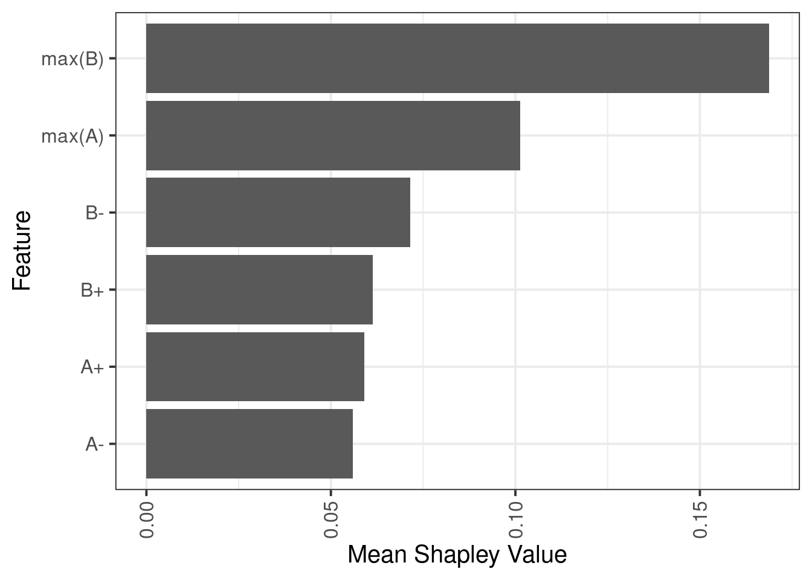


```r
p_comb_score <- tibble(pred = feats_mat_comb_df$pred, y = feats_mat_comb_df$dAB) %>% 
    mutate(col = densCols(., bandwidth=0.06,colramp=colorRampPalette(c("white","lightblue", "blue", "darkblue", "yellow", "gold","orange","red", "darkred" )))) %>% 
    ggplot(aes(x=pred, y=y, col=col)) + 
        geom_point(shape=19, size=point_size) + 
        scale_color_identity() + 
        coord_cartesian(xlim = c(-1.1, 0.6), ylim = c(-1.8, 1.2)) +                 
        xlab("Combined model") + 
        ylab("Meth (3a-/-) - (3b-/-)") +         
        theme(aspect.ratio=1, panel.grid.major=element_blank(), panel.grid.minor=element_blank()) + 
        labs(subtitle = glue("R^2 = {cor}", cor = round(cor(feats_mat_comb_df$pred, feats_mat_comb_df$dAB)^2, digits=2))) + 
        theme(plot.subtitle = ggtext::element_markdown())


p_comb_score
```

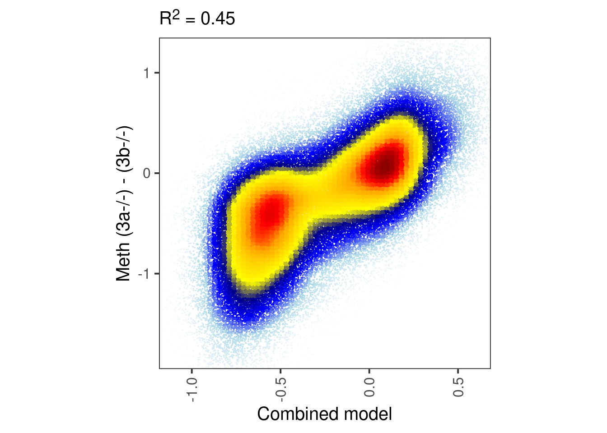

```r
cor(feats_mat_comb_df$dAB, feats_mat_comb_df$pred)^2
```

```
## [1] 0.4487908
```


```r
df <- gextract.left_join("DNMT.ab_score_xgb_plus", intervals=feats_mat_comb_df, iterator=feats_mat_comb_df) %>% select(comb_score = pred, dinuc_score = DNMT.ab_score_xgb_plus, dAB) %>% as_tibble()
```


```r
df %>%
        filter(abs(dAB) <= 0.05 )  %>%
        ggplot(aes(x=comb_score, y=dinuc_score)) +
            scattermore::geom_scattermore() + 
            geom_abline(linetype="dashed") + 
            theme(aspect.ratio=1)
```

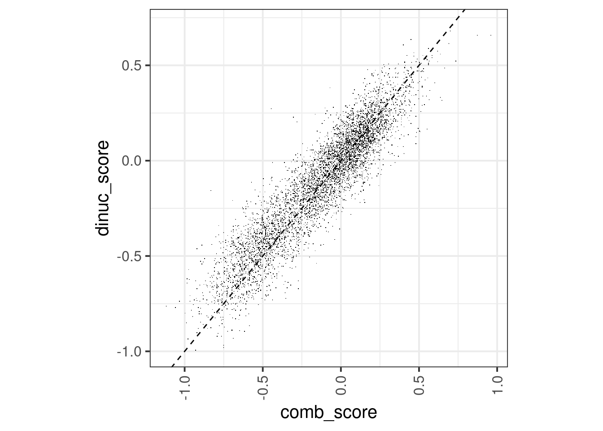


```r
p_comb_vs_dinuc <- df %>% 
    mutate(col = densCols(., bandwidth=0.06,colramp=colorRampPalette(c("white","lightblue", "blue", "darkblue", "yellow", "gold","orange","red", "darkred" )))) %>% 
    ggplot(aes(x=comb_score, y=dinuc_score, col=col)) + 
        geom_point(shape=19, size=point_size) + 
        scale_color_identity() + 
        coord_cartesian(xlim = c(-1, 1), ylim = c(-1, 1)) +                 
        xlab("Combined model") + 
        ylab("Dinuc score") +         
        theme(aspect.ratio=1, panel.grid.major=element_blank(), panel.grid.minor=element_blank()) + 
        labs(subtitle = glue("R^2 = {cor}", cor = round(cor(df$comb_score, df$dinuc_score)^2, digits=2))) + 
        theme(plot.subtitle = ggtext::element_markdown())


p_comb_vs_dinuc
```


```r
cor(df$comb_score, df$dinuc_score)^2
```

```
## [1] 0.8948897
```

Extract sequence from model


```r
flank_bp <- 5
seq_df_wide <- get_seq_df(feats_mat_comb_df %>% select(chrom, start, end), flank_bp =  flank_bp) %>% seq_df_to_wide(flank_bp = flank_bp)
```


```r
model_glm_comb <- gen_seq_model(seq_df_wide, feats_mat_comb_df, pred) 
```


```r
coef_df_comb <- get_coef_df(model_glm_comb)
```


```r
options(repr.plot.width = 5, repr.plot.height = 6)
p <- coef_df_comb %>% 
    ggplot(aes(x=pos, y=dinuc, fill=coefficient)) + 
        geom_tile() + 
        scale_fill_gradient2(low = "darkblue", high = "darkred", mid = "white", midpoint = 0, na.value="white") + 
        theme_minimal() + 
        ylab("Dinucleotide") + 
        xlab("Position")
p
```

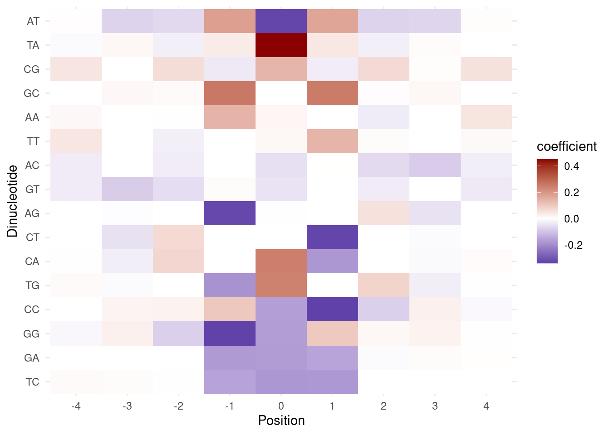

### Figure 5I


```r
model_ab <- readr::read_rds(here("output/ab_dinuc_model_5bp.rds"))
```


```r
coef_df_ab <- get_coef_df(model_ab)
```


```r
options(repr.plot.width = 5, repr.plot.height = 6)

df <- coef_df_comb %>% 
    select(pos, dinuc, coef_comb = coefficient) %>% 
    left_join(coef_df_ab %>% rename(coef = coefficient)) %>% 
    replace_na(replace = list(coef = 0, coef_comb = 0)) %>% 
    mutate(label = paste0(pos, ",", dinuc))
```

```
## Joining, by = c("pos", "dinuc")
```

```r
df_scale <- df %>% 
    mutate_at(vars(coef, coef_comb), function(x) x - mean(x) ) %>% 
    mutate_at(vars(coef, coef_comb), function(x) x / sd(x) ) 

p <-  df %>% 
    ggplot(aes(x=coef, y=coef_comb, label=label)) + 
        geom_point() +        
        geom_abline(linetype="dashed") + 
        theme_bw() + 
        theme(aspect.ratio=1) 
              
p_scale <- df_scale %>% 
    ggplot(aes(x=coef, y=coef_comb, label=label)) + 
        geom_point(size=0.01) +        
        geom_abline(linetype="dashed") + 
        xlab("Dinuc model") + 
        ylab("Combined model") + 
        theme(aspect.ratio=1) 

cor.test(df$coef, df$coef_comb, method="spearman")
```

```
## Warning in cor.test.default(df$coef, df$coef_comb, method = "spearman"): Cannot
## compute exact p-value with ties
```

```
## 
## 	Spearman's rank correlation rho
## 
## data:  df$coef and df$coef_comb
## S = 38921, p-value < 2.2e-16
## alternative hypothesis: true rho is not equal to 0
## sample estimates:
##       rho 
## 0.9217878
```

```r
p               
```


```r
p_scale
```

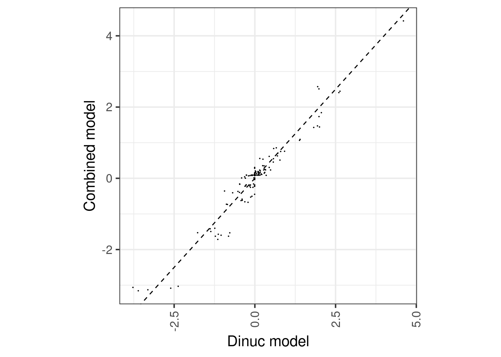

```r
p_scale + ggrepel::geom_text_repel() 
```

```
## Warning: ggrepel: 131 unlabeled data points (too many overlaps). Consider
## increasing max.overlaps
```

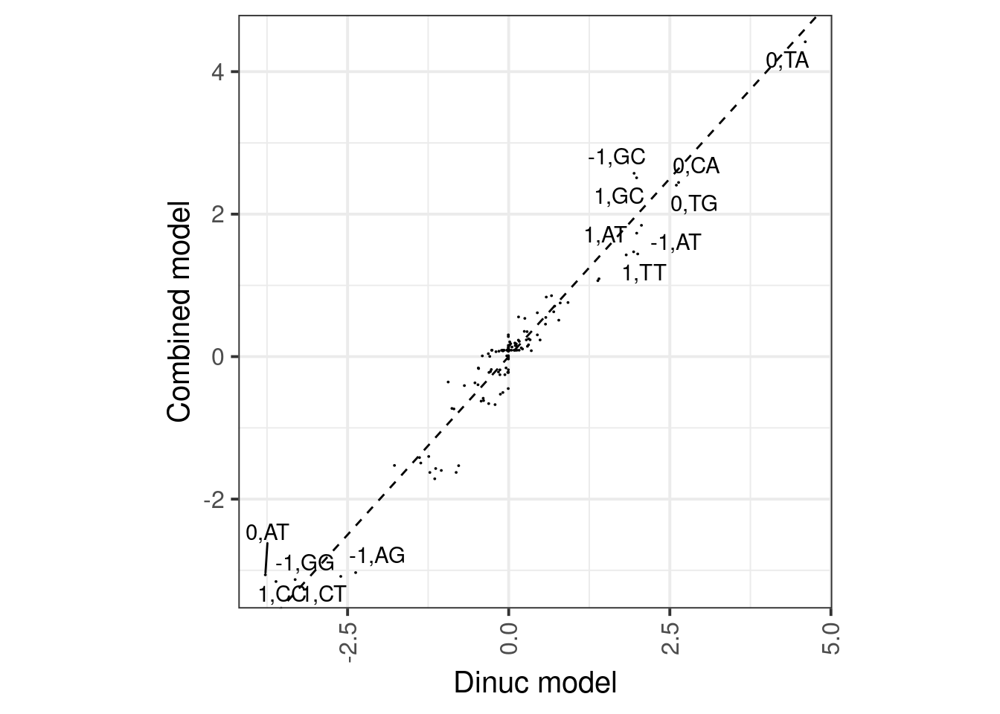

### Figure 5J


```r
epi6 <- fread(here("output/meissner_epi_cpg_meth_sum.tsv")) %>% 
    mutate(dAB_epi6 = ko3a - ko3b, dA_epi6 = ko3a - wt, dB_epi6 = ko3b - wt) %>% 
    filter(!is.na(dAB_epi6)) %>% 
    select(chrom, start, end, wt, ko3a, ko3b, dAB_epi6, dA_epi6, dB_epi6) %>% 
    as_tibble()
nrow(epi6)
```

```
## [1] 13388
```


```r
epi6_scores <- gextract.left_join(c("DNMT.ab_score_comb", "DNMT.ab_score_xgb_plus"), intervals=epi6, iterator=epi6, colnames=c("comb_model", "eb_model")) %>%
    select(-(chrom1:end1)) %>%
    as_tibble()
```


```r
p_epi6_score <- epi6_scores %>% 
    select(eb_model, dAB_epi6) %>%
    mutate(col = densCols(., bandwidth=bandwidth,colramp=colorRampPalette(c("white","lightblue", "blue", "darkblue", "yellow", "gold","orange","red", "darkred" )))) %>% 
    ggplot(aes(x=eb_model, y=dAB_epi6, col=col)) + 
        geom_point(shape=19, size=point_size) + 
        scale_color_identity() + 
        coord_cartesian(xlim = c(-1, 0.6), ylim = c(-0.4, 0.6)) +         
        xlab("EB model") + 
        ylab("Epi (3a-/-) – (3b-/-)") +         
        theme(aspect.ratio=1, panel.grid.major=element_blank(), panel.grid.minor=element_blank()) + 
        labs(subtitle = glue("r = {cor}", cor = round(cor(epi6_scores$dAB_epi6, epi6_scores$eb_model), digits=2)))
cor(epi6_scores$dAB_epi6, epi6_scores$eb_model)
```

```
## [1] 0.6284416
```

```r
p_epi6_score
```

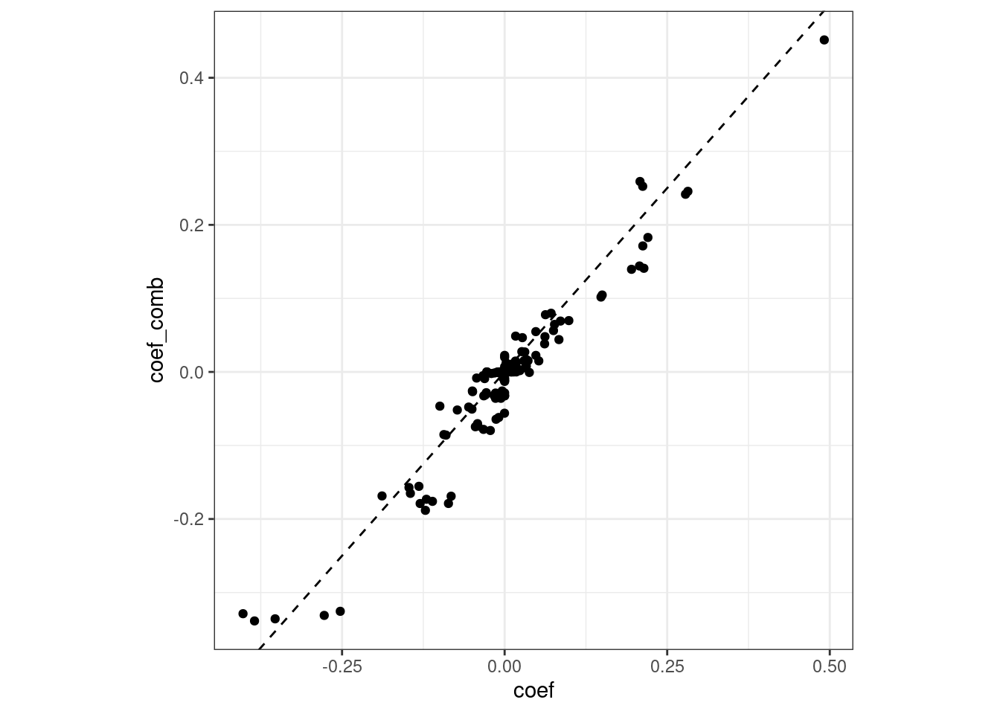


```r
p_epi6_score_comb <- epi6_scores %>% 
    select(comb_model, dAB_epi6) %>%
    mutate(col = densCols(., bandwidth=bandwidth,colramp=colorRampPalette(c("white","lightblue", "blue", "darkblue", "yellow", "gold","orange","red", "darkred" )))) %>% 
    ggplot(aes(x=comb_model, y=dAB_epi6, col=col)) + 
        geom_point(shape=19, size=point_size) + 
        scale_color_identity() + 
#         coord_cartesian(xlim = c(-1, 0.6), ylim = c(-0.4, 0.6)) +         
        xlab("Comb model") + 
        ylab("Epi (3a-/-) – (3b-/-)") +         
        theme(aspect.ratio=1, panel.grid.major=element_blank(), panel.grid.minor=element_blank()) + 
        labs(subtitle = glue("r = {cor}", cor = round(cor(epi6_scores$dAB_epi6, epi6_scores$comb_model), digits=2)))
cor(epi6_scores$dAB_epi6, epi6_scores$comb_model)
```

```
## [1] 0.6040253
```

```r
p_epi6_score_comb
```


