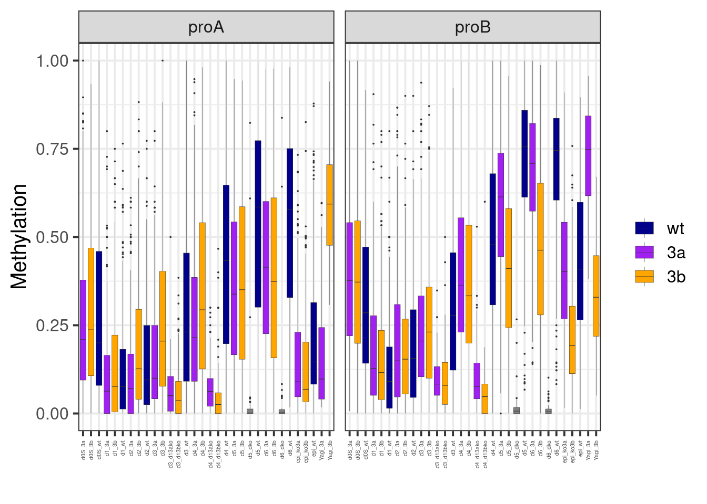

---
jupyter:
  jupytext:
    formats: ipynb,Rmd
    text_representation:
      extension: .Rmd
      format_name: rmarkdown
      format_version: '1.2'
      jupytext_version: 1.11.4
  kernelspec:
    display_name: R
    language: R
    name: ir
---

# Yagi et al. 
[Identification of distinct loci for de novo DNA methylation by DNMT3A and DNMT3B during mammalian development](https://www.nature.com/articles/s41467-020-16989-w)


### initialize definitions


```r
suppressMessages(suppressWarnings(source(here::here("code/init.R"))))
```

### DMRs


```r
yagi_dmrs <- fread(here("data/yagi_dmrs.tsv")) %>% 
    filter(chrom %in% gintervals.all()$chrom) %>% 
    as_tibble() 

yagi_dmrs <- yagi_dmrs %>% 
    mutate(
        Yagi_3a = ifelse(type == "proA", meanMethy2, meanMethy1),
        Yagi_3b = ifelse(type == "proB", meanMethy2, meanMethy1)
    )

yagi_dmrs <- yagi_dmrs %>% 
    select(chrom, start, end, type, Yagi_3a, Yagi_3b)


head(yagi_dmrs)
```

```
## # A tibble: 6 x 6
##   chrom     start       end type    Yagi_3a   Yagi_3b
## 1  chr6  48387929  48389217 proA 0.05732420 0.6731291
## 2  chr3  55584536  55588340 proA 0.02412445 0.4470477
## 3  chr1 186549516 186554917 proA 0.02829836 0.5260327
## 4  chr4 135845931 135846972 proA 0.10997219 0.6153078
## 5 chr11 118941147 118943355 proA 0.04548308 0.6741248
## 6  chr7  77491664  77494580 proA 0.02552988 0.6597258
```

```r
nrow(yagi_dmrs)
```

```
## [1] 764
```

### Get Meissner data


```r
md <- tribble(~track_name, ~sort, ~num,
    "Meissner_Nature_2017.Epi_Dnmt3a_1", "ko3a", 1,
    "Meissner_Nature_2017.Epi_Dnmt3a_2", "ko3a", 2,
    "Meissner_Nature_2017.Epi_Dnmt3a_4", "ko3a", 4,
    "Meissner_Nature_2017.Epi_Dnmt3a_5", "ko3a", 5,
    "Meissner_Nature_2017.Epi_Dnmt3a_6", "ko3a", 6,
    "Meissner_Nature_2017.Epi_Dnmt3b_1", "ko3b", 1,
    "Meissner_Nature_2017.Epi_Dnmt3b_2", "ko3b", 2,
    "Meissner_Nature_2017.Epi_Dnmt3b_3", "ko3b", 3,
    "Meissner_Nature_2017.Epi_Dnmt3b_4", "ko3b", 4,
    "Meissner_Nature_2017.Epi_Dnmt3b_5", "ko3b", 5,
    "Meissner_Nature_2017.Epi_Dnmt3b_6", "ko3b", 6,
    "Meissner_Nature_2017.Epi_WT_4", "wt", 4,
    "Meissner_Nature_2017.Epi_WT_5", "wt", 5,
    "Meissner_Nature_2017.Epi_WT_6", "wt", 6,
    "Meissner_Nature_2017.Epi_WT_7", "wt", 7) %>% 
        mutate(name = paste0(sort, "_", num))
        
m_all_epi6 <- gextract_meth(tracks = md$track_name, names=md$name, intervals=yagi_dmrs %>% select(chrom, start, end), extract_meth_calls = TRUE, iterator = yagi_dmrs %>% select(chrom, start, end)) %cache_df% here("output/meissner_epi_yagi_meth.tsv")  %>% as_tibble()    
```


```r
min_cov <- 10
m_epi6 <- m_all_epi6 %>% select(chrom, start, end)
for (g in unique(md$sort)){
        nms <- md %>% filter(sort == g) %>% pull(name)

        cov_col <- paste0(g, ".cov")
        meth_col <- paste0(g, ".meth")            

        m_epi6[[cov_col]] <- rowSums(m_all_epi6[, paste0(nms, ".cov")], na.rm=TRUE)
        m_epi6[[meth_col]] <- rowSums(m_all_epi6[, paste0(nms, ".meth")], na.rm=TRUE)
        
        m_epi6[[g]] <- ifelse(m_epi6[[cov_col]] >= min_cov, m_epi6[[meth_col]] / m_epi6[[cov_col]], NA)
    }
m_epi6 <- m_epi6 %>% select(-ends_with(".meth"), -ends_with(".cov"))  %cache_df% here("output/meissner_epi_yagi_meth_sum.tsv")
```

### Get MEEB data


```r
m_meeb <- calc_eb_day0_to_day6_cpg_meth(intervals = yagi_dmrs %>% select(chrom, start, end), iterator =  yagi_dmrs %>% select(chrom, start, end), cache_fn = here("output/meeb_day0_to_day6_yagi_meth.tsv"), use_sort = FALSE, max_na = 100) %>% 
    select(-ends_with("cov"), -ends_with("meth")) %>% 
    select(-contains("_ko1"), -contains("_tko"), -starts_with("d0_"))
```


```r
head(m_meeb)
```

```
## # A tibble: 6 x 30
##   chrom    start      end d3_d13ako  d4_d13ako d3_d13bko  d4_d13bko     d5_dko
## 1  chr1 14497410 14498475        NA         NA        NA 0.38461538         NA
## 2  chr1 21070410 21070719        NA         NA        NA         NA         NA
## 3  chr1 34163709 34164326        NA         NA        NA         NA         NA
## 4  chr1 38266943 38267649 0.1076265 0.09757137 0.1166078 0.07476636 0.01094891
## 5  chr1 38685382 38686284        NA         NA        NA         NA         NA
## 6  chr1 57032568 57032760 0.0000000 0.00000000 0.0000000         NA         NA
##        d6_dko     d0S_3a     d1_3a     d2_3a     d3_3a      d4_3a     d5_3a
## 1          NA 0.66346154        NA        NA        NA 0.55855856 0.4925373
## 2          NA 0.31428571        NA        NA        NA 0.29113924 0.3614458
## 3          NA 0.05769231        NA        NA        NA 0.08333333 0.1320755
## 4 0.009803922 0.29095853 0.1721992 0.1582915 0.2002882 0.25531915 0.5327103
## 5          NA 0.41111111        NA        NA        NA 0.22222222 0.4615385
## 6          NA 0.06779661        NA        NA 0.0000000 0.00000000 0.0000000
##        d6_3a    d0S_3b     d1_3b     d2_3b     d3_3b      d4_3b      d5_3b
## 1 0.50000000 0.8068182        NA        NA        NA 0.80373832 0.80000000
## 2 0.43801653 0.5918367        NA        NA        NA 0.61538462 0.64406780
## 3 0.17283951 0.0000000        NA        NA        NA 0.13513514 0.22580645
## 4 0.67054908 0.3020355 0.1372951 0.2084993 0.2549451 0.25453654 0.29600000
## 5 0.44520548 0.5306122        NA        NA        NA 0.48913043 0.64444444
## 6 0.04635762 0.1538462        NA        NA        NA 0.04395604 0.01923077
##        d6_3b    d0S_wt     d1_wt     d2_wt     d3_wt     d4_wt      d5_wt
## 1 0.81250000        NA        NA        NA 0.8571429 0.8000000 0.79569892
## 2 0.67832168        NA        NA        NA        NA 0.9523810 0.59183673
## 3 0.22602740        NA        NA        NA        NA 0.1600000 0.46913580
## 4 0.33012628 0.3144775 0.1382979 0.1384615 0.2685560 0.3562982 0.77044610
## 5 0.58235294        NA        NA        NA        NA 0.5666667 0.66666667
## 6 0.05128205        NA        NA        NA        NA 0.2666667 0.03921569
##        d6_wt
## 1 0.82173913
## 2 0.84771574
## 3 0.36200000
## 4 0.74321230
## 5 0.61437908
## 6 0.05809129
```

```r
dim(m_meeb)
```

```
## [1] 764  30
```


```r
yagi_meth <- yagi_dmrs %>% 
    left_join(m_epi6) %>% 
    left_join(m_meeb)
```

```
## Joining, by = c("chrom", "start", "end")
## Joining, by = c("chrom", "start", "end")
```

```r
head(yagi_meth)
```

```
## # A tibble: 6 x 36
##   chrom     start       end type    Yagi_3a   Yagi_3b       ko3a       ko3b
## 1  chr6  48387929  48389217 proA 0.05732420 0.6731291 0.03305727 0.01935100
## 2  chr3  55584536  55588340 proA 0.02412445 0.4470477 0.03345408 0.02190160
## 3  chr1 186549516 186554917 proA 0.02829836 0.5260327 0.03760639 0.02147777
## 4  chr4 135845931 135846972 proA 0.10997219 0.6153078 0.11737341 0.04451465
## 5 chr11 118941147 118943355 proA 0.04548308 0.6741248 0.07684360 0.03943182
## 6  chr7  77491664  77494580 proA 0.02552988 0.6597258 0.00000000 0.04000000
##           wt  d3_d13ako  d4_d13ako d3_d13bko  d4_d13bko      d5_dko     d6_dko
## 1 0.03128703         NA 0.05000000        NA 0.00000000          NA 0.00000000
## 2 0.05538695         NA 0.00000000 0.0000000 0.00000000          NA         NA
## 3 0.07845847 0.09322034 0.09478407 0.1114696 0.04453912 0.007029877 0.01030928
## 4 0.21266968 0.03361345 0.06903766 0.0311804 0.02857143 0.000000000 0.01162791
## 5 0.14754879 0.15384615 0.09090909 0.0000000 0.03571429          NA 0.00000000
## 6         NA         NA 0.00000000        NA         NA          NA         NA
##       d0S_3a      d1_3a     d2_3a      d3_3a      d4_3a     d5_3a     d6_3a
## 1 0.05240642 0.00000000 0.0000000 0.03378378 0.03199269 0.0715859 0.1162437
## 2 0.22588832 0.31034483 0.1200000 0.08333333 0.24896836 0.2323718 0.2582781
## 3 0.46839605 0.33613445 0.3232462 0.38888889 0.43388339 0.2618705 0.3223706
## 4 0.12714157 0.06666667 0.0505618 0.10747664 0.10019084 0.1414427 0.4215470
## 5 0.18901660 0.07692308 0.2500000 0.14893617 0.19910847 0.2071713 0.2143895
## 6 0.36474164 0.25000000 0.1153846 0.34482759 0.34335840 0.2874251 0.3011665
##       d0S_3b      d1_3b      d2_3b      d3_3b      d4_3b      d5_3b      d6_3b
## 1 0.09992194 0.01086957 0.02816901 0.00781250 0.03423237 0.05020921 0.03491379
## 2 0.22635659 0.19148936 0.12500000 0.14893617 0.21798030 0.21082621 0.25292056
## 3 0.51350450 0.40802213 0.51413428 0.60601504 0.54364798 0.23013245 0.35954601
## 4 0.11684518 0.03960396 0.05479452 0.09459459 0.10903427 0.08480000 0.08768536
## 5 0.19321149 0.23255814 0.14285714 0.22580645 0.18750000 0.17412141 0.18470021
## 6 0.66250000 0.15384615 0.88235294 0.77777778 0.72745098 0.64102564 0.62837163
##      d0S_wt      d1_wt      d2_wt      d3_wt      d4_wt      d5_wt      d6_wt
## 1 0.0733945 0.00000000 0.01075269 0.04411765 0.05958132 0.07562278 0.08210877
## 2 0.1935484 0.11363636 0.18918919 0.22857143 0.27392739 0.31428571 0.33866951
## 3 0.6337895 0.39802336 0.44246032 0.56379101 0.67888716 0.59645937 0.38639532
## 4 0.1174785 0.05925926 0.05384615 0.12921348 0.19919786 0.27834179 0.32883390
## 5 0.1296296 0.06000000 0.07317073 0.15789474 0.28443114 0.22222222 0.24428214
## 6 0.7187500 0.48275862 0.66666667 0.56410256 0.82432432 0.73489933 0.66535433
```

```r
yagi_meth %>% count(type)
```

```
## # A tibble: 2 x 2
##   type   n
## 1 proA 427
## 2 proB 343
```

### Extended Data Figure 8I


```r
options(repr.plot.width = 14, repr.plot.height = 7)
line_colors <- c("wt" = "darkblue", "3a" = "purple", "3b" = "orange")
p_yagi <- yagi_meth %>%     
    select(chrom:end, type, Yagi_3a, Yagi_3b, epi_ko3a = ko3a, epi_ko3b = ko3b, epi_wt = wt, everything()) %>% 
    gather("samp", "meth", -(chrom:type)) %>%     
    mutate(samp = gsub("_all", "", samp)) %>% 
    mutate(line = case_when(
        grepl("3a", samp) ~ "3a",
        grepl("3b", samp) ~ "3b",
        grepl("wt", samp) ~ "wt"
    )) %>% 
    mutate(line = factor(line, levels = names(line_colors))) %>%
    ggplot(aes(x=samp, y=meth, fill=line)) + 
        geom_boxplot(outlier.size = 0, lwd = 0.1) + 
        xlab("") + 
        ylab("Methylation") + 
        scale_fill_manual("", values=line_colors) + 
        vertical_labs() + 
        theme(axis.text.x=element_text(size=4)) + 
        facet_wrap(~type)

p_yagi
```

```
## Warning: Removed 8158 rows containing non-finite values (stat_boxplot).
```


